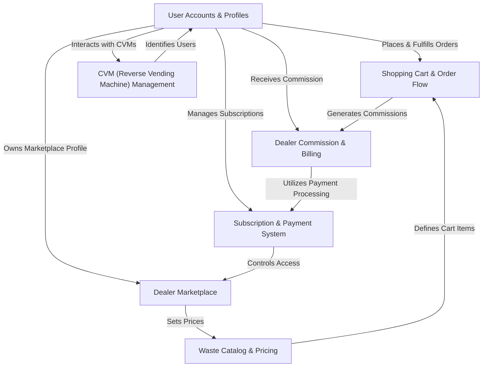
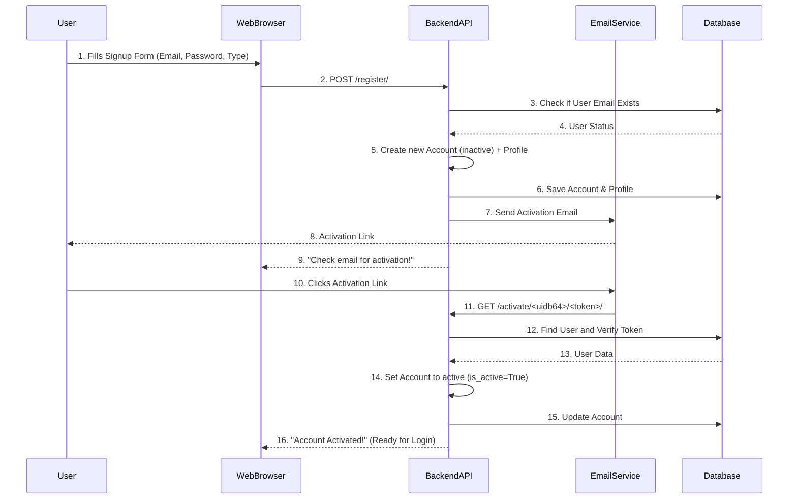
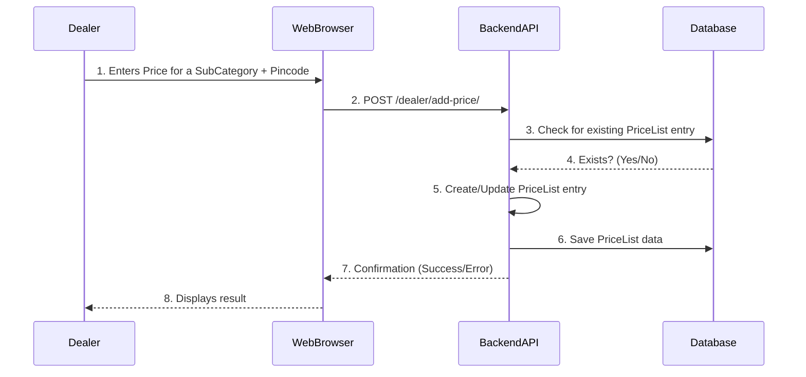
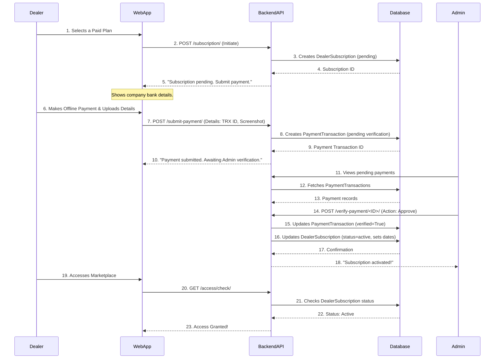
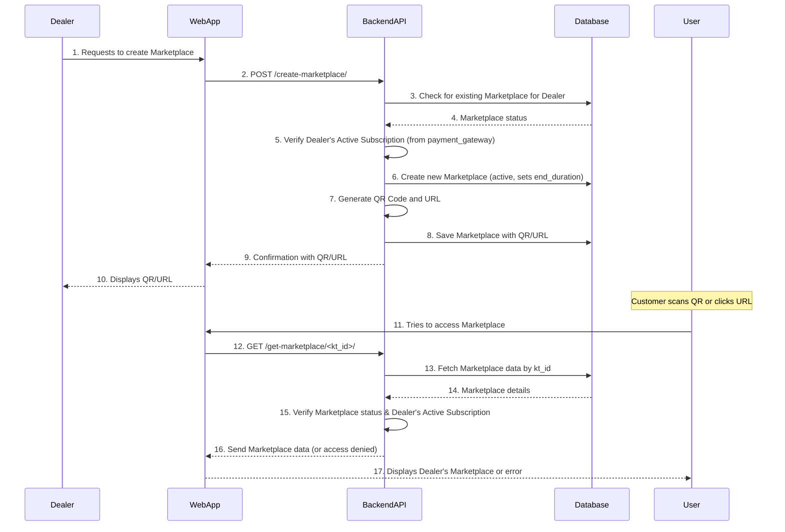
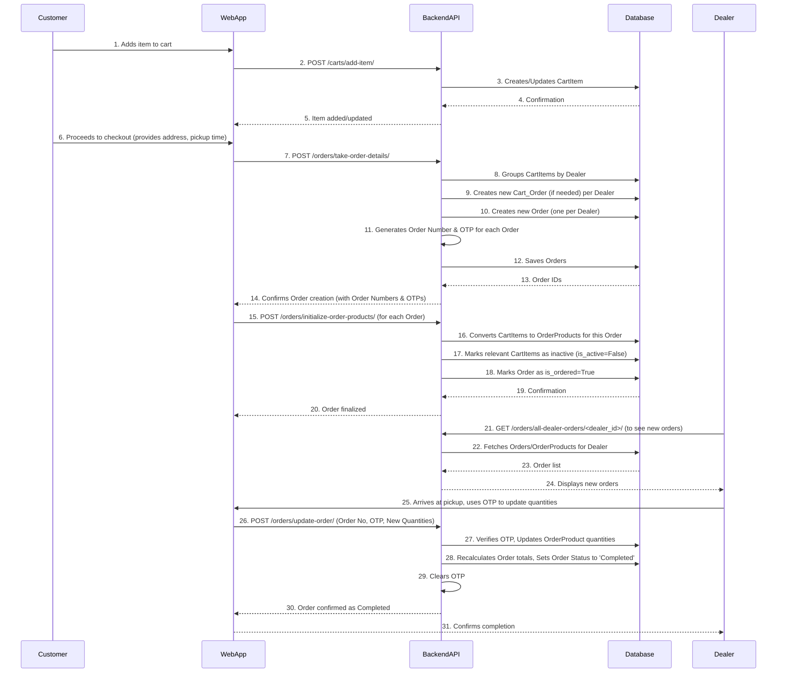
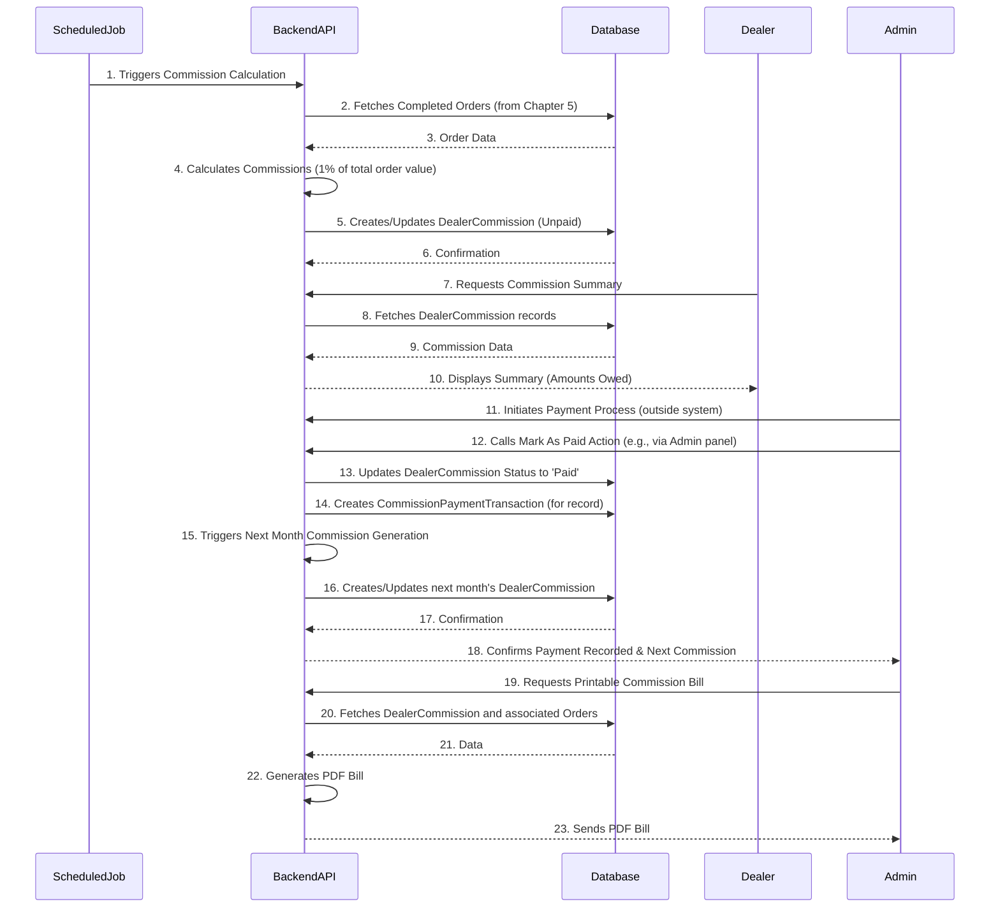

# Tutorial: kabadi_techno_backend

Kabadi Techno is a comprehensive platform designed to **revolutionize waste recycling**. It effectively **connects customers** who wish to dispose of recyclables with **local dealers** interested in buying them. The platform manages the *entire recycling ecosystem*, including detailed waste categorization and pricing, a streamlined order and pickup process, dealer subscriptions for marketplace access, and even specialized management for Reverse Vending Machines (CVMs). It also handles dealer commissions and billing for transparency.


## Visual Overview



## Chapters


1. [User Accounts & Profiles](#chapter-1-user-accounts--profiles)
2. [Waste Catalog & Pricing](#chapter-2-waste-catalog--pricing)
3. [Subscription & Payment System](#chapter-3-subscription--payment-system)
4. [Dealer Marketplace](#chapter-4-dealer-marketplace)
5. [Shopping Cart & Order Flow](#chapter-5-shopping-cart--order-flow)
6. [Dealer Commission & Billing](#chapter-6-dealer-commission--billing)
7. [CVM (Reverse Vending Machine) Management](#chapter-7-cvm-reverse-vending-machine-management)

---

# Chapter 1: User Accounts & Profiles

Welcome to the Kabadi Techno backend! In this first chapter, we're going to explore a super important concept: how our application knows *who* you are. Think of it like a national ID card system for our app. Every user – whether they're a **Customer** selling waste, a **Dealer** buying it, or even an internal **Admin** managing the system – needs a unique identity.

This "identity system" is crucial because it allows users to:
*   **Sign up** for an account.
*   **Log in** to access their personalized features.
*   **Manage their details**, like their profile picture or where they live.
*   **Keep their account secure** with password management.

Our main goal for this chapter is to understand how a new user signs up for Kabadi Techno and then logs into their account.

## What's an Account? (And its Friends!)

At the heart of our identity system is the `Account`. This is your main digital ID card. But just like a national ID, it often comes with other specific details, depending on who you are.

Let's break down the key pieces:

| Concept           | What it is (Analogy)                                  | Role in Kabadi Techno                                    |
| :---------------- | :---------------------------------------------------- | :------------------------------------------------------- |
| **Account**       | Your main ID card (like a Passport or Driver's License) | Stores basic info: email, password, full name, phone number, and whether you're a Customer, Dealer, or Admin. |
| **CustomerProfile** | A special "Customer Permit" added to your ID card     | Stores extra details only for Customers, like a unique `kt_id` (Kabadi Techno ID) and your profile picture. |
| **DealerProfile** | A special "Business License" added to your ID card    | Stores extra details only for Dealers, like their unique `kt_id` and their business type. |
| **Address**       | Your address book                                     | Stores your physical locations, allowing you to manage multiple addresses (e.g., home, office). |

The `Account` model is the core. Every user starts with an `Account`. Depending on whether you sign up as a `Customer` or a `Dealer`, a corresponding `CustomerProfile` or `DealerProfile` is automatically linked to your `Account`. This ensures everyone has the right tailored experience.

## Use Case: Signing Up and Logging In

Let's walk through the most common interaction: a new user joining Kabadi Techno.

### Step 1: Signing Up

Imagine a new **Customer** wants to join. They fill out a registration form with their name, email, phone number, and choose a password. They also specify they want to be a 'Customer'.

When they submit this information, it goes to our backend system.

```python
# accounts/views.py (Simplified SignupAPIView)
class SignupAPIView(APIView):
    def post(self, request):
        serializer = AccountSerializer(data=request.data) # 1. Get data
        if serializer.is_valid(raise_exception=True):    # 2. Check if data is valid
            user = serializer.save()                     # 3. Create Account!
            user.is_active = False                       # 4. Account is inactive
            # ... code to send activation email (we'll explain this next!) ...
            if user.account_type == 'Customer':
                CustomerProfile.objects.get_or_create(auth_id=user) # 5. Create CustomerProfile
            else: # Must be Dealer
                DealerProfile.objects.get_or_create(auth_id=user)   # 5. Create DealerProfile
            return Response({"message": "Registration successful. Activation link sent to your email."}, status=201)
        return Response(serializer.errors, status=400)

```

**Explanation:**
1.  The `SignupAPIView` is like the "registration desk." It receives the new user's information.
2.  An `AccountSerializer` (think of it as a form checker) quickly verifies if the data is correct and if the passwords match.
3.  If everything looks good, `serializer.save()` creates a new `Account` in our system.
4.  Crucially, the new `Account` is marked as `is_active = False`. This means the user can't log in yet!
5.  Based on the `account_type` chosen (`Customer` or `Dealer`), a corresponding `CustomerProfile` or `DealerProfile` is also created and linked to the new `Account`. These profiles get their unique `kt_id` generated automatically!
6.  Finally, a success message is sent back, telling the user to check their email for an "activation link."

### Step 2: Email Activation

Why activate? This is a security step to make sure the user truly owns the email address they registered with. It prevents people from signing up with fake emails.

The user receives an email with a special link. When they click it:

```python
# accounts/views.py (Simplified ActivateAccountAPIView)
class ActivateAccountAPIView(APIView):
    def get(self, request, uidb64, token):
        try:
            uid = force_str(urlsafe_base64_decode(uidb64)) # 1. Decode user ID
            user = User.objects.get(pk=uid)                # 2. Find the user
        except Exception:
            return Response({"error": "Invalid activation link."}, status=400)

        token_generator = PasswordResetTokenGenerator()
        if not token_generator.check_token(user, token): # 3. Check if link is valid
            return Response({"error": "Invalid or expired token."}, status=400)

        user.is_active = True                            # 4. Activate the account!
        user.save()
        return Response({"message": "Account activated successfully."}, status=200)

```

**Explanation:**
1.  The activation link contains two encoded pieces of information: the `uidb64` (the user's ID) and a `token` (a secret code).
2.  Our `ActivateAccountAPIView` decodes these pieces to find the correct user.
3.  It then verifies if the `token` is valid and hasn't expired. This is like checking if a special one-time key still works.
4.  If valid, the user's `is_active` status is changed to `True`, allowing them to log in.

### Step 3: Logging In

Now that the account is active, the user can log in. They'll go to the login screen and enter their email and password.

```python
# accounts/views.py (Simplified LoginAccount)
class LoginAccount(APIView):
    def post(self, request):
        email = request.data.get("email")
        password = request.data.get("password")
        user_type = request.data.get("user_type")

        # 1. Check if email/password are provided
        # 2. Find user by email and check user_type

        user = authenticate(request, email=email, password=password) # 3. Verify credentials
        if user is None:
            return Response({"error": "Invalid email or password."}, status=401)

        if not user.is_active: # 4. Check if account is active
            return Response({"error": "Account not activated."}, status=403)

        token = get_tokens_for_user(user) # 5. Generate unique login tokens
        user.online = True # Mark user as online
        user.save()

        # 6. Fetch specific profile details (kt_id, etc.)
        kt_id = None
        if user.account_type == 'Customer':
            profile = CustomerProfile.objects.filter(auth_id=user).first()
            if profile: kt_id = profile.kt_id
        elif user.account_type == 'Dealer':
            profile = DealerProfile.objects.filter(auth_id=user).first()
            if profile: kt_id = profile.kt_id

        user_data = UserSerializer(user).data
        user_data['kt_id'] = kt_id # Add kt_id to user data

        return Response({"token": token, "user": user_data, "message": "Logged in."}, status=200)

```

**Explanation:**
1.  The `LoginAccount` view receives the user's email, password, and chosen user type (Customer or Dealer).
2.  It first quickly checks if the user exists and if the `user_type` matches.
3.  `authenticate()` is a special Django function that checks if the provided email and password match an active account in our database. It's like checking if your ID card and password match.
4.  If the credentials are correct, it makes sure the account is `is_active`.
5.  If everything is good, `get_tokens_for_user()` creates unique "tokens" for this session. These tokens are like temporary passes that let the user access other parts of the system without re-entering their password for every action.
6.  Finally, it fetches the user's specific `kt_id` from their linked `CustomerProfile` or `DealerProfile` and includes it in the response, along with other user details. The user is now successfully logged in!

## How It Works Under the Hood

Let's peek behind the curtain to see the components involved in this identity system.

### The Signup Journey (Simplified)

Here’s a simplified flow of what happens when a user registers:



**What's happening in each step:**
1.  A user interacts with the website, providing their signup details.
2.  The website sends these details to the `/register/` endpoint on our backend.
3.  The backend first checks the `Database` to ensure no one has already used that email.
4.  The `Database` responds with whether the email is taken.
5.  If unique, the backend creates a new `Account` entry (but marks it as `is_active=False`) and a linked `CustomerProfile` or `DealerProfile`.
6.  These new records are saved in the `Database`.
7.  An activation email is sent to the user's provided email address using an `EmailService`.
8.  The user receives this email with a special activation link.
9.  The backend sends a success message back to the website.
10. The user clicks the activation link in their email.
11. The link directs their browser back to a special `/activate/` endpoint on the backend.
12. The backend uses the link's unique IDs and tokens to find the correct `Account` in the `Database` and verify the link's authenticity.
13. The `Database` provides the user's details.
14. If the link is valid, the backend updates the `Account`'s `is_active` status to `True`.
15. This change is saved in the `Database`.
16. Finally, the backend confirms to the user's browser that their account is now active and ready for login!

### Core Building Blocks (Code Deep Dive)

Let's look at the actual code files that make this happen.

#### 1. The Models (`accounts/models.py`)

Models are like blueprints for the data our application stores.

```python
# accounts/models.py (Core Models - Simplified)
from django.db import models
from django.contrib.auth.models import AbstractBaseUser,BaseUserManager,PermissionsMixin

class MyAccountManager(BaseUserManager):
    def create_user(self, full_name, email, password=None, account_type=None, phone_number=None):
        # ... logic to create a regular user ...
        user = self.model(email=self.normalize_email(email), full_name=full_name, account_type=account_type, phone_number=phone_number)
        user.set_password(password) # Sets encrypted password
        user.save(using=self._db)
        return user

class Account(AbstractBaseUser,PermissionsMixin):
    account_type_choice =(('Customer','Customer'),('Dealer','Dealer'),)
    full_name = models.CharField(max_length=100)
    email = models.EmailField(max_length=100,unique=True)
    phone_number = models.CharField(max_length=13,null=True,blank=True)
    account_type = models.CharField(choices=account_type_choice,max_length=30,null=True,blank=True)
    is_active = models.BooleanField(default=False) # Important: Default is False!
    is_admin = models.BooleanField(default=False)
    # ... other required Django user fields ...
    objects = MyAccountManager() # Our custom manager to create users

class CustomerProfile(models.Model):
    kt_id = models.CharField(max_length=20, editable=False) # Auto-generated unique ID
    auth_id = models.OneToOneField(Account, on_delete=models.CASCADE) # Links to ONE Account
    ProfilePic = models.ImageField(upload_to='media/accounts/Customer/')
    # ... other customer-specific fields ...

class DealerProfile(models.Model):
    kt_id = models.CharField(max_length=20, editable=False) # Auto-generated unique ID
    auth_id = models.OneToOneField(Account,on_delete=models.CASCADE,null=True) # Links to ONE Account
    ProfilePic = models.ImageField(upload_to='accounts/Dealer/ProfilePic')
    # ... other dealer-specific fields ...

class Address(models.Model):
    add_user = models.ForeignKey(Account,on_delete=models.CASCADE) # Links to MANY Addresses
    add_line1 = models.CharField(max_length=200)
    zipcode = models.IntegerField()
    is_default = models.BooleanField(default=False)
    # ... other address fields ...
```

**Explanation:**
*   **`Account`**: This is the core. It uses Django's `AbstractBaseUser` for secure password handling and `PermissionsMixin` for roles. Notice `is_active` defaults to `False` for new signups. `MyAccountManager` helps us create new users easily.
*   **`CustomerProfile` / `DealerProfile`**: These models have a `OneToOneField` pointing to `Account`. This means one `Account` can only have one `CustomerProfile` or one `DealerProfile`, ensuring a strong link. They store the unique `kt_id` and profile pictures. The `kt_id` is generated automatically when a new profile is saved!
*   **`Address`**: This model uses a `ForeignKey` to `Account`. This means one `Account` can have *many* `Address` entries (like home, work, etc.).

#### 2. The Serializers (`accounts/serializers.py`)

Serializers are like translators. They convert complex data (like our `Account` objects) into simple formats (like JSON) that web browsers can understand, and vice-versa. They also handle data validation.

```python
# accounts/serializers.py (Key Serializers - Simplified)
from rest_framework import serializers
from .models import Account, CustomerProfile, DealerProfile, Address

class AccountSerializer(serializers.ModelSerializer):
    password2 = serializers.CharField(write_only=True) # For confirming password

    class Meta:
        model = Account
        fields = ['full_name', 'email', 'phone_number', 'password', 'password2', 'account_type']
        extra_kwargs = {'password': {'write_only': True}} # Password won't be sent back

    def validate(self, attrs):
        if attrs['password'] != attrs['password2']: # Check if passwords match
            raise serializers.ValidationError("Passwords do not match")
        return attrs

    def create(self, validated_data):
        validated_data.pop('password2') # Remove temp field
        return Account.objects.create_user(**validated_data) # Use our custom manager to create user

class UserSerializer(serializers.ModelSerializer):
    class Meta:
        model = Account
        fields = ['id', 'full_name', 'email', 'account_type', 'is_active'] # What gets returned after login

class CustomerProfileSerializer(serializers.ModelSerializer):
    class Meta:
        model = CustomerProfile
        fields = ['ProfilePic'] # For updating profile picture

class DealerProfileSerializer(serializers.ModelSerializer):
    class Meta:
        model = DealerProfile
        fields = ['ProfilePic'] # For updating profile picture

class AddressSerializer(serializers.ModelSerializer):
    class Meta:
        model = Address
        fields = ['add_line1', 'city', 'zipcode', 'is_default'] # For managing addresses
```

**Explanation:**
*   **`AccountSerializer`**: This is used for user *signup*. It takes raw data, checks if passwords match (`validate` method), and then uses our `MyAccountManager`'s `create_user` method to safely create the `Account`.
*   **`UserSerializer`**: This is simpler, used to display basic user information (like after a successful login).
*   **`CustomerProfileSerializer` / `DealerProfileSerializer`**: These are used when a user wants to update their profile information, like changing their profile picture.
*   **`AddressSerializer`**: Used for adding, updating, or viewing user addresses.

#### 3. The Views (`accounts/views.py`)

Views are like the "receptionists" of our backend. They receive requests from web browsers, talk to models and serializers, and send back responses. We've already seen simplified versions of `SignupAPIView`, `ActivateAccountAPIView`, and `LoginAccount`.

Here are a few other important views related to user accounts:

*   **`PasswordResetAPIView` / `PasswordResetConfirmAPIView`**: These handle the "forgot password" flow. If you forget your password, you ask for a reset link, and then use that link to set a new password.
*   **`ChangePasswordAPIView`**: Allows a logged-in user to change their password securely.
*   **`CustomerProfileAPIView` / `DealerProfileAPIView`**: These allow logged-in users to view (`GET`) or update (`PUT`) their specific profile details (like profile pictures).
*   **`AddressAPIView`**: Allows logged-in users to add, view, update, or delete their addresses. It also handles setting a default address.
*   **`MyQRCode`**: This cool view generates a QR code containing the user's `kt_id`. This `kt_id` is unique to them and will be important later, especially with [CVM (Reverse Vending Machine) Management](07_cvm__reverse_vending_machine__management_.md)!
*   **`UserActivationAPIView` / `AdminUserListAPIView`**: These are special views accessible only by `Admin` users. They allow our internal team to manually activate/deactivate user accounts or view a list of all users in the system.

#### 4. The URLs (`accounts/urls.py`)

URLs are like street addresses. They tell our web server where to send incoming requests.

```python
# accounts/urls.py (Simplified)
from django.urls import path
from .views import (
    SignupAPIView, LoginAccount, ActivateAccountAPIView,
    PasswordResetAPIView, PasswordResetConfirmAPIView, ChangePasswordAPIView,
    CustomerProfileAPIView, DealerProfileAPIView, AddressAPIView, MyQRCode,
    UserActivationAPIView, AdminUserListAPIView
)

urlpatterns = [
    path('register/', SignupAPIView.as_view(), name = "registration"),
    path('login/',LoginAccount.as_view(),name='login_account'),
    path('activate/<str:uidb64>/<str:token>/', ActivateAccountAPIView.as_view(), name='activate_account'),
    path('password-reset/', PasswordResetAPIView.as_view(), name='password_reset'),
    path('reset-password/<str:uidb64>/<str:token>/', PasswordResetConfirmAPIView.as_view(), name='password_reset_confirm'),
    path('change-pass/',ChangePasswordAPIView.as_view(),name='change-password'),
    path('myqr/',MyQRCode.as_view(),name='my-qr'),
    path('customer-profile/', CustomerProfileAPIView.as_view(), name='customer-profile'),
    path('dealer-profile/',DealerProfileAPIView.as_view(),name='dealer_profile'),
    path('address/', AddressAPIView.as_view(), name='address'),
    path('address/<int:id>/', AddressAPIView.as_view(), name='address_detail'), # For specific address updates/deletes
    path('user-activation/', UserActivationAPIView.as_view(), name='user_activation'), # Admin only
    path('admin-user-list/', AdminUserListAPIView.as_view(), name='admin_user_list'), # Admin only
]
```

**Explanation:**
Each `path()` links a specific URL (like `/register/`) to a `View` (like `SignupAPIView.as_view()`). When a request hits that URL, Django knows which "receptionist" (View) should handle it. The `<str:uidb64>/<str:token>/` parts are special placeholders that capture dynamic values from the URL, like the user ID and token in the activation link.

## Conclusion

Phew! You've just learned about the foundation of any application: user accounts. You now know that `Account` is the central identity, with specialized `CustomerProfile` and `DealerProfile` models storing unique details. We've walked through how users sign up, activate their accounts via email, and log in, all backed by robust models, serializers, and views.

Understanding user accounts is crucial because everything else in Kabadi Techno builds upon knowing who the user is. Next up, we'll dive into what kinds of waste our users can actually trade!

[Next Chapter: Waste Catalog & Pricing](02_waste_catalog___pricing_.md)

---

<sub><sup>**References**: [[1]](https://github.com/snehabansal483/kabadi_techno_backend/blob/9f9f47120fae3c2788821a20ffe93fbf4e8a2077/accounts/admin.py), [[2]](https://github.com/snehabansal483/kabadi_techno_backend/blob/9f9f47120fae3c2788821a20ffe93fbf4e8a2077/accounts/models.py), [[3]](https://github.com/snehabansal483/kabadi_techno_backend/blob/9f9f47120fae3c2788821a20ffe93fbf4e8a2077/accounts/serializers.py), [[4]](https://github.com/snehabansal483/kabadi_techno_backend/blob/9f9f47120fae3c2788821a20ffe93fbf4e8a2077/accounts/urls.py), [[5]](https://github.com/snehabansal483/kabadi_techno_backend/blob/9f9f47120fae3c2788821a20ffe93fbf4e8a2077/accounts/views.py)</sup></sub>

---

# Chapter 2: Waste Catalog & Pricing

Welcome back to the Kabadi Techno backend tutorial! In [Chapter 1: User Accounts & Profiles](01_user_accounts___profiles_.md), we learned how our system identifies "who" is using the app – whether they're a **Customer**, a **Dealer**, or an **Admin**. Now that we know who's who, the next big question is: **"What can they actually trade?"**

Imagine you're trying to sell your old newspapers or plastic bottles. How does Kabadi Techno know what "newspapers" are, and more importantly, how much they're worth? This is where our "Waste Catalog & Pricing" system comes in!

Think of it like a specialized "product catalog" for recyclable waste. It helps us:
*   Define different types of waste, from common items like paper to more specific categories.
*   Organize these waste types neatly so everyone can easily find what they're looking for.
*   Allow **Dealers** to set their own buy-back prices for these waste types, which can even change depending on the location (like a specific `Pincode`).

Our main goal for this chapter is to understand how we list different types of waste and how **Dealers** can set prices for them based on specific areas.

## What's in the Waste Catalog? (And its Friends!)

To make sense of all the different types of waste, we break them down into a few key pieces:

| Concept         | What it is (Analogy)                                  | Role in Kabadi Techno                                    |
| :-------------- | :---------------------------------------------------- | :------------------------------------------------------- |
| **Category**    | A big "department" or group (like "Paper" in a store) | Organizes waste into broad groups (e.g., Plastic, Metal). |
| **SubCategory** | A specific "item" within a department (like "Newspaper" in the "Paper" section) | Provides specific details about a waste item (e.g., PET Bottles, Old Books). Each `SubCategory` belongs to a `Category`. |
| **PriceList**   | A "price tag" set by a specific store at a specific location | A **Dealer's** buy-back price for a particular `SubCategory` in a certain `Pincode`. |

Let's use an example: A `Category` might be "Paper." Inside "Paper," you'd find `SubCategory` items like "Newspaper," "Cardboard," and "Magazines." Then, a specific `Dealer` might offer a `PriceList` for "Newspaper" at "₹15 per kg" for the "110001" `Pincode`, but a different price for "Cardboard" in the same `Pincode`.

## Use Case: How a Dealer Sets Prices for Waste

Let's walk through how a **Dealer** might add or update the prices for different waste items in their service area. This is crucial for **Customers** to know what they can sell and for how much.

### Step 1: Adding a New Price for a SubCategory

Imagine a **Dealer** wants to start buying "Newspaper" in the `Pincode` "110001" and sets the price to `₹15` per kg.

```python
# dealer_details/views.py (Simplified AddPrice APIView)
class AddPrice(APIView):
    def post(self, request):
        serializer = PriceListPostSerializer(data=request.data) # 1. Get data (SubCategory, Dealer, Pincode, Price)
        if serializer.is_valid(raise_exception=True):    # 2. Check if data is valid
            subcategory = request.data['subcategory']
            dealer = request.data['dealer']
            pincode = request.data['pincode']
            # Check if this price already exists for this dealer/subcategory/pincode
            if PriceList.objects.filter(subcategory=subcategory, dealer=dealer, pincode=pincode).exists():
                return Response({'message': 'Price already set for this combination.'}, status=406)
            else:
                serializer.save() # 3. Create the new PriceList entry!
                return Response(serializer.data, status=201)
        return Response(serializer.errors, status=400)
```

**Explanation:**
1.  The `AddPrice` view receives information about the `subcategory` (e.g., ID for Newspaper), the `dealer` (their ID), the `pincode`, and the `price` they want to set.
2.  A `PriceListPostSerializer` acts as a form checker, ensuring all the necessary data is provided and correct.
3.  Before saving, it checks if a price for *this specific subcategory, by this specific dealer, in this specific pincode* already exists. We don't want duplicate entries!
4.  If it's a new entry, `serializer.save()` creates a new `PriceList` record in our database. Now, the system knows this dealer buys Newspaper at this price in this area!

**Example Input (What a Dealer sends):**
```json
{
    "subcategory": 123,  // ID for 'Newspaper' SubCategory
    "dealer": 456,       // ID for a specific DealerProfile
    "pincode": "110001",
    "price": 15
}
```
**Example Output (What the system sends back):**
```json
{
    "subcategory": 123,
    "dealer": 456,
    "pincode": "110001",
    "price": 15
}
```
(Or an error message if the price already exists for that combination).

### Step 2: Updating an Existing Price

What if the market price for "Newspaper" changes, and the **Dealer** now wants to buy it for `₹16` instead of `₹15` in `Pincode` "110001"?

```python
# dealer_details/views.py (Simplified UpdatePrice APIView)
class UpdatePrice(APIView):
    serializer_class = UpdatePriceSerializer
    def post(self, request):
        serializer = UpdatePriceSerializer(data=request.data) # 1. Get update data
        if serializer.is_valid(raise_exception=True):
            subcategory_id = request.data['subcategory']
            dealer_id = request.data['dealer']
            new_price = request.data['price']
            pincode = request.data['pincode']

            try:
                # 2. Find the existing PriceList entry
                price_entry = PriceList.objects.get(subcategory=subcategory_id, dealer=dealer_id, pincode=pincode)
                price_entry.price = new_price # 3. Update the price!
                price_entry.save() # 4. Save the change
                # Prepare a nice response with updated details
                context = {
                    'dealer_name': price_entry.dealer.auth_id.full_name,
                    'subcategory_name': price_entry.subcategory_name,
                    'price': price_entry.price,
                    'unit': price_entry.unit,
                    'pincode': price_entry.pincode,
                }
                return Response(context, status=200)
            except PriceList.DoesNotExist:
                return Response({'error': 'Price entry not found for this product/pincode.'}, status=404)
```

**Explanation:**
1.  The `UpdatePrice` view gets the `subcategory` ID, `dealer` ID, `pincode`, and the `new_price` from the request.
2.  It then tries to find the *exact* `PriceList` entry that matches these details.
3.  If found, it updates only the `price` field of that entry.
4.  Finally, it saves the changes to the database.

**Example Input (What a Dealer sends for an update):**
```json
{
    "subcategory": 123,  // ID for 'Newspaper' SubCategory
    "dealer": 456,       // ID for the DealerProfile
    "pincode": "110001",
    "price": 16          // New price
}
```
**Example Output (What the system sends back after update):**
```json
{
    "dealer_name": "Kabadi Dealer A",
    "subcategory_name": "Newspaper",
    "price": 16,
    "unit": "kg",
    "pincode": "110001"
}
```

## How It Works Under the Hood

Let's peek behind the curtain to see the components involved in building this waste catalog and pricing system.

### The Pricing Journey (Simplified)

Here’s a simplified flow of what happens when a **Dealer** sets a price for a waste item:



**What's happening in each step:**
1.  A **Dealer** uses the website/app to enter the details for a waste item's price (which `SubCategory`, their `DealerProfile`, which `Pincode`, and the `price`).
2.  The website sends this data to the `/dealer/add-price/` endpoint on our backend.
3.  The backend checks the `Database` to see if a price for that exact `SubCategory`, `Dealer`, and `Pincode` combination already exists.
4.  The `Database` tells the backend if a matching record was found.
5.  Based on the check, the backend either creates a **new** `PriceList` entry (if it's new) or **updates** an existing one.
6.  The `PriceList` data is then saved (or updated) in the `Database`.
7.  The backend sends a confirmation message back to the website.
8.  The website displays the success or error message to the **Dealer**.

### Core Building Blocks (Code Deep Dive)

Let's look at the actual code files that make this happen.

#### 1. The Models (`Category/models.py` and `dealer_details/models.py`)

Models are like blueprints for the data our application stores.

```python
# Category/models.py (Simplified)
from django.db import models

class Category(models.Model):
    name = models.CharField(max_length=50)
    image = models.ImageField(upload_to='photos/categories',blank=True)
    # ... other fields for Category ...

    def __str__(self):
        return self.name

class SubCategory(models.Model):
    category = models.ForeignKey(Category,on_delete=models.CASCADE) # Links to a Category
    sub_name = models.CharField(max_length=50)
    unit = models.CharField(max_length=3) # e.g., 'kg', 'pcs'
    sub_image = models.ImageField(upload_to='photos/SubCategory',blank=True)
    GST = models.FloatField(default=0)
    # ... other fields for SubCategory ...

    def __str__(self):
        return self.sub_name
```
**Explanation:**
*   **`Category`**: This model defines the broad groups of waste. It has a `name` (like "Paper") and an `image`.
*   **`SubCategory`**: This model defines the specific types of waste. It's linked to a `Category` using a `ForeignKey` (meaning one `Category` can have many `SubCategory` items). It also specifies a `unit` (e.g., 'kg' or 'pcs') and `GST` percentage.

```python
# dealer_details/models.py (Simplified)
from django.db import models
from Category.models import Category, SubCategory # Import our waste definitions
from accounts.models import DealerProfile # Import DealerProfile from Chapter 1

class PriceList(models.Model):
    subcategory = models.ForeignKey(SubCategory, on_delete=models.CASCADE) # Links to a specific waste item
    dealer = models.ForeignKey(DealerProfile, on_delete=models.CASCADE)    # Links to a specific Dealer
    pincode = models.CharField(max_length=6) # The location for this price
    price = models.IntegerField()            # The price set by the dealer
    # ... other fields like created_date, modified_date ...

    def __str__(self):
        # A helpful name for the PriceList entry
        return f"{self.subcategory.sub_name} by {self.dealer.auth_id.full_name} for {self.pincode}"

    def save(self, *args, **kwargs):
        # Automatically fill in details from the linked SubCategory and Dealer
        self.category_name = self.subcategory.category.name
        self.subcategory_name = self.subcategory.sub_name
        self.unit = self.subcategory.unit
        self.GST = self.subcategory.GST
        self.dealer_account_type = self.dealer.auth_id.account_type
        super(PriceList, self).save(*args, **kwargs)
```
**Explanation:**
*   **`PriceList`**: This is the heart of the pricing system.
    *   It has `ForeignKey` relationships to `SubCategory` and `DealerProfile` (which we learned about in [Chapter 1: User Accounts & Profiles](01_user_accounts___profiles_.md)). This means each price is specifically tied to a type of waste and a dealer.
    *   It stores the `pincode` (where the price applies) and the actual `price`.
    *   The `save` method is special: before the `PriceList` is saved, it automatically pulls information like `category_name`, `subcategory_name`, `unit`, and `GST` from the linked `SubCategory` and `DealerProfile` to make queries easier later.

```python
# dealer_details/models.py (Simplified GetPincodes)
class GetPincodes(models.Model):
    dealer_id = models.ForeignKey(DealerProfile, on_delete=models.CASCADE)
    pincode1 = models.CharField(max_length=6, null=True, blank=True)
    pincode2 = models.CharField(max_length=6, null=True, blank=True)
    # ... pincode3 through pincode11 ...
    addrequest = models.CharField(max_length=6, null=True, blank=True) # for requesting new pincodes
    no_of_pincodes = models.IntegerField(default = 5, null=True, blank=True)

    def __str__(self):
        return str(self.dealer_id.auth_id) # Show the dealer's name

    class Meta:
        verbose_name = 'GetPincode'
        verbose_name_plural = 'GetPincodes'
```
**Explanation:**
*   **`GetPincodes`**: This model helps dealers manage *which* pincodes they serve. A dealer might serve multiple areas. This model stores up to 11 pincodes they operate in. While `PriceList` stores a price for *one* pincode, `GetPincodes` stores *all* pincodes a dealer covers.

#### 2. The Serializers (`dealer_details/serializers.py`)

Serializers are like translators. They convert complex data (like our `PriceList` objects) into simple formats (like JSON) that web browsers can understand, and vice-versa. They also handle data validation.

```python
# dealer_details/serializers.py (Key Serializers - Simplified)
from rest_framework import serializers
from .models import PriceList

class PriceListPostSerializer(serializers.ModelSerializer):
    class Meta:
        model = PriceList
        fields = ('subcategory', 'dealer', 'pincode', 'price') # Fields used when adding a new price

class UpdatePriceSerializer(serializers.ModelSerializer):
    class Meta:
        model = PriceList
        fields = ('subcategory', 'dealer', 'pincode', 'price') # Fields used when updating a price

class SearchSubcategoryByPincodeSerializer(serializers.ModelSerializer):
    kt_id = serializers.SerializerMethodField(read_only=True) # Display Dealer's KT ID

    def get_kt_id(self, obj):
        return obj.dealer.kt_id # How to get the KT ID from the linked DealerProfile

    class Meta:
        model = PriceList
        fields = '__all__' # Show all fields when searching, including auto-filled ones
        read_only_fields = ['category', 'subcategory'] # These are auto-filled, not set directly
```
**Explanation:**
*   **`PriceListPostSerializer`**: Used for `AddPrice` view. It defines which fields are needed to create a new `PriceList` entry.
*   **`UpdatePriceSerializer`**: Used for `UpdatePrice` view. It defines fields needed to update an existing `PriceList` entry.
*   **`SearchSubcategoryByPincodeSerializer`**: This is special. It's used when a `Customer` searches for waste prices. It tells Django how to present the `PriceList` data, including automatically showing the `kt_id` of the `Dealer` who set the price.

#### 3. The Views (`Category/views.py` and `dealer_details/views.py`)

Views are like the "receptionists" of our backend. They receive requests from web browsers, talk to models and serializers, and send back responses. We've already seen simplified versions of `AddPrice` and `UpdatePrice`.

Here are a few other important views:

```python
# Category/views.py (Simplified)
from rest_framework.views import APIView
from rest_framework.response import Response
from .serializers import CategorySerializer, AllSubCategorySerializer
from .models import Category, SubCategory

class CategoryList(APIView):
    def get(self,request):
        categories = Category.objects.all() # Get all categories
        serializer = CategorySerializer(categories,many = True) # Convert to data format
        return Response(serializer.data) # Send back categories

class AllSubCategoryList(APIView):
    def get(self, request):
        all_subcategories = SubCategory.objects.all() # Get all subcategories
        serializer = AllSubCategorySerializer(all_subcategories,many = True) # Convert to data format
        return Response(serializer.data) # Send back subcategories
```
**Explanation:**
*   **`CategoryList`**: When a user wants to see all the main waste categories (like "Paper", "Plastic"), this view fetches all `Category` objects from the database and returns them.
*   **`AllSubCategoryList`**: Similar to `CategoryList`, but it fetches and returns all `SubCategory` objects (like "Newspaper", "PET Bottles").

```python
# dealer_details/views.py (Simplified GetPrice and SearchSubcategoryByPincode)
from rest_framework.views import APIView
from rest_framework.response import Response
from .models import PriceList
from .serializers import PriceListGetSerializer, SearchSubcategoryByPincodeSerializer
from django.core.exceptions import ObjectDoesNotExist
from rest_framework import status

class GetPrice(APIView):
    def get(self, request, dealer_id):
        # Get all prices set by a specific dealer
        prices = PriceList.objects.filter(dealer__id=dealer_id)
        serializer = PriceListGetSerializer(prices, many=True)
        return Response(serializer.data)

class SearchSubcategoryByPincode(APIView):
    def get(self, request, pincode):
        try:
            # Find all PriceList entries for a given pincode
            matching_prices = PriceList.objects.filter(pincode=pincode)
            if not matching_prices.exists():
                raise ObjectDoesNotExist # No prices found for this pincode

            serializer = SearchSubcategoryByPincodeSerializer(matching_prices, many=True)
            # Add count for convenience
            context = {'subcategory_count': matching_prices.count()}
            response_data = list(serializer.data)
            response_data.append(context) # Append count to the list of prices
            return Response(response_data, status=status.HTTP_200_OK)
        except ObjectDoesNotExist:
            return Response({'error': 'No waste types available for this pincode.'}, status=status.HTTP_404_NOT_FOUND)
```
**Explanation:**
*   **`GetPrice`**: Allows a `Dealer` (or anyone querying a dealer's prices) to see all the prices *that dealer* has set.
*   **`SearchSubcategoryByPincode`**: This is probably the most important view for a `Customer`! When a `Customer` enters their pincode (e.g., "110001"), this view finds *all* `PriceList` entries from *any* `Dealer` that serve that `pincode`. It then returns a list of waste types and their prices, along with the `kt_id` of the `Dealer` offering that price.

#### 4. The URLs (`Category/urls.py` and `dealer_details/urls.py`)

URLs are like street addresses. They tell our web server where to send incoming requests.

```python
# Category/urls.py (Simplified)
from django.urls import path
from .views import CategoryList, AllSubCategoryList

urlpatterns = [
    path('category-list/', CategoryList.as_view(), name="category_list"),
    path('all-subcategory-list/', AllSubCategoryList.as_view(), name="all_subcategory_list"),
]
```
**Explanation:**
*   These URLs make it possible for the frontend (the website/app) to ask for lists of categories and subcategories.

```python
# dealer_details/urls.py (Simplified)
from django.urls import path
from .views import (
    AddPrice, UpdatePrice, DeletePrice, GetPrice,
    SearchSubcategoryByPincode,
    # ... other views for dealer details ...
)

urlpatterns = [
    path('add-price/', AddPrice.as_view(), name='add_price'),
    path('update-price/', UpdatePrice.as_view(), name='update_price'),
    path('delete-price/', DeletePrice.as_view(), name='delete_price'),
    path('get-price/<int:dealer_id>/', GetPrice.as_view(), name='get_price'),
    path('search-by-pincode/<str:pincode>/', SearchSubcategoryByPincode.as_view(), name='search_by_pincode'),
    # ... other URL patterns ...
]
```
**Explanation:**
*   These URLs are the "entrances" for actions related to dealer pricing:
    *   `/add-price/`: For dealers to add new prices.
    *   `/update-price/`: For dealers to change existing prices.
    *   `/get-price/<dealer_id>/`: To fetch all prices for a specific dealer.
    *   `/search-by-pincode/<pincode>/`: For customers to find available waste prices in their area.

## Conclusion

You've now got a solid understanding of how Kabadi Techno manages its "product catalog" for waste! You know that `Category` and `SubCategory` define what types of waste exist, and `PriceList` allows individual **Dealers** to set their buy-back prices, even varying by `Pincode`. This system is essential because it forms the basis for **Customers** to see what they can sell and at what value, and for **Dealers** to announce their purchasing intentions.

Knowing about accounts and waste types is great, but how do **Customers** and **Dealers** gain access to these features and services? That's what we'll cover next: the system that handles access and payments!

[Next Chapter: Subscription & Payment System](03_subscription___payment_system_.md)

---

<sub><sup>**References**: [[1]](https://github.com/snehabansal483/kabadi_techno_backend/blob/9f9f47120fae3c2788821a20ffe93fbf4e8a2077/Category/models.py), [[2]](https://github.com/snehabansal483/kabadi_techno_backend/blob/9f9f47120fae3c2788821a20ffe93fbf4e8a2077/Category/views.py), [[3]](https://github.com/snehabansal483/kabadi_techno_backend/blob/9f9f47120fae3c2788821a20ffe93fbf4e8a2077/dealer_details/models.py), [[4]](https://github.com/snehabansal483/kabadi_techno_backend/blob/9f9f47120fae3c2788821a20ffe93fbf4e8a2077/dealer_details/serializers.py), [[5]](https://github.com/snehabansal483/kabadi_techno_backend/blob/9f9f47120fae3c2788821a20ffe93fbf4e8a2077/dealer_details/views.py)</sup></sub>

---

# Chapter 3: Subscription & Payment System

Welcome back to the Kabadi Techno backend tutorial! In [Chapter 1: User Accounts & Profiles](01_user_accounts___profiles_.md), we understood how users (especially **Dealers**) get their identity in our system. Then, in [Chapter 2: Waste Catalog & Pricing](02_waste_catalog___pricing_.md), we learned how Dealers can define prices for different types of waste in various locations.

Now, imagine you're a **Dealer** who wants to buy waste and access the marketplace where customers sell their recyclables. How do you get access to this powerful feature? That's exactly what this chapter is about!

This "Subscription & Payment System" is like a digital membership service. It handles:
*   How **Dealers** choose different "membership plans" (e.g., a 3-month plan).
*   How they **pay** for these plans.
*   How our system tracks if a **Dealer's** membership is active or has expired.
*   Even includes a **free trial** for new **Dealers**!

Our main goal for this chapter is to understand how a **Dealer** subscribes to a plan, makes a payment, and how the system then grants them access to premium features like the marketplace.

## What's a Subscription? (And its Friends!)

To manage memberships, we use a few key components:

| Concept                | What it is (Analogy)                                    | Role in Kabadi Techno                                      |
| :--------------------- | :------------------------------------------------------ | :--------------------------------------------------------- |
| **SubscriptionPlan**   | The "menu" of membership options (e.g., 1-month, 3-month) | Defines available plans, their duration (e.g., 30 days), and cost. Includes a special "trial" plan. |
| **DealerSubscription** | Your personal "active membership card"                  | A record for *each Dealer* showing which plan they have, when it started, when it ends, and if it's currently `active`. |
| **PaymentTransaction** | The "payment receipt" you get from a store              | Records details about a payment made by a Dealer for a paid subscription (like transaction ID, amount, and a screenshot of the payment). |
| **Trial Period Logic** | A "free sample" before you buy                          | Allows new Dealers a one-time free subscription period (e.g., 30 days) to test the platform. |
| **Automatic Expiration**| The "alarm clock" for memberships                     | Ensures subscriptions automatically become `expired` when their time runs out, revoking marketplace access. |

Let's see how these pieces work together in a real-world scenario.

## Use Case: A Dealer Subscribes and Pays

Imagine a new **Dealer** signs up, gets a free trial, and then decides to upgrade to a paid plan.

### Step 1: New Dealer Gets a Free Trial

When a new **DealerProfile** is created (as we saw in [Chapter 1: User Accounts & Profiles](01_user_accounts___profiles_.md)), our system automatically gives them a free trial! This is done behind the scenes using something called a "signal."

```python
# payment_gateway/signals.py (Simplified)
from django.db.models.signals import post_save
from django.dispatch import receiver
from accounts.models import DealerProfile
from .models import SubscriptionPlan, DealerSubscription

@receiver(post_save, sender=DealerProfile)
def create_trial_subscription(sender, instance, created, **kwargs):
    if created: # Only do this when a NEW DealerProfile is made
        try:
            trial_plan = SubscriptionPlan.objects.get(plan_type='trial') # Find the special trial plan
            DealerSubscription.objects.create( # Create the trial subscription
                dealer=instance,
                plan=trial_plan,
                is_trial=True,
                status='active' # Immediately active for trial!
            )
            print(f"Trial subscription created for dealer {instance.kt_id}")
        except SubscriptionPlan.DoesNotExist:
            print(f"Trial plan not found. Please create a trial plan in admin.")

```
**Explanation:**
This code automatically runs every time a `DealerProfile` is saved for the *first time*. It looks for a `SubscriptionPlan` marked as `trial` and then creates a new `DealerSubscription` for the new dealer, marking it as `active` and `is_trial`. This grants them instant (temporary) access.

### Step 2: Dealer Views Available Plans

After their trial (or anytime), a **Dealer** might want to see what paid subscription plans are available.

```python
# payment_gateway/views.py (Simplified SubscriptionPlanListView)
from rest_framework.views import APIView
from rest_framework.response import Response
from .serializers import SubscriptionPlanSerializer
from .models import SubscriptionPlan

class SubscriptionPlanListView(APIView):
    def get(self, request):
        plans = SubscriptionPlan.objects.filter(is_active=True) # Get only active plans
        serializer = SubscriptionPlanSerializer(plans, many=True) # Prepare plans for display
        # ... logic to mark if trial was used (skipped for brevity) ...
        return Response(serializer.data)

```
**Explanation:**
When a user visits the plans page, this view fetches all `SubscriptionPlan`s that are currently `is_active=True` (meaning they are available to choose from) and sends them back.

**Example Output (Simplified):**
```json
[
    {
        "id": 1,
        "plan_type": "trial",
        "name": "1 Month Free Trial",
        "duration_days": 30,
        "amount": "0.00",
        "description": "Get started with a free trial!"
    },
    {
        "id": 2,
        "plan_type": "3_month",
        "name": "3 Month Basic Plan",
        "duration_days": 90,
        "amount": "1500.00",
        "description": "Access marketplace for 3 months."
    }
]
```

### Step 3: Dealer Initiates a Paid Subscription

The **Dealer** selects a paid plan (e.g., the "3 Month Basic Plan") from the list.

```python
# payment_gateway/views.py (Simplified DealerSubscriptionView.post)
# ... imports ...
from accounts.models import DealerProfile
from .models import SubscriptionPlan, DealerSubscription
from .serializers import DealerSubscriptionSerializer

class DealerSubscriptionView(APIView):
    # ... GET method ...

    def post(self, request):
        dealer = DealerProfile.objects.get(auth_id=request.user) # Find the logged-in dealer
        plan_id = request.data.get('plan_id') # Get chosen plan ID

        plan = SubscriptionPlan.objects.get(id=plan_id, is_active=True) # Find the plan

        # ... checks for existing active subscription or multiple trials (skipped) ...

        # Create new subscription
        subscription = DealerSubscription.objects.create(
            dealer=dealer,
            plan=plan,
            is_trial=False, # It's a paid plan
            status='pending' # IMPORTANT: It's 'pending' until payment is verified!
        )
        message = 'Subscription created. Submit payment details.'
        serializer = DealerSubscriptionSerializer(subscription)
        return Response({
            'message': message,
            'subscription': serializer.data,
            'next_step': 'submit_payment' # Tell the user what to do next
        }, status=status.HTTP_201_CREATED)

```
**Explanation:**
When a **Dealer** chooses a paid plan, this view creates a `DealerSubscription` entry for them. Crucially, its `status` is set to `pending`. This means the subscription isn't active yet, and the **Dealer** needs to make a payment. The system also suggests the "next step" is to `submit_payment`.

**Example Input:**
```json
{
    "plan_id": 2 // ID for "3 Month Basic Plan"
}
```
**Example Output (Simplified):**
```json
{
    "message": "Subscription created. Submit payment details.",
    "subscription": {
        "id": 789,
        "dealer_ktid": "KT-DEALER-123",
        "plan_name": "3 Month Basic Plan",
        "status": "pending",
        // ... other subscription details ...
    },
    "next_step": "submit_payment"
}
```

### Step 4: Dealer Submits Payment Details

Since we are doing manual verification, the **Dealer** needs to transfer money (e.g., via NEFT or QR code) to our company's bank account. First, they need our bank details:

```python
# payment_gateway/views.py (Simplified get_bank_details)
# ... imports ...
from .models import BankDetails
from .serializers import BankDetailsSerializer

@api_view(['GET'])
def get_bank_details(request):
    bank_details = BankDetails.objects.filter(is_active=True).first() # Get company bank details
    if not bank_details:
        return Response({'error': 'Bank details not configured'}, status=status.HTTP_404_NOT_FOUND)
    serializer = BankDetailsSerializer(bank_details)
    return Response(serializer.data)

```
**Explanation:**
This view provides the company's bank account details and QR code information needed for the **Dealer** to make the payment.

**Example Output (Simplified):**
```json
{
    "account_name": "Kabadi Techno Pvt. Ltd.",
    "account_number": "1234567890",
    "ifsc_code": "KBLI0000123",
    "bank_name": "Kabadi Bank",
    "plan_2": "http://example.com/qr_code_plan2.png" // QR for 3-month plan
}
```

After making the transfer, the **Dealer** gets a transaction ID and often a payment screenshot. They then submit these details to our system:

```python
# payment_gateway/views.py (Simplified submit_payment)
# ... imports ...
from .models import PaymentTransaction
from .serializers import SubmitPaymentSerializer, PaymentTransactionSerializer

@api_view(['POST'])
@permission_classes([IsAuthenticated])
def submit_payment(request):
    dealer = DealerProfile.objects.get(auth_id=request.user)
    serializer = SubmitPaymentSerializer(data=request.data, context={'request': request}) # Context for validation

    if serializer.is_valid():
        payment_transaction = serializer.save() # Create the PaymentTransaction record

        # Link payment reference to the subscription
        subscription = payment_transaction.subscription
        subscription.payment_reference = payment_transaction.transaction_id
        subscription.save()

        response_serializer = PaymentTransactionSerializer(payment_transaction)
        return Response({
            'message': 'Payment details submitted. Awaiting admin verification.',
            'payment_transaction': response_serializer.data,
            'status': 'pending_verification'
        }, status=status.HTTP_201_CREATED)
    return Response(serializer.errors, status=status.HTTP_400_BAD_REQUEST)

```
**Explanation:**
This view receives the payment details. It creates a `PaymentTransaction` record, linking it to the `DealerSubscription` and setting its status to `pending_verification`. This means the payment is *recorded*, but not yet *approved*.

**Example Input:**
```json
{
    "subscription": 789,           // The ID of the pending DealerSubscription
    "transaction_id": "TRANS12345",
    "amount": 1500.00,
    "payment_method": "neft",
    "payment_screenshot": "base64_encoded_image_data_or_url" // Or a file upload
}
```
**Example Output (Simplified):**
```json
{
    "message": "Payment details submitted. Awaiting admin verification.",
    "payment_transaction": {
        "id": 101,
        "subscription": 789,
        "transaction_id": "TRANS12345",
        "amount": "1500.00",
        "verified": false,
        "payment_status": "pending"
    },
    "status": "pending_verification"
}
```

### Step 5: Admin Verifies Payment and Activates Subscription

Now, an `Admin` user logs into the system to manually check the payment. They look at the submitted details and compare them with their bank records. If everything matches, they "approve" the payment.

```python
# payment_gateway/views.py (Simplified verify_payment)
# ... imports ...
from .models import PaymentTransaction, DealerSubscription
from rest_framework.permissions import BasePermission # For custom admin permission

class IsAdminUserCustom(BasePermission):
    def has_permission(self, request, view):
        return bool(request.user and request.user.is_authenticated and getattr(request.user, 'is_admin', False))

@api_view(['POST'])
@permission_classes([IsAuthenticated, IsAdminUserCustom]) # Only admins can access this!
def verify_payment(request, payment_id):
    payment_transaction = PaymentTransaction.objects.get(id=payment_id)
    action = request.data.get('action') # 'approve' or 'reject'

    if action == 'approve':
        payment_transaction.verified = True # Mark payment as verified
        payment_transaction.verified_by = request.user.username
        payment_transaction.verified_at = timezone.now()
        payment_transaction.save()

        subscription = payment_transaction.subscription
        subscription.status = 'active' # Activate the subscription!
        subscription.start_date = timezone.now()
        subscription.end_date = subscription.start_date + timedelta(days=subscription.plan.duration_days)
        subscription.save()

        return Response({'message': 'Payment verified and subscription activated.'})
    # ... logic for 'reject' (skipped for brevity) ...
    return Response({'error': 'Invalid action'}, status=status.HTTP_400_BAD_REQUEST)

```
**Explanation:**
This is an **admin-only** endpoint. When an `Admin` sends an `action: "approve"` for a specific `payment_id`:
1.  The `PaymentTransaction` is marked as `verified=True`.
2.  The linked `DealerSubscription` has its `status` changed to `active`.
3.  Its `start_date` is set to `now`, and `end_date` is calculated based on the plan's `duration_days`.
Now, the **Dealer** officially has an active subscription!

**Example Input (from Admin):**
```json
{
    "action": "approve",
    "notes": "Verified against bank statement on 2023-10-26"
}
```
**Example Output:**
```json
{
    "message": "Payment verified and subscription activated successfully"
}
```

### Step 6: Dealer Checks Marketplace Access

The **Dealer** can now try to access the marketplace. The system will check their subscription status.

```python
# payment_gateway/views.py (Simplified check_marketplace_access)
# ... imports ...
from accounts.models import DealerProfile
from .utils import get_dealer_active_subscription # Our helper function

@api_view(['GET'])
@permission_classes([IsAuthenticated])
def check_marketplace_access(request):
    dealer = DealerProfile.objects.get(auth_id=request.user)

    active_subscription = get_dealer_active_subscription(dealer) # Check active subscription

    if active_subscription and active_subscription.is_active:
        return Response({
            'access_granted': True,
            'subscription_type': active_subscription.plan.plan_type,
            'days_remaining': active_subscription.days_remaining,
            'expires_on': active_subscription.end_date
        })
    else:
        return Response({
            'access_granted': False,
            'message': 'Your subscription has expired. Please renew to access the marketplace.'
        })

```
**Explanation:**
This view uses a helper function (`get_dealer_active_subscription`) to quickly check if the logged-in **Dealer** has a currently `active` subscription. If yes, `access_granted` is `True`, and they can use the marketplace! If not, they get a message to renew.

**Example Output (if active):**
```json
{
    "access_granted": true,
    "subscription_type": "3_month",
    "days_remaining": 85,
    "expires_on": "2024-01-24T10:00:00Z"
}
```
**Example Output (if expired):**
```json
{
    "access_granted": false,
    "message": "Your subscription has expired. Please renew to access the marketplace."
}
```

### Step 7: Automatic Expiration of Subscriptions

What happens when the `end_date` passes for a subscription? Our system automatically handles it!

```python
# payment_gateway/utils.py (Simplified auto_expire_subscriptions)
from django.utils import timezone
from .models import DealerSubscription

def auto_expire_subscriptions():
    """
    Finds and marks 'active' subscriptions as 'expired' if their end_date is in the past.
    """
    expired_subscriptions = DealerSubscription.objects.filter(
        status='active', # Look for currently active ones
        end_date__lt=timezone.now() # Where end date is BEFORE right now
    )
    count = expired_subscriptions.count()
    if count > 0:
        expired_subscriptions.update(status='expired') # Change their status!
    return count

# This function is often called by a background task or utility view
# from payment_gateway.views.py
# @api_view(['POST'])
# @permission_classes([IsAuthenticated, IsAdminUserCustom])
# def expire_subscriptions_manually(request):
#     expired_count = auto_expire_subscriptions()
#     return Response({'message': f'Expired {expired_count} subscriptions'})

```
**Explanation:**
This `auto_expire_subscriptions` function (usually run by a scheduled background job, or by an Admin manually) queries the database for any `DealerSubscription` records that are currently `active` but whose `end_date` has already passed. It then updates their `status` to `expired`. This automatically revokes marketplace access for those dealers.

## How It Works Under the Hood

Let's look at the "machinery" behind this subscription and payment system.

### The Paid Subscription Journey (Simplified)

Here’s a simplified flow of what happens when a **Dealer** pays for a subscription:



**What's happening in each step:**
1.  A **Dealer** chooses a paid plan on the website/app.
2.  The website sends a request to the `/subscription/` endpoint to initiate the subscription.
3.  The backend creates a `DealerSubscription` record, but it's initially `pending` in the `Database`.
4.  The backend confirms to the website that the subscription is created but needs payment.
5.  The **Dealer** performs an offline bank transfer or QR code payment using the provided bank details (from `get_bank_details`).
6.  The **Dealer** then uploads the transaction ID and a screenshot of the payment to the website.
7.  The website sends these payment details to the `/submit-payment/` endpoint.
8.  The backend creates a `PaymentTransaction` record in the `Database`, marking it as `pending verification`.
9.  The backend confirms to the website that payment details are submitted.
10. An `Admin` logs into their dashboard to view pending payments.
11. The `Admin` selects a specific `PaymentTransaction` and manually `approves` it after verifying the payment in their bank account.
12. The backend receives the `approval` and updates the `PaymentTransaction` to `verified=True`.
13. More importantly, the linked `DealerSubscription`'s `status` is changed to `active`, and its `start_date` and `end_date` are calculated and saved in the `Database`.
14. The backend confirms activation to the `Admin`.
15. Now, when the **Dealer** tries to use the marketplace, the website requests `/access/check/`.
16. The backend checks the `DealerSubscription`'s status in the `Database`.
17. Since it's `active`, access is granted!

### Core Building Blocks (Code Deep Dive)

Let's look at the actual code files that make this happen.

#### 1. The Models (`payment_gateway/models.py`)

Models are the blueprints for the data we store.

```python
# payment_gateway/models.py (Core Models - Simplified)
from django.db import models
from django.utils import timezone
from datetime import timedelta
from accounts.models import DealerProfile # From Chapter 1

class SubscriptionPlan(models.Model):
    plan_type = models.CharField(max_length=20, unique=True) # 'trial', '3_month', etc.
    name = models.CharField(max_length=100)
    duration_days = models.IntegerField() # e.g., 30, 90, 365
    amount = models.DecimalField(max_digits=10, decimal_places=2, default=0.00)
    is_active = models.BooleanField(default=True)

class DealerSubscription(models.Model):
    STATUS_CHOICES = [('active', 'Active'), ('expired', 'Expired'), ('pending', 'Pending Payment')]
    dealer = models.ForeignKey(DealerProfile, on_delete=models.CASCADE) # Links to a Dealer
    plan = models.ForeignKey(SubscriptionPlan, on_delete=models.CASCADE) # Links to a Plan
    start_date = models.DateTimeField(default=timezone.now)
    end_date = models.DateTimeField()
    status = models.CharField(max_length=20, choices=STATUS_CHOICES, default='active')
    is_trial = models.BooleanField(default=False)
    payment_reference = models.CharField(max_length=100, blank=True, null=True)

    def save(self, *args, **kwargs):
        if not self.end_date: # Calculate end_date when saving a new subscription
            self.end_date = self.start_date + timedelta(days=self.plan.duration_days)
        super().save(*args, **kwargs)

    @property # A "smart" field that calculates on the fly
    def is_active(self):
        return (self.status == 'active' and self.start_date <= timezone.now() <= self.end_date)
    @property
    def days_remaining(self):
        if self.end_date > timezone.now():
            return (self.end_date - timezone.now()).days
        return 0

class PaymentTransaction(models.Model):
    subscription = models.ForeignKey(DealerSubscription, on_delete=models.CASCADE) # Links to a Subscription
    transaction_id = models.CharField(max_length=100)
    amount = models.DecimalField(max_digits=10, decimal_places=2)
    payment_method = models.CharField(max_length=20) # 'neft', 'qr_code'
    payment_screenshot = models.ImageField(upload_to='payment_screenshots/', blank=True, null=True)
    verified = models.BooleanField(default=False) # Key field: Is it approved by admin?
    verified_by = models.CharField(max_length=100, blank=True, null=True)
    verified_at = models.DateTimeField(blank=True, null=True)
    notes = models.TextField(blank=True, null=True)

class BankDetails(models.Model):
    account_name = models.CharField(max_length=200)
    account_number = models.CharField(max_length=50)
    ifsc_code = models.CharField(max_length=20)
    bank_name = models.CharField(max_length=200)
    plan_2 = models.CharField(max_length=255, blank=True, null=True, help_text="QR code URL for 3-month plan")
    # ... other plan QR codes ...
    is_active = models.BooleanField(default=True)

```
**Explanation:**
*   **`SubscriptionPlan`**: Simple blueprint for different plans.
*   **`DealerSubscription`**: Links a `DealerProfile` to a `SubscriptionPlan`. Important fields include `start_date`, `end_date`, `status` (active, pending, expired), and `is_trial`. The `save` method automatically calculates `end_date`. `is_active` and `days_remaining` are special "property" methods that calculate values on the fly without storing them in the database.
*   **`PaymentTransaction`**: Stores all the details about a payment made by a dealer. The `verified` field is crucial for admin approval.
*   **`BankDetails`**: Holds the company's bank details and QR codes needed for dealers to make payments.

#### 2. The Serializers (`payment_gateway/serializers.py`)

Serializers are used to convert our complex model data into formats like JSON (for sending to web apps) and vice-versa.

```python
# payment_gateway/serializers.py (Key Serializers - Simplified)
from rest_framework import serializers
from .models import SubscriptionPlan, DealerSubscription, PaymentTransaction, BankDetails

class SubscriptionPlanSerializer(serializers.ModelSerializer):
    class Meta:
        model = SubscriptionPlan
        fields = ['id', 'plan_type', 'name', 'duration_days', 'amount', 'description']

class DealerSubscriptionSerializer(serializers.ModelSerializer):
    plan_name = serializers.CharField(source='plan.name', read_only=True) # Show plan name
    dealer_ktid = serializers.CharField(source='dealer.kt_id', read_only=True) # Show dealer KT ID
    days_remaining = serializers.ReadOnlyField() # From the property in the model
    is_active = serializers.ReadOnlyField() # From the property in the model

    class Meta:
        model = DealerSubscription
        fields = ['id', 'dealer_ktid', 'plan_name', 'start_date', 'end_date', 'status', 'is_trial', 'days_remaining', 'is_active']

class PaymentTransactionSerializer(serializers.ModelSerializer):
    class Meta:
        model = PaymentTransaction
        fields = '__all__' # Include all fields

class SubmitPaymentSerializer(serializers.ModelSerializer):
    """Used when dealer SUBMITS payment details"""
    class Meta:
        model = PaymentTransaction
        fields = ['subscription', 'transaction_id', 'amount', 'payment_method', 'payment_screenshot']

    def validate(self, data):
        # Checks if subscription belongs to user and amount matches plan
        # (Simplified logic)
        return data

class BankDetailsSerializer(serializers.ModelSerializer):
    class Meta:
        model = BankDetails
        fields = ['account_name', 'account_number', 'ifsc_code', 'bank_name', 'plan_2', 'plan_3', 'plan_4']

```
**Explanation:**
*   These serializers define how data for `SubscriptionPlan`, `DealerSubscription`, `PaymentTransaction`, and `BankDetails` should look when sent over the web.
*   `DealerSubscriptionSerializer` is special because it includes the `plan_name`, `dealer_ktid`, `days_remaining`, and `is_active` fields, pulling information from related models or calculated properties.
*   `SubmitPaymentSerializer` is specifically for taking input from the dealer when they submit payment proof. It includes validation to ensure the data is correct (e.g., correct `amount` for the chosen plan).

#### 3. The Views (`payment_gateway/views.py`)

Views are the "receptionists" that handle incoming requests and send back responses. We've seen simplified versions in the "Use Case" section.

*   `SubscriptionPlanListView`: To list all available plans.
*   `check_trial_eligibility_view`: To check if a dealer can still get a free trial.
*   `DealerSubscriptionView`: Handles initiating new subscriptions (`POST`) and checking a dealer's current subscription status (`GET`).
*   `submit_payment`: Receives payment details from a dealer.
*   `get_bank_details`: Provides company bank details for payments.
*   `verify_payment`: **Admin-only** view to approve/reject payments and activate subscriptions.
*   `check_marketplace_access`: A quick check for dealers to see if they have access.
*   `subscription_history`: To view a dealer's past subscriptions.
*   `renew_subscription`: For dealers to renew their subscription.
*   `expire_subscriptions_manually`: **Admin-only** view to manually trigger subscription expiration.
*   `get_all_dealers_with_subscriptions`: **Admin-only** view to list all dealers and their subscription statuses.

#### 4. The Utilities (`payment_gateway/utils.py`)

Utility functions contain reusable logic.

```python
# payment_gateway/utils.py (Key Utilities - Simplified)
from django.utils import timezone
from .models import DealerSubscription

def auto_expire_subscriptions():
    """Marks subscriptions as 'expired' if their end_date is in the past."""
    # This is the function we saw earlier for automatic expiration
    # ... (full implementation is in the provided code) ...
    return expired_count

def get_dealer_active_subscription(dealer):
    """
    Finds an active subscription for a dealer.
    IMPORTANT: It first *automatically expires* any outdated subscriptions
    for that dealer before looking for active ones.
    """
    DealerSubscription.objects.filter(
        dealer=dealer,
        status='active',
        end_date__lt=timezone.now()
    ).update(status='expired') # First, expire old ones
    
    return DealerSubscription.objects.filter(
        dealer=dealer,
        status='active'
    ).first() # Then, get truly active one

def check_subscription_status(dealer):
    """Combines checks to determine overall subscription status."""
    # Uses get_dealer_active_subscription internally
    # ... (full implementation is in the provided code) ...
    return status_info

```
**Explanation:**
These utility functions contain crucial logic for managing subscription states. `get_dealer_active_subscription` is particularly important as it ensures that before checking for an *active* subscription, any subscriptions that *should* have expired are automatically marked as `expired`. This keeps the system accurate.

#### 5. The URLs (`payment_gateway/urls.py`)

URLs are like street addresses, telling our web server where to find the right view for each request.

```python
# payment_gateway/urls.py (Simplified)
from django.urls import path
from . import views

urlpatterns = [
    path('plans/', views.SubscriptionPlanListView.as_view(), name='subscription_plans'),
    path('trial/eligibility/', views.check_trial_eligibility_view, name='trial_eligibility'),
    path('subscription/', views.DealerSubscriptionView.as_view(), name='dealer_subscription'),
    path('submit-payment/', views.submit_payment, name='submit_payment'),
    path('bank-details/', views.get_bank_details, name='bank_details'),
    path('verify-payment/<int:payment_id>/', views.verify_payment, name='verify_payment'), # Admin only
    path('access/check/', views.check_marketplace_access, name='check_marketplace_access'),
    # ... other URLs for history, renewal, admin reports ...
]
```
**Explanation:**
Each `path()` links a specific URL to one of our views. For example, when a browser requests `/api/subscription/plans/`, Django knows to call the `SubscriptionPlanListView` to handle it.

## Conclusion

You've just walked through the entire "Subscription & Payment System" for Kabadi Techno! You now understand how `SubscriptionPlan` defines the different membership tiers, how `DealerSubscription` tracks a dealer's specific plan, and how `PaymentTransaction` records their payments. We covered the full flow from a free trial to initiating a paid plan, submitting payment details, and how `Admin` users verify these payments to activate subscriptions. You also learned about the crucial automatic expiration logic that keeps the system fair and up-to-date.

This system ensures that **Dealers** can access premium features reliably, allowing Kabadi Techno to manage its services effectively. Next, we'll dive into the core of the business: the actual marketplace where **Customers** and **Dealers** connect!

[Next Chapter: Dealer Marketplace](04_dealer_marketplace_.md)

---

<sub><sup>**References**: [[1]](https://github.com/snehabansal483/kabadi_techno_backend/blob/9f9f47120fae3c2788821a20ffe93fbf4e8a2077/payment_gateway/models.py), [[2]](https://github.com/snehabansal483/kabadi_techno_backend/blob/9f9f47120fae3c2788821a20ffe93fbf4e8a2077/payment_gateway/serializers.py), [[3]](https://github.com/snehabansal483/kabadi_techno_backend/blob/9f9f47120fae3c2788821a20ffe93fbf4e8a2077/payment_gateway/signals.py), [[4]](https://github.com/snehabansal483/kabadi_techno_backend/blob/9f9f47120fae3c2788821a20ffe93fbf4e8a2077/payment_gateway/urls.py), [[5]](https://github.com/snehabansal483/kabadi_techno_backend/blob/9f9f47120fae3c2788821a20ffe93fbf4e8a2077/payment_gateway/utils.py), [[6]](https://github.com/snehabansal483/kabadi_techno_backend/blob/9f9f47120fae3c2788821a20ffe93fbf4e8a2077/payment_gateway/views.py)</sup></sub>

---

# Chapter 4: Dealer Marketplace

Welcome back to the Kabadi Techno backend tutorial! In [Chapter 1: User Accounts & Profiles](01_user_accounts___profiles_.md), we learned how users get their unique identity. In [Chapter 2: Waste Catalog & Pricing](02_waste_catalog___pricing_.md), we explored how **Dealers** list prices for different types of waste. And most recently, in [Chapter 3: Subscription & Payment System](03_subscription___payment_system_.md), we discovered how **Dealers** get and maintain an active subscription, which is essential for accessing premium features.

Now, imagine you're a **Dealer** with an active subscription. You've set your prices, but how do **Customers** find *your specific business* to sell their waste? How do you create your own online presence, your digital "shop window," within the Kabadi Techno platform?

This is where the "Dealer Marketplace" comes in! It's a dedicated online space for each **Dealer**, acting as their unique business profile. It helps:
*   **Dealers** showcase their services and prices.
*   **Customers** easily discover and connect with specific **Dealers**.
*   The system generate unique QR codes and URLs for each **Dealer's** marketplace, making discovery super simple!

Our main goal for this chapter is to understand how a **Dealer** creates their marketplace, how it's linked to their active subscription, and how it can be accessed and managed.

## What's a Marketplace? (And its Friends!)

To create this digital shop window, we primarily rely on one key concept:

| Concept         | What it is (Analogy)                                  | Role in Kabadi Techno                                    |
| :-------------- | :---------------------------------------------------- | :------------------------------------------------------- |
| **Marketplace** | Your digital "shop window" or business profile        | A unique entry for each `Dealer`, linked to their `DealerProfile` and `DealerSubscription`. It includes a unique `kt_id`, a custom URL, and a QR code for easy sharing and discovery. |

The `Marketplace` is like a public listing for a `Dealer`. It's only `active` if the `Dealer` has an active subscription, ensuring that only engaged dealers are visible to customers.

## Use Case: A Dealer Creates Their Marketplace

Let's walk through how a **Dealer** sets up their digital shop window for the first time.

### Step 1: A Dealer Requests to Create Their Marketplace

A **Dealer** logs in and, if they have an active subscription (a crucial prerequisite from [Chapter 3: Subscription & Payment System](03_subscription___payment_system_.md)), they can create their marketplace. They just need to provide their `dealer_ktid` (their unique ID from [Chapter 1: User Accounts & Profiles](01_user_accounts___profiles_.md)).

```python
# marketplace/views.py (Simplified CreateMarketplace)
from rest_framework.views import APIView
from rest_framework.response import Response
from rest_framework import status
from marketplace.models import Marketplace
from accounts.models import DealerProfile # From Chapter 1
from payment_gateway.models import DealerSubscription # From Chapter 3

class CreateMarketplace(APIView):
    def post(self, request):
        dealer_ktid = request.data['dealer_ktid']
        dealer = DealerProfile.objects.get(kt_id=dealer_ktid) # Find the dealer

        # 1. Check if marketplace already exists for this dealer
        if Marketplace.objects.filter(dealer_id=dealer).exists():
            return Response({'unsuccessful': 'Dealer already has a Marketplace'}, status=status.HTTP_306_RESERVED)

        # 2. Check for active subscription (CRUCIAL!)
        current_subscription = DealerSubscription.objects.filter(dealer=dealer, status='active').first()
        if not current_subscription or not current_subscription.is_active:
            return Response({'error': 'No active subscription found'}, status=status.HTTP_400_BAD_REQUEST)

        # 3. Create the Marketplace!
        marketplace = Marketplace.objects.create(
            dealer_id=dealer,
            end_duration=current_subscription.end_date.date(), # Link to subscription end date
            status='active'
        )
        
        # 4. Generate unique QR code and URL (explained next)
        qr_url = f"http://localhost:5173/marketplace/{marketplace.kt_id}"
        qr_code_image_path, qr_code_url = self.convert_text_to_qrcode(qr_url, marketplace.kt_id, request)
        marketplace.qrCode = qr_code_image_path
        marketplace.url = qr_code_url
        marketplace.save() # Save with QR/URL info

        return Response({
            'success': 'Marketplace created and QR code generated',
            'marketplace_id': marketplace.kt_id,
            'qr_code_url': qr_code_url,
            'frontend_url': qr_url,
        }, status=status.HTTP_202_ACCEPTED)

    # Helper function (simplified for tutorial)
    def convert_text_to_qrcode(self, text, filename, request):
        # This function generates a QR code image and returns its path and URL.
        # It's an internal helper that uses the 'qrcode' library.
        # (Full details are in the actual project code for the curious!)
        return "/media/marketplace/QRs/example.jpg", f"http://{request.get_host()}/media/marketplace/QRs/example.jpg"

```
**Explanation:**
1.  The `CreateMarketplace` view receives the `dealer_ktid`.
2.  It first checks if this `Dealer` already has a marketplace. We only allow one per dealer!
3.  **Crucially**, it checks for an `active` `DealerSubscription`. If there's no active subscription, the dealer cannot create a marketplace. This links directly to what we learned in [Chapter 3: Subscription & Payment System](03_subscription___payment_system_.md).
4.  If all checks pass, a new `Marketplace` entry is created. Its `end_duration` (when it stops being active) is directly tied to the dealer's subscription `end_date`.
5.  A unique URL and QR code are then generated for this marketplace. The `convert_text_to_qrcode` is a helper function that takes the URL and makes a scannable image.
6.  Finally, the marketplace object is saved with its new QR code and URL, and a success message is returned to the dealer.

**Example Input (from a Dealer):**
```json
{
    "dealer_ktid": "KT-DEALER-456"
}
```
**Example Output (Simplified):**
```json
{
    "success": "Marketplace created and QR code generated",
    "marketplace_id": "KT-DEALER-456",
    "qr_code_url": "http://example.com/media/marketplace/QRs/KT-DEALER-456.jpg",
    "frontend_url": "http://localhost:5173/marketplace/KT-DEALER-456"
}
```

### Step 2: A Customer Accesses a Dealer's Marketplace

Now that a marketplace is created, how does a `Customer` or anyone interested find it? They can scan the generated QR code or use the unique URL.

```python
# marketplace/views.py (Simplified GetMarketplace)
class GetMarketplace(APIView):
    def get(self, request, kt_id):
        marketplace = Marketplace.objects.filter(kt_id=kt_id).first() # Find marketplace by KT ID
        if not marketplace:
            return Response({'error': 'Marketplace not found'}, status=status.HTTP_404_NOT_FOUND)
        
        dealer = marketplace.dealer_id
        from payment_gateway.models import DealerSubscription # From Chapter 3
        current_subscription = DealerSubscription.objects.filter(
            dealer=dealer, 
            status='active'
        ).first()
        
        # 1. Check if the associated Dealer has an active subscription OR if marketplace is deactive
        if not current_subscription or not current_subscription.is_active or marketplace.status != 'active':
            return Response({
                'error': 'Marketplace access denied',
                'message': 'This marketplace is currently not accessible. Subscription may have expired.',
                'marketplace_status': marketplace.status,
            }, status=status.HTTP_403_FORBIDDEN)
        
        # 2. If access is granted, return marketplace data
        serializer = GetMarketplaceSerializer(marketplace) # Prepare data for display
        response_data = serializer.data
        response_data['access_granted'] = True
        response_data['dealer_name'] = dealer.auth_id.full_name # Show dealer's name
        
        return Response(response_data)

```
**Explanation:**
1.  The `GetMarketplace` view receives the `kt_id` from the URL (e.g., when someone scans a QR code or clicks a link).
2.  It finds the `Marketplace` entry.
3.  **Crucially**, it then checks the associated `DealerProfile` to see if they have a currently `active` `DealerSubscription`. It also checks if the `Marketplace` itself is `active`. If either is not true, access is denied. This means if a dealer's subscription expires, their marketplace automatically becomes inaccessible!
4.  If the subscription is active and the marketplace is active, the marketplace details (like its URL, QR code, and associated dealer info) are returned.

**Example Request:**
`GET /api/marketplace/get-marketplace/KT-DEALER-456/`

**Example Output (if active):**
```json
{
    "id": 1,
    "dealer_id": 123,
    "kt_id": "KT-DEALER-456",
    "url": "http://example.com/marketplace/KT-DEALER-456",
    "qrCode": "/media/marketplace/QRs/KT-DEALER-456.jpg",
    "end_duration": "2024-01-24",
    "status": "active",
    "access_granted": true,
    "dealer_name": "Kabadi Dealer B"
}
```
**Example Output (if subscription expired):**
```json
{
    "error": "Marketplace access denied",
    "message": "This marketplace is currently not accessible. Subscription may have expired.",
    "marketplace_status": "active" // Marketplace is "active" but subscription isn't, so denied
}
```

### Step 3: Listing All Active Marketplaces

Our system can also list *all* marketplaces that are currently active and accessible to customers.

```python
# marketplace/views.py (Simplified ListActiveMarketplaces)
class ListActiveMarketplaces(APIView):
    def get(self, request):
        from payment_gateway.models import DealerSubscription
        
        # 1. Find all active subscriptions
        active_subscriptions = DealerSubscription.objects.filter(status='active')
        
        # 2. Get the dealers associated with these active subscriptions
        active_dealers = [sub.dealer for sub in active_subscriptions if sub.is_active]
        
        # 3. Find marketplaces belonging to these active dealers AND are themselves 'active'
        marketplaces = Marketplace.objects.filter(
            dealer_id__in=active_dealers,
            status='active'
        )
        
        marketplace_data = []
        for marketplace in marketplaces:
            serializer = GetMarketplaceSerializer(marketplace)
            data = serializer.data
            data['dealer_name'] = marketplace.dealer_id.auth_id.full_name
            marketplace_data.append(data)
        
        return Response({
            'count': len(marketplace_data),
            'marketplaces': marketplace_data
        })

```
**Explanation:**
1.  This view first queries all `DealerSubscription` records to find those marked as `active`.
2.  It then gathers the `DealerProfile` objects linked to these active subscriptions.
3.  Finally, it finds all `Marketplace` objects that belong to these active dealers AND whose own `status` is `active`. This ensures only truly accessible marketplaces are listed.

### Step 4: Admin Can Deactivate a Marketplace (Soft Delete)

Sometimes, an `Admin` might need to temporarily hide a marketplace without completely deleting it. This is called "soft deleting" or "deactivating."

```python
# marketplace/views.py (Simplified SoftDeleteMarketplace)
from rest_framework.permissions import IsAuthenticated # From Chapter 1

class SoftDeleteMarketplace(APIView):
    def patch(self, request, kt_id):
        # 1. Check if user is logged in and is an Admin
        if not request.user.is_authenticated or not request.user.is_admin:
            return Response({'error': 'Admin access required'}, status=status.HTTP_403_FORBIDDEN)
        
        try:
            marketplace = Marketplace.objects.get(kt_id=kt_id)
            
            # 2. Change the marketplace status to 'deactive'
            marketplace.status = 'deactive'
            marketplace.save()
            
            return Response({
                'success': 'Marketplace deactivated successfully',
                'marketplace_id': marketplace.kt_id,
                'current_status': marketplace.status,
            }, status=status.HTTP_200_OK)
            
        except Marketplace.DoesNotExist:
            return Response({'error': 'Marketplace not found'}, status=status.HTTP_404_NOT_FOUND)

```
**Explanation:**
1.  This is an **Admin-only** view, meaning only users with `is_admin=True` (from [Chapter 1: User Accounts & Profiles](01_user_accounts___profiles_.md)) can access it.
2.  An Admin provides the `kt_id` of the marketplace they want to deactivate.
3.  The view finds the `Marketplace` and simply changes its `status` field from `active` to `deactive`. This makes it no longer accessible through the `GetMarketplace` or `ListActiveMarketplaces` views, but the record itself isn't removed from the database.

## How It Works Under the Hood

Let's look at the "machinery" behind the Dealer Marketplace.

### The Marketplace Creation & Access Journey (Simplified)

Here’s a simplified flow of what happens when a **Dealer** creates their marketplace and a **Customer** tries to access it:



**What's happening in each step:**
1.  A **Dealer** initiates the creation of their marketplace through the web application.
2.  The web app sends a request to the `/create-marketplace/` endpoint on our backend.
3.  The backend first checks the `Database` to ensure this dealer doesn't already have a marketplace.
4.  The `Database` responds with the status.
5.  If not, the backend performs a crucial check: does this **Dealer** have an active subscription? This involves querying the `payment_gateway` logic (from [Chapter 3: Subscription & Payment System](03_subscription___payment_system_.md)).
6.  If the subscription is active, a new `Marketplace` entry is created in the `Database`, marked as `active`, and its `end_duration` is set based on the subscription's end date.
7.  The backend then generates a unique QR code and a direct URL for this marketplace.
8.  These QR code and URL details are saved back to the `Marketplace` entry in the `Database`.
9.  The backend sends a success confirmation, including the QR code URL and frontend URL, back to the web application.
10. The web app displays this information to the **Dealer**, allowing them to share it.

Now, for a **Customer** or other user to discover a dealer:
11. A **Customer** (or anyone) scans the QR code or clicks the unique URL provided by the dealer.
12. This directs them to the web app, which then sends a request to the `/get-marketplace/<kt_id>/` endpoint on the backend.
13. The backend fetches the `Marketplace` details from the `Database` using the provided `kt_id`.
14. The `Database` returns the marketplace information.
15. **Crucially**, the backend again verifies two things: is the `Marketplace` itself `active` and, more importantly, does the associated `Dealer` still have an `active` `DealerSubscription`?
16. Based on these checks, the backend sends the marketplace data (if access is granted) or an access denied message back to the web application.
17. The web application displays the dealer's digital shop window or informs the user that it's currently unavailable.

### Core Building Blocks (Code Deep Dive)

Let's look at the actual code files that make this happen.

#### 1. The Models (`marketplace/models.py`)

Models are like blueprints for the data our application stores.

```python
# marketplace/models.py (Core Model - Simplified)
from django.db import models
from accounts.models import DealerProfile # From Chapter 1
from datetime import date

class Marketplace(models.Model):
    status_choice =(('active','active'),('deactive','deactive'),)
    dealer_id = models.ForeignKey(DealerProfile, on_delete=models.CASCADE, null=True) # Links to ONE Dealer
    kt_id = models.CharField(max_length=100, null = True) # Unique ID for this marketplace
    url = models.CharField(max_length=240, null=True, blank=True) # The unique URL
    qrCode = models.ImageField(upload_to='marketplace/QRs', null=True, blank=True) # Path to QR code image
    end_duration = models.DateField(null = True) # When access should expire
    duration_active = models.IntegerField(null=True, blank=True) # Days remaining
    status = models.CharField(max_length=50, choices=status_choice, default='deactive') # 'active' or 'deactive'
    created_at = models.DateTimeField(auto_now_add=True)
    updated_at = models.DateTimeField(auto_now=True)

    def __str__(self):
        return str(self.dealer_id.auth_id)

    def save(self, *args, **kwargs):
        self.kt_id = self.dealer_id.kt_id # Copy dealer's kt_id to marketplace's kt_id
        # Logic to calculate duration_active based on end_duration and current date
        if isinstance(self.end_duration, date):
            today = date.today()
            countd = self.end_duration - today
            self.duration_active = countd.days
        # If end_duration has passed, set status to deactive and duration_active to 0
        if self.duration_active < 0:
            self.status = 'deactive'
            self.duration_active = 0
        super(Marketplace, self).save(*args, **kwargs)
```
**Explanation:**
*   **`Marketplace`**: This is the core model for the dealer's digital shop window.
    *   It has a `ForeignKey` to `DealerProfile`, linking each marketplace to a specific dealer (from [Chapter 1: User Accounts & Profiles](01_user_accounts___profiles_.md)).
    *   `kt_id` is a unique identifier, copied from the dealer's `kt_id`.
    *   `url` and `qrCode` store the unique link and the path to the generated QR code image.
    *   `end_duration` is a `DateField` that specifies when this marketplace should effectively expire, often mirroring the dealer's subscription end date.
    *   `status` (`active` or `deactive`) allows for soft deletion or temporary deactivation.
    *   The `save` method is special: it automatically copies the `dealer_id.kt_id` to `self.kt_id` and calculates `duration_active` (days remaining until expiration). It also automatically sets `status` to `deactive` if the `end_duration` has passed.

#### 2. The Serializers (`marketplace/serializers.py`)

Serializers are like translators. They convert complex data (like our `Marketplace` objects) into simple formats (like JSON) that web browsers can understand, and vice-versa.

```python
# marketplace/serializers.py (Key Serializers - Simplified)
from rest_framework import serializers
from .models import Marketplace

class CreateMarketplaceSerializer(serializers.ModelSerializer):
    dealer_ktid = serializers.CharField(max_length=20, write_only=True) # Input for dealer KT ID
    
    class Meta:
        model = Marketplace
        fields = ('dealer_ktid',) # Only dealer_ktid is needed to create

class GetMarketplaceSerializer(serializers.ModelSerializer):
    class Meta:
        model = Marketplace
        fields = '__all__' # Return all fields when fetching a marketplace
```
**Explanation:**
*   **`CreateMarketplaceSerializer`**: This is used for input when a dealer wants to create their marketplace. It only needs the `dealer_ktid`.
*   **`GetMarketplaceSerializer`**: This is used to output all the details of a `Marketplace` when it's being retrieved (e.g., when a customer accesses it).

#### 3. The Views (`marketplace/views.py`)

Views are like the "receptionists" of our backend. They receive requests from web browsers, talk to models and serializers, and send back responses. We've already seen simplified versions of `CreateMarketplace`, `GetMarketplace`, `ListActiveMarketplaces`, and `SoftDeleteMarketplace`.

Other notable views include:
*   **`DeleteMarketplace`**: An **Admin-only** view for permanently deleting a marketplace record from the database.
*   **`marketplace_qr_display` / `marketplace_visiting_card`**: These are special views that use Django's template system to render a nice webpage displaying the QR code or a digital visiting card for a dealer, making it easy for them to share.

#### 4. The URLs (`marketplace/urls.py`)

URLs are like street addresses. They tell our web server where to send incoming requests.

```python
# marketplace/urls.py (Simplified)
from django.urls import path
from django.conf import settings
from django.conf.urls.static import static
from .views import (
    CreateMarketplace, GetMarketplace, ListActiveMarketplaces,
    DeleteMarketplace, SoftDeleteMarketplace,
    marketplace_qr_display, marketplace_visiting_card
)

urlpatterns = [
    path('create-marketplace/', CreateMarketplace.as_view(), name='create-marketplace'),
    path('get-marketplace/<kt_id>/', GetMarketplace.as_view(), name='get-marketplace'),
    path('active-marketplaces/', ListActiveMarketplaces.as_view(), name='active-marketplaces'),
    path('delete-marketplace/<kt_id>/', DeleteMarketplace.as_view(), name='delete-marketplace'),
    path('deactivate-marketplace/<kt_id>/', SoftDeleteMarketplace.as_view(), name='deactivate-marketplace'),
    path('qr-display/<kt_id>/', marketplace_qr_display, name='marketplace-qr-display'),
    path('visiting-card/<kt_id>/', marketplace_visiting_card, name='marketplace-visiting-card'),
] + static(settings.MEDIA_URL, document_root=settings.MEDIA_ROOT)
```
**Explanation:**
Each `path()` links a specific URL to one of our views. For example, when a browser requests `/api/marketplace/create-marketplace/`, Django knows to call the `CreateMarketplace` view to handle it. The `<kt_id>/` part is a placeholder to capture the unique marketplace ID directly from the URL.

## Conclusion

You've just learned about the "Dealer Marketplace" system in Kabadi Techno! You now understand that the `Marketplace` model serves as a dealer's digital shop window, directly linked to their `DealerProfile` and critically dependent on their `DealerSubscription` status (from [Chapter 3: Subscription & Payment System](03_subscription___payment_system_.md)) for its accessibility. We covered how a marketplace is created, how unique QR codes and URLs are generated for easy discovery, and how the system ensures only active marketplaces (with active subscriptions) are accessible.

This system is vital for connecting **Customers** with **Dealers**, forming the hub where actual transactions will begin. Now that **Dealers** have their shop windows, how do **Customers** actually place orders for their waste? That's what we'll explore next!

[Next Chapter: Shopping Cart & Order Flow](05_shopping_cart___order_flow_.md)

---

<sub><sup>**References**: [[1]](https://github.com/snehabansal483/kabadi_techno_backend/blob/9f9f47120fae3c2788821a20ffe93fbf4e8a2077/marketplace/admin.py), [[2]](https://github.com/snehabansal483/kabadi_techno_backend/blob/9f9f47120fae3c2788821a20ffe93fbf4e8a2077/marketplace/models.py), [[3]](https://github.com/snehabansal483/kabadi_techno_backend/blob/9f9f47120fae3c2788821a20ffe93fbf4e8a2077/marketplace/serializers.py), [[4]](https://github.com/snehabansal483/kabadi_techno_backend/blob/9f9f47120fae3c2788821a20ffe93fbf4e8a2077/marketplace/urls.py), [[5]](https://github.com/snehabansal483/kabadi_techno_backend/blob/9f9f47120fae3c2788821a20ffe93fbf4e8a2077/marketplace/views.py)</sup></sub>

---

# Chapter 5: Shopping Cart & Order Flow

Welcome back to the Kabadi Techno backend tutorial! In [Chapter 1: User Accounts & Profiles](01_user_accounts___profiles_.md), we understood how users get their unique identity. In [Chapter 2: Waste Catalog & Pricing](02_waste_catalog___pricing_.md), we explored how **Dealers** list prices for different types of waste. And in [Chapter 4: Dealer Marketplace](04_dealer_marketplace_.md), we saw how **Dealers** create their digital shop windows.

Now that **Customers** can find **Dealers** and see their prices, how do they actually tell the system, "Hey, I want to sell this waste to *that* dealer!"? This is where the "Shopping Cart & Order Flow" comes in.

Imagine you're at a supermarket. You pick items and put them in your shopping trolley. When you're ready to pay, you go to the checkout. Our system works similarly! It manages the entire journey from a **Customer** picking out waste items they want to sell, to officially placing an order for pickup.

This system is like a well-organized supermarket process:
*   A `CartItem` is like an item you've placed in your shopping trolley.
*   Once you're ready, a `Cart_Order` helps organize these items for specific dealers.
*   Then, official `Order`s are created for each **Dealer** you're selling to.
*   Finally, `OrderProduct` records confirm exactly what waste is being sold in each official `Order`, ready for pickup!

Our main goal for this chapter is to understand how a **Customer** adds waste items to their cart, prepares them for order, and then officially places a multi-dealer order, leading to a pickup.

## What's in the Shopping Cart & Order System?

To manage this process, we use a few key components:

| Concept         | What it is (Analogy)                                  | Role in Kabadi Techno                                    |
| :-------------- | :---------------------------------------------------- | :------------------------------------------------------- |
| **CartItem**    | A single item in your shopping trolley (e.g., "10 kg of Newspaper") | Represents a specific quantity of waste a **Customer** wants to sell from a particular **Dealer's** `PriceList`. |
| **Cart_Order**  | Your full shopping trolley, but organized by which store you'll "check out" from | A container that groups `CartItem`s for a specific **Customer** and **Dealer**, preparing them for an `Order`. |
| **Order**       | An official "purchase request" for waste, like a receipt | Created *per Dealer*. If a **Customer** wants to sell items to three different **Dealers**, three separate `Order`s are created. It contains pickup details, total amounts, and an `order_number` with an `OTP`. |
| **OrderProduct**| The detailed list of items *within* an `Order`        | Each `CartItem` transforms into an `OrderProduct` once an `Order` is placed, finalizing the details (quantity, price, status) for that specific order. |

Let's see how a **Customer** uses these pieces to sell their waste.

## Use Case: A Customer Places an Order

Imagine a **Customer** wants to sell some paper to "Dealer A" and some plastic to "Dealer B."

### Step 1: Customer Adds Items to Their Cart (`CartItem`)

First, the **Customer** browses the available waste types and prices (from [Chapter 2: Waste Catalog & Pricing](02_waste_catalog___pricing_.md)). They select an item from a specific **Dealer's** price list and add it to their cart.

```python
# carts/views.py (Simplified AddToCart)
class AddToCart(APIView):
    def post(self, request):
        # 1. Get data: which price list item, for which customer
        price_list_id = request.data['price_list']
        customer_id = request.data['customer']

        customer = Customer.objects.get(id=customer_id)
        price_list = PriceList.objects.get(id=price_list_id)

        # 2. Check if item already exists in cart for this customer/price list
        cart_item_qs = CartItem.objects.filter(price_list=price_list, customer=customer)

        if cart_item_qs.exists():
            cart_item = cart_item_qs.first()
            cart_item.quantity += 1 # Just increase quantity if it's already there
            cart_item.save()
            msg = "Quantity updated"
        else:
            # 3. Create new CartItem if it's a new item
            cart_item = CartItem.objects.create(
                price_list=price_list,
                customer=customer,
                quantity=1,
                price=price_list.price # Pull price from PriceList
            )
            msg = "Item added to cart"
        return Response({'msg': msg, 'quantity': cart_item.quantity})
```

**Explanation:**
1.  The `AddToCart` view receives the `id` of the `PriceList` item (which waste type at what price from which dealer) and the `id` of the `Customer`.
2.  It checks if this exact item is already in the customer's cart.
3.  If yes, it just increases the `quantity` of the existing `CartItem`. If no, it creates a brand new `CartItem` entry with a quantity of 1. The `CartItem` model automatically pulls details like `subcategory_name`, `dealer`, `GST`, etc., from the linked `PriceList` when it's saved.

**Example Input (Customer adding 1kg Newspaper from Dealer A):**
```json
{
    "price_list": 101,  // ID of a PriceList entry (Newspaper, Dealer A, Pincode 110001)
    "customer": 123     // ID of the CustomerProfile
}
```
**Example Output:**
```json
{
    "msg": "Item added to cart",
    "quantity": 1
}
```

### Step 2: Customer Views Their Cart (`CartItem` Summary)

Before checkout, a **Customer** can review all the items they've added to their cart.

```python
# carts/views.py (Simplified ViewCart)
class ViewCart(APIView):
    def get(self, request, customer_id):
        customer = Customer.objects.get(id=customer_id)
        
        # 1. Fetch all active cart items for this customer
        cart_items = CartItem.objects.filter(customer=customer, is_active=True)
        
        if not cart_items.exists():
            return Response({'Empty': 'The Cart Is Empty'}, status=status.HTTP_204_NO_CONTENT)

        total = 0
        quantity = 0
        tax = 0
        percentage_amt = 0

        # 2. Calculate totals (subtotal, tax, percentage, grand_total)
        for item in cart_items:
            subtotal_item = item.price * item.quantity
            total += subtotal_item
            tax += (subtotal_item * item.GST / 100)
            percentage_amt += (subtotal_item * item.percentage / 100)
            quantity += item.quantity
        
        grand_total = round(total + tax + percentage_amt, 2)
        
        # 3. Prepare response with item details and overall summary
        serializer = ViewCartSerializer(cart_items, many=True)
        response_data = list(serializer.data) # Get list of item details
        response_data.append({ # Add summary to the end
            'total': total,
            'quantity': quantity,
            'tax': tax,
            'percentage_amt': percentage_amt,
            'grand_total': grand_total
        })
        return Response(response_data)
```

**Explanation:**
1.  The `ViewCart` endpoint receives the `customer_id`.
2.  It finds all `CartItem`s belonging to that customer that are `is_active`.
3.  It then calculates the total quantity, subtotal, tax, and a grand total for all items in the cart.
4.  Finally, it sends back a list of all `CartItem` details along with the calculated summary totals.

**Example Input:**
`GET /api/carts/view-cart/123/` (Customer ID 123)

**Example Output (Simplified):**
```json
[
    {
        "id": 1,
        "subcategory_name": "Newspaper",
        "dealer_id": 456, // Dealer A
        "quantity": 10,
        "price": 15.0,
        "subtotal": 150.0,
        "taxes": 7.5, // assuming 5% GST
        "percentage": 1.5 // assuming 1% platform fee
    },
    {
        "id": 2,
        "subcategory_name": "PET Bottles",
        "dealer_id": 789, // Dealer B
        "quantity": 5,
        "price": 20.0,
        "subtotal": 100.0,
        "taxes": 5.0, // assuming 5% GST
        "percentage": 1.0 // assuming 1% platform fee
    },
    {
        "total": 250.0,
        "quantity": 15,
        "tax": 12.5,
        "percentage_amt": 2.5,
        "grand_total": 265.0
    }
]
```

### Step 3: Customer Initiates Order(s) (`Order` Creation per Dealer)

When the **Customer** is ready to checkout, they provide their pickup address, date, and time. This is where the magic happens: if the customer has items from multiple dealers, the system automatically creates *separate orders for each dealer*.

```python
# order/views.py (Simplified TakeOrderDetails)
class TakeOrderDetails(APIView):
    def post(self, request):
        serializer = TakeOrderDetailsSerializer(data=request.data)
        if serializer.is_valid(raise_exception=True):
            customer_id = serializer.validated_data.get('customer_id')
            cart_items = CartItem.objects.filter(customer_id=customer_id, is_active=True)
            if not cart_items.exists():
                return Response({'error': 'No active cart items found'})

            dealers_items = {}
            for item in cart_items:
                dealer_id = item.dealer_id # Crucial: Group by dealer!
                if dealer_id not in dealers_items:
                    dealers_items[dealer_id] = []
                dealers_items[dealer_id].append(item)
            
            created_orders = []
            for dealer_id, dealer_items in dealers_items.items():
                # 1. Get or create a Cart_Order for this customer-dealer pair
                cart_order, _ = Cart_Order.objects.get_or_create(
                    customer_id=customer_id, dealer_id=dealer_id, status="False"
                )
                # 2. Create the main Order for this specific dealer
                order_data = serializer.validated_data.copy()
                order_data['dealer_id'] = dealer_id
                order_data['cart_order_id'] = cart_order.id
                order_obj = serializer.create(order_data) # Create the Order instance
                order_obj.ip = request.META.get('REMOTE_ADDR')
                
                # 3. Generate unique order number and OTP
                # (Simplified order number/OTP generation logic)
                order_obj.order_number = f"KT{datetime.date.today().strftime('%Y%m%d')}{order_obj.id:06}"
                order_obj.otp = str(random.randint(100000, 999999))
                order_obj.save()
                
                created_orders.append({
                    'order_id': order_obj.id,
                    'order_number': order_obj.order_number,
                    'dealer_id': dealer_id,
                    'otp': order_obj.otp
                })
            return Response({'msg': f'Created {len(created_orders)} orders', 'orders': created_orders})
```

**Explanation:**
1.  The `TakeOrderDetails` view gets the customer's contact and pickup information.
2.  It then finds all `active` `CartItem`s for that customer and cleverly groups them by the `dealer_id` associated with each item.
3.  For each unique `dealer_id` found, it either finds an existing `Cart_Order` (a placeholder for this customer-dealer combination) or creates a new one.
4.  Then, it creates a new `Order` record, linking it to the `Customer`, the `Dealer`, and the `Cart_Order`.
5.  Each new `Order` gets a unique `order_number` and a one-time password (`otp`). The `otp` is very important for confirming the pickup later.
6.  This process repeats for every unique dealer in the customer's cart, resulting in multiple `Order`s if necessary.

**Example Input (Customer places order for items from two dealers):**
```json
{
    "customer_id": 123,
    "first_name": "Jane",
    "last_name": "Doe",
    "phone": "9876543210",
    "email": "jane@example.com",
    "address_line_1": "123 Main St",
    "city": "Anytown",
    "state": "State",
    "country": "India",
    "pickup_date": "2023-11-15",
    "pickup_time": "8am - 1pm"
}
```
**Example Output (Simplified, showing two orders created):**
```json
{
    "msg": "Created 2 orders for 2 dealers",
    "orders": [
        {
            "order_id": 501,
            "order_number": "20231110KT000501",
            "dealer_id": 456,
            "otp": "123456"
        },
        {
            "order_id": 502,
            "order_number": "20231110KT000502",
            "dealer_id": 789,
            "otp": "789012"
        }
    ]
}
```

### Step 4: Formalizing Order Products (`OrderProductInitialization`)

After the `Order`s are created (with unique `order_number`s and `otp`s), the actual `CartItem`s need to be moved into `OrderProduct` records. This also marks the main `Order` as `is_ordered` and the original `CartItem`s as `is_active=False` (meaning they are no longer in the shopping cart).

```python
# order/views.py (Simplified OrderProductInitialization)
class OrderProductInitialization(APIView):
    def post(self, request):
        serializer = OrderProductInitializationSerializer(data=request.data)
        if serializer.is_valid(raise_exception=True):
            order_id = request.data['order']
            order_number = request.data['order_number'] # For verification
            
            # 1. Fetch the specific Order (already created in previous step)
            order = Order.objects.get(id=order_id, is_ordered=False, order_number=order_number)
            customer = order.customer_id
            dealer_id = order.dealer_id
            
            # 2. Get active cart items for THIS specific order's customer and dealer
            cart_items = CartItem.objects.filter(
                customer=customer, 
                dealer=dealer_id, # Link items from specific dealer
                is_active=True
            )
            if not cart_items.exists():
                return Response({'error': 'No active cart items found for this order'})
            
            for cart_item in cart_items:
                # 3. Create an OrderProduct for each CartItem
                order_product = OrderProduct.objects.create(
                    order=order,
                    cart_item=cart_item,
                    is_ordered=True,
                    status='Pending'
                )
                order_product.save() # Custom save method populates all fields from cart_item
                
                # 4. Mark the CartItem as inactive (it's now part of an order)
                cart_item.is_active = False
                cart_item.save()

            # 5. Mark the main Order as 'ordered'
            order.is_ordered = True
            order.save()

            return Response({
                'msg': 'Order initialized successfully',
                'order_id': order.id,
                'items_processed': cart_items.count()
            })
```

**Explanation:**
1.  This view takes the `order_id` and `order_number` of one of the newly created `Order`s.
2.  It fetches all `active` `CartItem`s that belong to *that specific customer and dealer combination* (since each `Order` is for one dealer).
3.  For each such `CartItem`, it creates a corresponding `OrderProduct` record, copying all the details (waste type, quantity, price, etc.).
4.  Once an `OrderProduct` is created, the original `CartItem` is marked `is_active=False` so it doesn't show up in the customer's cart anymore.
5.  Finally, the main `Order` object itself is marked `is_ordered=True`.

**Example Input:**
```json
{
    "order": 501,          // One of the order IDs from previous step
    "order_number": "20231110KT000501" 
}
```
**Example Output:**
```json
{
    "msg": "Order initialized successfully",
    "order_id": 501,
    "items_processed": 1 // Number of items processed for this specific order
}
```
This step is typically called for each order that was created in the previous step.

### Step 5: Dealer Confirms Pickup and Updates Quantities (using OTP)

When the **Dealer** (or their pickup agent) arrives at the customer's location, they might weigh the waste and find the quantities are slightly different from what was initially listed. They use the `order_number` and `otp` to update the actual quantities and mark the order as `Completed`.

```python
# order/views.py (Simplified UpdateOrder)
class UpdateOrder(APIView):
    def post(self, request):
        serializer = UpdateOrderSerializer(data=request.data)
        if not serializer.is_valid():
            return Response({"error": serializer.errors}, status=status.HTTP_400_BAD_REQUEST)
        
        order_number = serializer.validated_data['order_number']
        otp = serializer.validated_data['otp']
        items_to_update = serializer.validated_data['items']
        
        try:
            order = Order.objects.get(order_number=order_number, otp=otp) # Find order by number & OTP
        except Order.DoesNotExist:
            return Response({"error": "Invalid order number or OTP"}, status=status.HTTP_400_BAD_REQUEST)
        
        updated_items = []
        for item_data in items_to_update:
            subcategory_name = item_data.get('subcategory_name')
            new_quantity = int(item_data.get('quantity'))
            
            try:
                # Update the quantity in the official OrderProduct
                order_product = OrderProduct.objects.get(order=order, subcategory_name=subcategory_name)
                old_quantity = order_product.quantity
                order_product.quantity = new_quantity
                order_product.status = 'Completed' # Mark item as completed
                order_product.save() # This re-calculates total_amount for this product
                updated_items.append({'name': subcategory_name, 'old': old_quantity, 'new': new_quantity})
            except OrderProduct.DoesNotExist:
                updated_items.append({'name': subcategory_name, 'error': 'Item not found in order'})

        # Recalculate main order total
        order_products_in_order = OrderProduct.objects.filter(order=order)
        order.order_total = sum(op.total_amount for op in order_products_in_order)
        order.status = 'Completed' # Mark main order as completed
        order.otp = None # OTP is one-time use, clear it
        order.save()
        
        # Trigger commission calculation (handled in Chapter 6)
        # ... (simplified/omitted here) ...
        
        return Response({
            "msg": "Order updated and completed successfully",
            "order_number": order_number,
            "updated_items": updated_items,
            "order_status": "Completed"
        })
```

**Explanation:**
1.  The `UpdateOrder` view takes the `order_number`, the `otp` (for security), and a list of items with their `new_quantity`.
2.  It verifies the `order_number` and `otp`.
3.  For each item in the list, it finds the corresponding `OrderProduct` and updates its `quantity`. Crucially, the `OrderProduct`'s `save()` method automatically recalculates its `total_amount` based on the new quantity.
4.  After updating all items, the view recalculates the `order_total` for the main `Order` and sets its `status` to `Completed`. The `otp` is then cleared to prevent reuse.
5.  This is a critical step that finalizes the transaction and marks the order as successfully completed, often triggering commission calculations for the dealer (which we'll discuss in [Chapter 6: Dealer Commission & Billing](06_dealer_commission___billing_.md)).

**Example Input (Dealer updates quantities for order "20231110KT000501"):**
```json
{
    "order_number": "20231110KT000501",
    "otp": "123456",
    "items": [
        {
            "subcategory_name": "Newspaper",
            "quantity": 9   // Original was 10, now 9
        }
    ]
}
```
**Example Output:**
```json
{
    "msg": "Order updated and completed successfully",
    "order_number": "20231110KT000501",
    "updated_items": [
        {"name": "Newspaper", "old": 10, "new": 9}
    ],
    "order_status": "Completed"
}
```

### Step 6: Viewing Order Details

Both **Customers** and **Dealers** can view the status and details of their orders.

```python
# order/views.py (Simplified ViewOrder - for Customer)
class ViewOrder(APIView):
    def get(self, request, customer_id, order): # `order` here is the order ID
        try:
            ordeR = Order.objects.get(id=order, customer_id=customer_id) # Get specific order
            order_products = OrderProduct.objects.filter(order=ordeR, is_ordered=True).exclude(status__in=['Cancelled by Customer', 'Cancelled by dealer'])

            if not order_products.exists():
                return Response({'Empty': 'The Order Is Empty'}, status=status.HTTP_204_NO_CONTENT)

            # Recalculate totals for display (even if already stored)
            total = sum(op.price * op.quantity for op in order_products)
            tax = sum(op.price * op.quantity * op.GST / 100 for op in order_products)
            percentage_amt = sum(op.price * op.quantity * op.percentage / 100 for op in order_products)
            order_total = round(total + tax + percentage_amt, 2)

            ordeR.tax = round(tax, 2)
            ordeR.order_total = order_total
            ordeR.save() # Save updated totals

            context = {
                'order_number': ordeR.order_number,
                'full_name': ordeR.full_name(),
                'pickup_date': ordeR.pickup_date,
                'order_total': ordeR.order_total,
                'order_status': ordeR.status
            }
            # Serialize OrderProducts (items) and append overall order context
            serializer = ViewOrderSerializer(order_products, many=True)
            new_serializer_data = list(serializer.data)
            new_serializer_data.append(context)
            return Response(new_serializer_data, status=status.HTTP_200_OK)
        except ObjectDoesNotExist:
            return Response({'Empty': 'Order not found'}, status=status.HTTP_204_NO_CONTENT)

# order/views.py (Simplified GetAllOrdersdealer - for Dealer)
class GetAllOrdersdealer(APIView):
    def get(self, request, dealer_id):
        # Dealers view orders based on OrderProduct entries assigned to them
        order_products_for_dealer = OrderProduct.objects.filter(dealer_id=dealer_id)
        
        # Group by order number to avoid duplicate orders if multiple items in one order
        unique_order_numbers = order_products_for_dealer.values_list('order_number', flat=True).distinct()
        
        # Get the main Order objects for these unique order numbers
        orders = Order.objects.filter(order_number__in=unique_order_numbers)
        
        serializer = GetAllOrdersdealerSerializer(orders, many=True)
        return Response(serializer.data)
```

**Explanation:**
*   `ViewOrder` (for Customers): Takes a `customer_id` and an `order_id`. It fetches the main `Order` details and all associated `OrderProduct`s, calculating final totals for display.
*   `GetAllOrdersdealer` (for Dealers): Takes a `dealer_id`. It finds all `OrderProduct`s assigned to that dealer, groups them by `order_number` to get unique `Order`s, and then returns a list of these orders with their details.

## How It Works Under the Hood

Let's look at the "machinery" behind the Shopping Cart & Order Flow.

### The Order Flow Journey (Simplified)

Here’s a simplified flow of what happens from adding to cart to order completion:



**What's happening in each step:**
1.  A **Customer** chooses a waste item to sell on the web application.
2.  The web app sends a request to add this item to the cart.
3.  The backend creates or updates a `CartItem` entry in the `Database`.
4.  The backend confirms the addition.
5.  When the **Customer** is ready to checkout, they provide their pickup details.
6.  The web app sends these details to the `TakeOrderDetails` endpoint.
7.  The backend first looks at all the `CartItem`s the customer has and smartly groups them by the **Dealer** they are associated with.
8.  For each **Dealer** group, it creates/finds a `Cart_Order` as a temporary container.
9.  Then, for each **Dealer**, it creates a completely new `Order` record, filling in all the customer and pickup information.
10. Each `Order` is assigned a unique `order_number` and a secret `otp`.
11. The backend saves these new `Order` records.
12. The backend responds with the details of all the `Order`s that were created (one for each dealer).
13. The web app then calls the `OrderProductInitialization` endpoint for *each* of these new `Order`s.
14. For each `Order`, the backend takes the active `CartItem`s linked to that order's customer and dealer, and converts them into `OrderProduct` records.
15. The original `CartItem`s are then marked as `is_active=False` (they've been "checked out").
16. The main `Order` is marked as `is_ordered=True`, signifying it's officially placed.
17. A **Dealer** can query their backend to see new orders waiting for them.
18. When the **Dealer** picks up the waste, they confirm the quantities using the `order_number` and `otp`.
19. The backend verifies the `otp` and updates the quantities of `OrderProduct`s.
20. It recalculates the total amount for the `Order` and marks its status as `Completed`. The `otp` is also cleared.
21. The backend confirms the completion, and the dealer's app shows the order as finished.

### Core Building Blocks (Code Deep Dive)

Let's look at the actual code files that make this happen.

#### 1. The Models (`carts/models.py` and `order/models.py`)

Models are like blueprints for the data our application stores.

```python
# carts/models.py (Core Models - Simplified)
from django.db import models
from accounts.models import CustomerProfile, DealerProfile # From Chapter 1
from dealer_details.models import PriceList # From Chapter 2

class CartItem(models.Model):
    customer = models.ForeignKey(CustomerProfile, on_delete=models.CASCADE, null=True)
    customer_name = models.CharField(max_length=250, null=True)
    price_list = models.ForeignKey(PriceList, on_delete=models.CASCADE, null=True) # Link to a specific price
    dealer = models.ForeignKey(DealerProfile, on_delete=models.CASCADE, null=True) # Auto-filled from price_list
    subcategory_name = models.CharField(max_length=250) # Auto-filled
    quantity = models.IntegerField(default=0)
    price = models.FloatField() # Auto-filled
    is_active = models.BooleanField(default=True) # Is it still in the active cart?

    def save(self, *args, **kwargs):
        # Automatically pull data from linked PriceList and CustomerProfile
        if self.price_list:
            self.subcategory_name = self.price_list.subcategory_name
            self.price = self.price_list.price
            self.dealer = self.price_list.dealer.auth_id # Corrected to DealerProfile
        if self.customer and hasattr(self.customer, 'auth_id'):
            self.customer_name = self.customer.auth_id.full_name
        super(CartItem, self).save(*args, **kwargs)

class Cart_Order(models.Model):
    customer_id = models.ForeignKey(CustomerProfile, on_delete=models.CASCADE, null=True)
    dealer_id = models.ForeignKey(DealerProfile, on_delete=models.CASCADE, null=True)
    # The following fields (cart_item_1 to cart_item_10) represent slots for items.
    # While they can be used, in some views (like TakeOrderDetails) CartItems are
    # filtered directly, then grouped by dealer. This model primarily serves to
    # group a customer-dealer pair for order creation.
    cart_item_1 = models.OneToOneField(CartItem, on_delete=models.SET_NULL, null=True, blank=True, related_name='cart_item_no_1')
    # ... cart_item_2 to cart_item_10 ... (similar fields)
    status = models.CharField(default="False", max_length=20) # 'True' once ordered

```
**Explanation:**
*   **`CartItem`**: This is the basic unit of the shopping cart. It holds how much of a specific waste type a customer wants to sell. It links directly to a `CustomerProfile` and a `PriceList`. Its `save` method is smart: it automatically pulls `subcategory_name`, `price`, and `dealer` from the `PriceList` it's linked to. `is_active` is key to track if it's still in the active cart or part of a placed order.
*   **`Cart_Order`**: This model acts as a unique identifier for a customer's intention to order from a *specific* dealer. It links a `CustomerProfile` and a `DealerProfile`. The `cart_item_N` fields provide explicit slots, but as seen in `TakeOrderDetails`, it often serves as a marker for the customer-dealer relationship before creating the main `Order`.

```python
# order/models.py (Core Models - Simplified)
from django.db import models
from accounts.models import CustomerProfile
from carts.models import CartItem
from django.utils import timezone

class Order(models.Model):
    STATUS_CHOICES = (('Pending', 'Pending'), ('Confirmed', 'Confirmed'), ('Cancelled', 'Cancelled'), ('Completed', 'Completed'))
    TimeSlot = (('8am - 1pm','8am - 1pm'), ('1pm - 6pm','1pm - 6pm'))

    customer_id = models.ForeignKey(CustomerProfile, on_delete=models.SET_NULL, null=True)
    dealer_id = models.IntegerField(null=True, blank=True) # Stores the ID of the DealerProfile
    order_number = models.CharField(max_length=50) # Unique ID for this order
    first_name = models.CharField(max_length=50)
    last_name = models.CharField(max_length=50)
    phone = models.CharField(max_length=15)
    email = models.EmailField(max_length=50)
    address_line_1 = models.CharField(max_length=50)
    city = models.CharField(max_length=50)
    pickup_date = models.DateField()
    pickup_time = models.CharField(max_length=30, choices=TimeSlot)
    order_total = models.FloatField(null=True)
    tax = models.FloatField(null=True)
    otp = models.CharField(max_length=6, blank=True, null=True) # One-Time Password for pickup
    is_ordered = models.BooleanField(default=False) # True once order is finalized
    cart_order_id = models.IntegerField(null=True, blank=True) # Link to Cart_Order
    status = models.CharField(max_length=30, choices=STATUS_CHOICES, default='Pending')

class OrderProduct(models.Model):
    STATUS = (('New','New'), ('Accepted','Accepted'), ('Completed','Completed'), ('Cancelled by Customer','Cancelled by Customer'))
    order = models.ForeignKey(Order, on_delete=models.CASCADE) # Links to the main Order
    cart_item = models.ForeignKey(CartItem, on_delete=models.CASCADE, null=True) # Links to original cart item
    customer_id = models.IntegerField() # Copied from CartItem/Order
    dealer_id = models.IntegerField() # Copied from CartItem/Order
    subcategory_name = models.CharField(max_length=250) # Copied
    quantity = models.IntegerField() # Can be updated later
    price = models.FloatField() # Copied
    GST = models.FloatField(default=0) # Copied
    percentage = models.FloatField(default=0) # Copied
    unit = models.CharField(max_length=3) # Copied
    order_number = models.CharField(max_length=50) # Copied from Order
    is_ordered = models.BooleanField(default=False)
    total_amount = models.FloatField(default=0.0) # Calculated
    status = models.CharField(max_length=30, choices=STATUS, default='New')

    def save(self, *args, **kwargs):
        # Auto-populate fields from linked CartItem when created
        if self.cart_item and not self.customer_id: # Only if fields are not set
            self.customer_id = self.cart_item.customer.id
            self.dealer_id = self.cart_item.dealer.id
            self.subcategory_name = self.cart_item.subcategory_name
            self.quantity = self.cart_item.quantity
            self.price = self.cart_item.price
            self.GST = self.cart_item.GST
            self.percentage = self.cart_item.percentage
            self.unit = self.cart_item.unit
        
        # Link to main Order's order_number
        if self.order:
            self.order_number = self.order.order_number

        # Always recalculate total_amount
        if self.quantity and self.price:
            subtotal = self.quantity * self.price
            tax_amount = subtotal * (self.GST / 100) if self.GST else 0
            percentage_amount = subtotal * (self.percentage / 100) if self.percentage else 0
            self.total_amount = subtotal + tax_amount + percentage_amount

        super(OrderProduct, self).save(*args, **kwargs)
```
**Explanation:**
*   **`Order`**: This is the official order record. It holds all the customer's details, pickup information, and important fields like `order_number` and `otp`. Note that `dealer_id` is an `IntegerField` here, storing the ID of the `DealerProfile` it's associated with. `is_ordered` tracks if the order has been fully processed (from cart to order).
*   **`OrderProduct`**: This is a line item *within* an `Order`. Each `OrderProduct` represents one type of waste being sold in that specific order. It links to its `Order` and the original `CartItem`. Its `save` method is crucial as it copies all the necessary details from the `CartItem` and automatically calculates `total_amount` for that item, including GST and percentage fees.

#### 2. The Serializers (`carts/serializers.py` and `order/serializers.py`)

Serializers convert complex data (like our models) into simple formats (like JSON) and vice-versa.

```python
# carts/serializers.py (Key Serializers - Simplified)
from rest_framework import serializers
from .models import CartItem, Cart_Order

class AddToCartSerializer(serializers.ModelSerializer):
    class Meta:
        model = CartItem
        fields = ('customer', 'price_list') # Only need these for input

class ViewCartSerializer(serializers.ModelSerializer):
    subtotal = serializers.SerializerMethodField()
    taxes = serializers.SerializerMethodField()
    percentage = serializers.SerializerMethodField()
    kt_id = serializers.SerializerMethodField() # Dealer's KT ID

    class Meta:
        model = CartItem
        fields = ('id', 'subcategory_name', 'dealer_id', 'kt_id', 'quantity', 'price', 'subtotal', 'taxes', 'percentage')

    def get_subtotal(self, obj):
        return round(obj.quantity * obj.price, 2)
    # ... get_taxes, get_percentage, get_kt_id methods ...

class add_order_serializer(serializers.ModelSerializer):
    class Meta:
        model = Cart_Order
        fields = ['customer_id', 'dealer_id'] # Minimal fields to define a Cart_Order
```
**Explanation:**
*   **`AddToCartSerializer`**: Used when a customer adds an item to their cart.
*   **`ViewCartSerializer`**: Used to display items in the cart, including calculated `subtotal`, `taxes`, and `percentage` per item. It also fetches the `kt_id` of the dealer for each item.
*   **`add_order_serializer`**: A simple serializer for creating a `Cart_Order`, mainly used to define the customer-dealer relationship.

```python
# order/serializers.py (Key Serializers - Simplified)
from rest_framework import serializers
from .models import Order, OrderProduct

class TakeOrderDetailsSerializer(serializers.ModelSerializer):
    order_number = serializers.CharField(read_only=True)
    otp = serializers.CharField(read_only=True)

    class Meta:
        model = Order
        exclude = ('dealer_id', 'status', 'is_ordered', 'created_at', 'updated_at', 'order_total', 'tax', 'ip')

class OrderProductInitializationSerializer(serializers.ModelSerializer):
    class Meta:
        model = OrderProduct
        fields = ('order', 'order_number') # Input for initializing OrderProducts

class UpdateOrderSerializer(serializers.Serializer):
    order_number = serializers.CharField(max_length=50, required=True)
    otp = serializers.CharField(max_length=6, required=True)
    items = serializers.ListField(
        child=serializers.DictField(
            child=serializers.CharField()
        ),
        required=True
    )
    # Custom validation for 'items' list (ensures 'subcategory_name' and 'quantity')

class ViewOrderSerializer(serializers.ModelSerializer):
    # Calculates subtotal, taxes, percentage for each order product
    subtotal = serializers.SerializerMethodField()
    taxes = serializers.SerializerMethodField()
    percentage = serializers.SerializerMethodField()
    class Meta:
        model = OrderProduct
        fields = ('order', 'subcategory_name', 'unit', 'quantity', 'price', 'subtotal', 'taxes', 'percentage','status')

class GetAllOrdersdealerSerializer(serializers.ModelSerializer):
    subcategory_names = serializers.SerializerMethodField()
    prices = serializers.SerializerMethodField()
    quantities = serializers.SerializerMethodField()
    order_total = serializers.SerializerMethodField()
    pickup = serializers.SerializerMethodField() # Pickup date/time

    class Meta:
        model = OrderProduct # Note: This serializer is on OrderProduct model
        fields = '__all__'
    
    # ... get_subcategory_names, get_prices, get_quantities, get_order_total, get_pickup methods ...
```
**Explanation:**
*   **`TakeOrderDetailsSerializer`**: Used when the customer initiates an `Order`. It ensures all necessary customer and pickup details are provided. `order_number` and `otp` are `read_only` because the backend generates them.
*   **`OrderProductInitializationSerializer`**: Used as input for the `OrderProductInitialization` view, only requiring the `order_id` and `order_number` to process.
*   **`UpdateOrderSerializer`**: A custom serializer to handle the complex input for updating an order, ensuring `order_number`, `otp`, and the list of `items` with their new quantities are correctly provided.
*   **`ViewOrderSerializer`**: Used to present the details of individual `OrderProduct`s within an order.
*   **`GetAllOrdersdealerSerializer`**: Designed for dealers to view their orders. It cleverly aggregates data from multiple `OrderProduct`s that belong to the same `Order`, providing a summary of items, quantities, and totals for each order. It also includes pickup details from the main `Order` model.

#### 3. The Views (`carts/views.py` and `order/views.py`)

Views are the "receptionists" of our backend. They receive requests from web browsers, talk to models and serializers, and send back responses. We've already seen simplified versions of `AddToCart`, `ViewCart`, `TakeOrderDetails`, `OrderProductInitialization`, `UpdateOrder`, `ViewOrder`, and `GetAllOrdersdealer`.

Other important views include:
*   **`DecreaseQuantity` / `AddQuantity` / `RemoveItem` (in `carts/views.py`)**: Allow customers to modify or remove items from their cart.
*   **`RegenerateOTP` (in `order/views.py`)**: Allows a customer to get a new OTP for an existing order if the previous one was lost or expired (though the system typically invalidates OTPs after use).
*   **`CancelOrderViaCustomer` / `CancelOrderViadealer` (in `order/views.py`)**: Allow either the customer or the dealer to cancel an order.
*   **`AcceptedOrderViadealer` (in `order/views.py`)**: A dealer can explicitly mark an order as 'Accepted' before marking it 'Completed'.

#### 4. The URLs (`carts/urls.py` and `order/urls.py`)

URLs are like street addresses. They tell our web server where to send incoming requests.

```python
# carts/urls.py (Simplified)
from django.urls import path
from .views import (
    AddToCart, DecreaseQuantity, AddQuantity, RemoveItem,
    ViewCart,
    # frontend specific views like add_item, add_order etc.
)

urlpatterns = [
    path('add-item/', AddToCart.as_view(), name='add_to_cart'),
    path('decrease-quantity/', DecreaseQuantity.as_view(), name='decrease_quantity'),
    path('add-quantity/', AddQuantity.as_view(), name='add_quantity'),
    path('remove-item/', RemoveItem.as_view(), name='remove_item'),
    path('view-cart/<int:customer_id>/', ViewCart.as_view(), name='view_cart'),
    # Frontend specific URLs:
    path('add-item-frontend/', add_item.as_view(), name='add_item_frontend'),
    path('delete-item-frontend/<int:id>/', DeleteCartItem.as_view(), name='delete_item_frontend'),
    path('add-order-frontend/', add_order.as_view(), name='add_cart_order_frontend'),
]
```
**Explanation:**
These URLs define the endpoints for all cart-related actions, allowing customers to build and manage their "shopping trolley" before placing an official order.

```python
# order/urls.py (Simplified)
from django.urls import path
from .views import (
    TakeOrderDetails, UpdateOrderDetails, UpdateOrder, RegenerateOTP, DeleteOrderDetails,
    OrderProductInitialization, ViewOrder, CancelOrderViaCustomer, CancelOrderViadealer,
    AcceptedOrderViadealer, GetAllOrdersCustomer, GetAllOrdersdealer, GetOrderProducuts,
    GetAllOrdersofCustomerfordealer,
    # frontend specific views like order_info, order_confirm
)

urlpatterns = [
    path('take-order-details/', TakeOrderDetails.as_view(), name='take_order_details'),
    path('update-order-details/<int:id>/', UpdateOrderDetails.as_view(), name='update_order_details'),
    path('update-order/', UpdateOrder.as_view(), name='update_order_with_otp'),
    path('regenerate-otp/', RegenerateOTP.as_view(), name='regenerate_otp'),
    path('delete-order-details/<int:id>/', DeleteOrderDetails.as_view(), name='delete_order_details'),
    path('initialize-order-products/', OrderProductInitialization.as_view(), name='initialize_order_products'),
    path('view-order/<int:customer_id>/<int:order>/', ViewOrder.as_view(), name='view_order'),
    path('cancel-order-customer/<int:customer_id>/<str:order_number>/', CancelOrderViaCustomer.as_view(), name='cancel_order_customer'),
    path('cancel-order-dealer/<int:dealer_id>/<str:order_number>/', CancelOrderViadealer.as_view(), name='cancel_order_dealer'),
    path('accept-order-dealer/<int:dealer_id>/<str:order_number>/', AcceptedOrderViadealer.as_view(), name='accept_order_dealer'),
    path('get-all-orders-customer/<int:customer_id>/', GetAllOrdersCustomer.as_view(), name='get_all_orders_customer'),
    path('get-all-orders-dealer/<int:dealer_id>/', GetAllOrdersdealer.as_view(), name='get_all_orders_dealer'),
    # ... other URLs for specific order product views or frontend variations ...
]
```
**Explanation:**
These URLs are the "entrances" for managing the entire order lifecycle, from initial placement to final completion and cancellation. They provide specific paths for customers to view their orders and for dealers to manage the orders assigned to them.

## Conclusion

You've just learned about the "Shopping Cart & Order Flow" in Kabadi Techno! You now understand how `CartItem`s represent items in a customer's cart, how they are then grouped (implicitly or via `Cart_Order`) to create one or more `Order`s (one per dealer), and how `OrderProduct` records finalize the details within each `Order`. We covered the full journey from adding items to cart, placing an order, formalizing order items, and finally updating and completing orders using a secure OTP system.

This system is the backbone of actual waste transactions on the platform, directly linking customer demand with dealer supply. But once these orders are completed, how does Kabadi Techno handle the financial side, especially with our **Dealers**? That's what we'll explore next!

[Next Chapter: Dealer Commission & Billing](06_dealer_commission___billing_.md)

---

<sub><sup>**References**: [[1]](https://github.com/snehabansal483/kabadi_techno_backend/blob/9f9f47120fae3c2788821a20ffe93fbf4e8a2077/carts/models.py), [[2]](https://github.com/snehabansal483/kabadi_techno_backend/blob/9f9f47120fae3c2788821a20ffe93fbf4e8a2077/carts/serializers.py), [[3]](https://github.com/snehabansal483/kabadi_techno_backend/blob/9f9f47120fae3c2788821a20ffe93fbf4e8a2077/carts/views.py), [[4]](https://github.com/snehabansal483/kabadi_techno_backend/blob/9f9f47120fae3c2788821a20ffe93fbf4e8a2077/order/models.py), [[5]](https://github.com/snehabansal483/kabadi_techno_backend/blob/9f9f47120fae3c2788821a20ffe93fbf4e8a2077/order/serializers.py), [[6]](https://github.com/snehabansal483/kabadi_techno_backend/blob/9f9f47120fae3c2788821a20ffe93fbf4e8a2077/order/views.py)</sup></sub>

---

# Chapter 6: Dealer Commission & Billing

Welcome back to the Kabadi Techno backend tutorial! In [Chapter 5: Shopping Cart & Order Flow](05_shopping_cart___order_flow_.md), we followed a **Customer's** journey from adding waste to their cart to successfully placing and completing an order with a **Dealer**. When a dealer picks up waste, it's a job well done!

But what happens after a **Dealer** completes many successful pickups? How does Kabadi Techno ensure they get paid for their hard work? That's where the "Dealer Commission & Billing" system comes in!

Think of this system as Kabadi Techno's automated "payroll and invoicing department" specifically for our **Dealers**. It answers crucial questions like:
*   How much commission has a **Dealer** earned from all their completed orders?
*   How does Kabadi Techno track when these commissions are paid out?
*   Can we generate a clear bill for the **Dealer** to see their earnings?

Our main goal for this chapter is to understand how a **Dealer's** commission is calculated, how Kabadi Techno manages its payment, and how transparent bills are generated.

## What's a Dealer Commission? (And its Friends!)

To handle this financial aspect, we use a few key components:

| Concept                        | What it is (Analogy)                                  | Role in Kabadi Techno                                    |
| :----------------------------- | :---------------------------------------------------- | :------------------------------------------------------- |
| **DealerCommission**           | A "paycheck record" for a dealer                     | Tracks the total commission earned by a specific `Dealer` from their completed orders over a period. It lists the orders included and its `status` (Unpaid/Paid). |
| **CommissionPaymentTransaction** | The "bank transfer record" from Kabadi Techno to the Dealer | Records details of an actual payment made by Kabadi Techno *to* a `Dealer` for their commission (e.g., transaction ID, amount paid). |
| **Order & OrderProduct**       | The "source of income" (from [Chapter 5: Shopping Cart & Order Flow](05_shopping_cart___order_flow_.md)) | The completed `Order`s and their `OrderProduct`s are the basis for calculating commission. |

Essentially, when a `Dealer` completes `Order`s, `DealerCommission` records are created to say "Kabadi Techno owes this much to this dealer." Then, `CommissionPaymentTransaction` records show when Kabadi Techno actually pays that amount.

## Use Case: Dealer Earns & Gets Paid Their Commission

Let's walk through how a **Dealer** earns commission and how Kabadi Techno manages paying it.

### Step 1: Commission Calculation (Happens Automatically)

Kabadi Techno doesn't manually count every order for every dealer. Instead, a system process runs periodically (e.g., monthly) to calculate commissions.

```python
# invoice/management/commands/calculate_commissions.py (Simplified)
from django.core.management.base import BaseCommand
from django.utils import timezone
from decimal import Decimal
from accounts.models import DealerProfile # From Chapter 1
from order.models import Order, OrderProduct # From Chapter 5
from invoice.models import DealerCommission

class Command(BaseCommand):
    help = 'Calculate monthly commissions for all dealers'

    def handle(self, *args, **options):
        end_date = timezone.now().date() # Usually end of a month
        start_date = end_date - timedelta(days=30) # Example period

        dealers = DealerProfile.objects.filter(auth_id__is_active=True)
        
        for dealer in dealers:
            # Get orders for this dealer in the period that are Confirmed/Completed
            orders = Order.objects.filter(
                dealer_id=dealer.id,
                created_at__date__gte=start_date,
                created_at__date__lte=end_date,
                status__in=['Confirmed', 'Completed'] # Only completed orders count!
            )

            total_amount = Decimal('0.00')
            order_numbers = []
            for order in orders:
                order_total_decimal = Decimal(str(order.order_total)) if order.order_total else Decimal('0.00')
                total_amount += order_total_decimal
                order_numbers.append(order.order_number)

            if total_amount > 0:
                commission_amount = total_amount * Decimal('0.01') # 1% commission
                payment_due_date = end_date + timedelta(days=30) # Due in 30 days

                # Create/update DealerCommission record
                DealerCommission.objects.update_or_create(
                    dealer=dealer,
                    calculation_date=end_date, # Or first day of month for consistency
                    defaults={
                        'order_numbers': order_numbers,
                        'total_order_amount': total_amount,
                        'commission_amount': commission_amount,
                        'payment_due_date': payment_due_date,
                        'status': 'Unpaid'
                    }
                )
                self.stdout.write(f'Commission for {dealer.kt_id} calculated: {commission_amount}')
        self.stdout.write(self.style.SUCCESS('Commission calculation complete.'))

```
**Explanation:**
1.  This code is usually run as a background task (like a scheduled job). It finds all active `DealerProfile`s.
2.  For each dealer, it looks at all `Order`s (from [Chapter 5: Shopping Cart & Order Flow](05_shopping_cart___order_flow_.md)) that they have `Confirmed` or `Completed` within a specific period (e.g., the last month).
3.  It sums up the `order_total` for all these eligible orders.
4.  Then, it calculates the commission, typically a small percentage (e.g., 1%) of the `total_order_amount`.
5.  Finally, it creates (or updates if one already exists for the period) a `DealerCommission` record, storing the amount, the `order_numbers` included, and marking its `status` as `Unpaid`. This means Kabadi Techno now officially owes this amount to the dealer.

**Example Output (Internal Log):**
```
Commission for KT-DEALER-456 calculated: 150.75
Commission for KT-DEALER-789 calculated: 80.20
Commission calculation complete.
```

### Step 2: Dealer Views Their Commission Summary

A **Dealer** (or Kabadi Techno's internal team) can view a summary of the commissions due to a specific dealer.

```python
# invoice/views.py (Simplified DealerCommissionViewSet.dealer_summary)
from rest_framework import viewsets, status
from rest_framework.decorators import action
from rest_framework.response import Response
from invoice.models import DealerCommission
from accounts.models import DealerProfile # From Chapter 1

class DealerCommissionViewSet(viewsets.ModelViewSet):
    queryset = DealerCommission.objects.all()
    # ... other methods ...

    @action(detail=False, methods=['get'])
    def dealer_summary(self, request):
        dealer_id_or_ktid = request.query_params.get('dealer_id')
        if not dealer_id_or_ktid:
            return Response({'error': 'dealer_id parameter is required'}, status=status.HTTP_400_BAD_REQUEST)
        
        try:
            # Find the dealer by ID or KT ID
            try:
                dealer = DealerProfile.objects.get(id=int(dealer_id_or_ktid))
            except ValueError:
                dealer = DealerProfile.objects.get(kt_id=dealer_id_or_ktid)
        except DealerProfile.DoesNotExist:
            return Response({'error': f'Dealer not found: {dealer_id_or_ktid}'}, status=status.HTTP_404_NOT_FOUND)
        
        commissions = DealerCommission.objects.filter(dealer=dealer).order_by('-calculation_date')
        
        total_commissions = commissions.count()
        paid_commissions = commissions.filter(status='Paid').count()
        unpaid_commissions = commissions.filter(status='Unpaid').count()
        total_commission_amount = sum(c.commission_amount for c in commissions)
        total_unpaid_amount = sum(c.commission_amount for c in commissions.filter(status='Unpaid'))

        return Response({
            'dealer_info': {
                'kt_id': dealer.kt_id,
                'name': dealer.auth_id.full_name if dealer.auth_id else ''
            },
            'summary': {
                'total_commissions_records': total_commissions,
                'paid_records': paid_commissions,
                'unpaid_records': unpaid_commissions,
                'total_earned_amount': total_commission_amount,
                'total_amount_currently_owed': total_unpaid_amount
            },
            'commission_records': [
                {
                    'id': c.id,
                    'calculation_date': c.calculation_date,
                    'commission_amount': c.commission_amount,
                    'status': c.status,
                    'payment_due_date': c.payment_due_date,
                    'is_overdue': c.is_overdue
                } for c in commissions
            ]
        })
```
**Explanation:**
1.  This API endpoint takes a `dealer_id` or `kt_id` as input.
2.  It fetches all `DealerCommission` records for that specific dealer.
3.  It then calculates summary statistics, such as the total number of commission records, how many are `Paid` or `Unpaid`, and the total `commission_amount` currently owed.
4.  The response provides a clear overview for the dealer to see their financial standing.

**Example Request:**
`GET /api/invoice/commissions/dealer_summary/?dealer_id=KT-DEALER-456`

**Example Output (Simplified):**
```json
{
    "dealer_info": {
        "kt_id": "KT-DEALER-456",
        "name": "Kabadi Dealer Alpha"
    },
    "summary": {
        "total_commissions_records": 3,
        "paid_records": 1,
        "unpaid_records": 2,
        "total_earned_amount": "300.50",
        "total_amount_currently_owed": "220.00"
    },
    "commission_records": [
        {
            "id": 103,
            "calculation_date": "2023-10-31",
            "commission_amount": "120.00",
            "status": "Unpaid",
            "payment_due_date": "2023-11-30",
            "is_overdue": false
        },
        {
            "id": 102,
            "calculation_date": "2023-09-30",
            "commission_amount": "100.00",
            "status": "Unpaid",
            "payment_due_date": "2023-10-30",
            "is_overdue": true
        },
        {
            "id": 101,
            "calculation_date": "2023-08-31",
            "commission_amount": "80.50",
            "status": "Paid",
            "payment_due_date": "2023-09-30",
            "is_overdue": false
        }
    ]
}
```

### Step 3: Kabadi Techno Marks Commission as Paid (Admin Action)

Once Kabadi Techno actually transfers the commission amount to the **Dealer's** bank account, an Admin needs to update the system to reflect this payment.

```python
# invoice/admin.py (Simplified Admin Action)
from django.contrib import admin
from .models import DealerCommission
from invoice.views import DealerCommissionViewSet # For internal helper

@admin.register(DealerCommission)
class DealerCommissionAdmin(admin.ModelAdmin):
    list_display = ('dealer', 'commission_amount', 'status', 'payment_due_date')
    list_filter = ('status', 'dealer')
    actions = ['mark_selected_as_paid'] # Custom Admin action

    def mark_selected_as_paid(self, request, queryset):
        updated_count = 0
        for commission in queryset:
            if commission.status == 'Unpaid':
                commission.status = 'Paid' # Change status to Paid!
                commission.save()
                updated_count += 1
                
                # After marking as paid, generate next month's commission (important!)
                viewset = DealerCommissionViewSet()
                viewset._generate_next_month_commission(commission.dealer) 
        
        self.message_user(request, f'{updated_count} commission(s) marked as paid.')
            
    mark_selected_as_paid.short_description = "Mark selected commissions as Paid"

```
**Explanation:**
1.  This is an action primarily used by Kabadi Techno's `Admin` users (those with `is_admin=True` from [Chapter 1: User Accounts & Profiles](01_user_accounts___profiles_.md)) in the Django Admin panel.
2.  An Admin selects one or more `Unpaid` `DealerCommission` records.
3.  Upon selecting "Mark selected commissions as Paid," the `status` of those records changes from `Unpaid` to `Paid`.
4.  Crucially, this action also triggers the logic to automatically calculate and generate the next month's commission for the dealer (if there are new eligible orders), making the billing process continuous.

**(Optional: Recording Detailed Payment Transactions)**
For internal financial record-keeping, Kabadi Techno's finance team might also record the exact bank transaction details and a screenshot of the transfer.

```python
# invoice/views.py (Simplified submit_commission_payment)
from rest_framework.decorators import api_view, permission_classes
from rest_framework.permissions import IsAuthenticated
from rest_framework.response import Response
from invoice.models import CommissionPaymentTransaction, DealerCommission
from invoice.serializers import SubmitCommissionPaymentSerializer # For validation

@api_view(['POST'])
@permission_classes([IsAuthenticated]) # Requires authentication (e.g., admin user)
def submit_commission_payment(request):
    # This endpoint is typically used by Kabadi Techno's internal finance team
    # to record the payment they've made to a dealer.
    serializer = SubmitCommissionPaymentSerializer(data=request.data, context={'request': request})
    if serializer.is_valid():
        payment_transaction = serializer.save()
        # Optionally, update commission status here if this is the final confirmation point
        commission = payment_transaction.commission
        commission.payment_reference = payment_transaction.transaction_id
        commission.save() # Update with reference
        return Response({
            'message': 'Payment transaction recorded successfully.',
            'transaction_id': payment_transaction.transaction_id
        }, status=status.HTTP_201_CREATED)
    return Response(serializer.errors, status=status.HTTP_400_BAD_REQUEST)

```
**Explanation:**
1.  This API endpoint allows Kabadi Techno's internal team to submit a record of an outgoing commission payment.
2.  They provide the `commission` ID, the `transaction_id` from their bank, the `amount`, `payment_method`, and optionally a `payment_screenshot` of their transfer.
3.  A `CommissionPaymentTransaction` record is created, detailing this specific payout.

### Step 4: Admin Generates Printable Commission Bill

To provide transparency and a formal record, Kabadi Techno can generate a printable bill for each commission.

```python
# invoice/views.py (Simplified dealer_commission_bill_view)
from django.shortcuts import render, get_object_or_404
from django.template.loader import get_template
from django.http import HttpResponse
from xhtml2pdf import pisa # Library for PDF generation
from django.conf import settings
import os
from invoice.models import DealerCommission
from order.models import Order # From Chapter 5

def dealer_commission_bill_view(request, commission_id):
    commission = get_object_or_404(DealerCommission, id=commission_id)
    
    # Get all orders included in this specific commission period
    orders_in_commission = Order.objects.filter(
        order_number__in=commission.order_numbers,
        dealer_id=commission.dealer.id # Filter for the correct dealer
    ).order_by('created_at')

    context = {
        'commission': commission,
        'orders': orders_in_commission,
        'today': timezone.now().date(),
        'kabadi_techno_name': 'Kabadi Techno Pvt. Ltd.',
        'kabadi_address': '123 Recyclers Lane, Green City, 110001',
    }

    # If 'download=pdf' in URL, generate PDF
    if request.GET.get("download") == "pdf":
        template_path = 'invoice/dealer_commission_bill.html'
        template = get_template(template_path)
        html = template.render(context)
        
        # Logic to save PDF to a file and serve it
        # ... (simplified for tutorial) ...
        
        response = HttpResponse(content_type='application/pdf')
        response['Content-Disposition'] = f'attachment; filename="commission_bill_{commission.id}.pdf"'
        pisa.CreatePDF(html, dest=response) # Create PDF directly to response
        return response

    return render(request, 'invoice/dealer_commission_bill.html', context)

```
**Explanation:**
1.  This view takes a `commission_id` (the ID of the `DealerCommission` record) as input.
2.  It fetches the `DealerCommission` object and all the `Order`s that were included in that specific commission calculation.
3.  It then uses a template (`dealer_commission_bill.html`) to format all this information into a human-readable bill.
4.  If the request includes `?download=pdf` in the URL, it uses a library like `xhtml2pdf` to convert the HTML bill into a downloadable PDF document. This provides a professional and shareable record of the commission payment.

**Example Request:**
`GET /invoice/commission/103/?download=pdf`

**Example Output:**
(A downloadable PDF file, resembling an invoice, showing: Commission ID, Dealer Name, Calculation Period, Total Order Amount, Commission Amount, List of included Order Numbers, Payment Due Date, Payment Status).

### Step 5: Automatic Next Month Commission Generation

A smart feature of the system is that once a commission is marked as `Paid`, it automatically tries to generate the next month's commission. This ensures that the billing cycle is continuous.

```python
# invoice/views.py (Simplified _generate_next_month_commission)
# This is an internal helper function, called by mark_as_paid
def _generate_next_month_commission(self, dealer):
    from datetime import timedelta
    from calendar import monthrange
    from decimal import Decimal
    from accounts.models import DealerProfile # From Chapter 1
    from order.models import Order, OrderProduct # From Chapter 5
    from invoice.models import DealerCommission

    today = timezone.now().date()
    # Determine start and end dates for the *next* month
    # ... (date calculation logic) ...
    next_month_start_date = today.replace(month=today.month % 12 + 1, day=1) # Simplified for example
    next_month_end_date = next_month_start_date.replace(day=monthrange(next_month_start_date.year, next_month_start_date.month)[1])

    # Find orders in the current month that haven't been included in a PAID commission yet
    # ... (logic to exclude already paid orders) ...
    eligible_orders_for_next_commission = Order.objects.filter(
        dealer_id=dealer.id,
        created_at__date__gte=next_month_start_date, # Or current month's start, depends on exact logic
        created_at__date__lte=next_month_end_date, # Or current month's end
        status__in=['Confirmed', 'Completed']
    )
    
    total_amount = Decimal('0.00')
    order_numbers = [order.order_number for order in eligible_orders_for_next_commission]
    for order in eligible_orders_for_next_commission:
        total_amount += Decimal(str(order.order_total))

    if total_amount > 0:
        commission_amount = total_amount * Decimal('0.01')
        next_commission = DealerCommission.objects.create(
            dealer=dealer,
            order_numbers=order_numbers,
            total_order_amount=total_amount,
            commission_amount=commission_amount,
            calculation_date=next_month_start_date,
            payment_due_date=next_month_end_date,
            status='Unpaid',
            auto_generated_after_payment=True
        )
        return next_commission
    return None

```
**Explanation:**
1.  This helper function is called, for example, by the `mark_as_paid` admin action.
2.  It calculates the dates for the *next* billing period (e.g., the following month).
3.  It then searches for `Confirmed` or `Completed` `Order`s for that dealer within this new period that *have not yet been accounted for in any previous PAID commission*. This is key to avoid double-counting.
4.  If it finds such orders and calculates a positive `total_amount`, it creates a new `DealerCommission` record for the upcoming month, marking it `Unpaid` and setting `auto_generated_after_payment=True`.
5.  This ensures that as soon as Kabadi Techno settles one month's commission, the system is already looking ahead to the next month's earnings for the dealer.

## How It Works Under the Hood

Let's look at the "machinery" behind the Dealer Commission & Billing system.

### The Commission & Billing Journey (Simplified)

Here’s a simplified flow of how commission is calculated, paid, and billed:



**What's happening in each step:**
1.  A `ScheduledJob` (a background task running periodically) tells the `BackendAPI` to start calculating commissions.
2.  The `BackendAPI` queries the `Database` for all `Order`s that have been completed by various **Dealers** within the current billing cycle.
3.  The `Database` sends back the relevant order data.
4.  The `BackendAPI` processes this data, calculating the commission amount (e.g., 1% of the total value of collected waste) for each dealer.
5.  It then creates or updates `DealerCommission` records in the `Database`, marking them initially as `Unpaid` for Kabadi Techno to pay out.
6.  The `BackendAPI` confirms that the commission records have been updated.

Now, for the **Dealer** to see their earnings:
7.  A **Dealer** (or their representative) makes a request to the `BackendAPI` to see their commission summary.
8.  The `BackendAPI` fetches all `DealerCommission` records related to that dealer from the `Database`.
9.  The `Database` provides the commission data.
10. The `BackendAPI` then presents this summary, showing how much is owed, how much has been paid, and so on.

When Kabadi Techno pays the dealer:
11. An `Admin` (representing Kabadi Techno's finance team) initiates the actual money transfer to the dealer (e.g., via bank transfer, outside the system).
12. After the payment is made, the `Admin` uses a specific action in the `BackendAPI` (like "Mark as Paid" in the admin panel) to update the commission record.
13. The `BackendAPI` updates the `DealerCommission` status from `Unpaid` to `Paid` in the `Database`.
14. It also creates a `CommissionPaymentTransaction` record in the `Database` to formally log the details of this payment (amount, transaction ID, etc.).
15. A smart part of this step is that the `BackendAPI` then automatically triggers the calculation for the *next month's* commission for that dealer.
16. This new, upcoming `DealerCommission` record is created or updated in the `Database`.
17. The `Database` confirms these updates.
18. The `BackendAPI` confirms to the `Admin` that the payment has been recorded and the next commission cycle has been initiated.

Finally, for transparent billing:
19. An `Admin` might request a printable bill for a specific commission.
20. The `BackendAPI` fetches the relevant `DealerCommission` and all the `Order`s associated with it from the `Database`.
21. The `Database` provides all the necessary data.
22. The `BackendAPI` uses this data to generate a formatted PDF bill.
23. This PDF bill is then sent back to the `Admin`, who can forward it to the dealer.

### Core Building Blocks (Code Deep Dive)

Let's look at the actual code files that make this happen.

#### 1. The Models (`invoice/models.py`)

Models are like blueprints for the data our application stores.

```python
# invoice/models.py (Core Models - Simplified)
from django.db import models
from django.utils import timezone
from datetime import timedelta
from accounts.models import DealerProfile # From Chapter 1

class DealerCommission(models.Model):
    STATUS_CHOICES = [("Paid", "Paid"), ("Unpaid", "Unpaid")]
    dealer = models.ForeignKey(DealerProfile, on_delete=models.CASCADE, related_name="commissions")
    order_numbers = models.JSONField()  # List of order_number strings included in this commission
    total_order_amount = models.DecimalField(max_digits=12, decimal_places=2) # Total value of orders
    commission_amount = models.DecimalField(max_digits=12, decimal_places=2) # 1% of total_order_amount
    status = models.CharField(max_length=10, choices=STATUS_CHOICES, default="Unpaid") # Paid or Unpaid
    calculation_date = models.DateField(default=timezone.now) # When commission was calculated
    payment_due_date = models.DateField() # When Kabadi Techno plans to pay
    auto_generated_after_payment = models.BooleanField(default=False) # For tracking
    
    # ... created_at, updated_at ...

    class Meta:
        unique_together = ['dealer', 'calculation_date'] # No duplicate commissions for same dealer/month

    def save(self, *args, **kwargs):
        # Automatically set payment due date (e.g., last day of calculation month)
        if not self.payment_due_date:
            from calendar import monthrange
            calc_date = self.calculation_date
            last_day = monthrange(calc_date.year, calc_date.month)[1]
            self.payment_due_date = calc_date.replace(day=last_day)
        super().save(*args, **kwargs)
    
    @property
    def is_overdue(self):
        return self.status == 'Unpaid' and self.payment_due_date < timezone.now().date()
    
    @property
    def days_until_due(self):
        return (self.payment_due_date - timezone.now().date()).days

class CommissionPaymentTransaction(models.Model):
    commission = models.ForeignKey(DealerCommission, on_delete=models.CASCADE, related_name="payment_transactions")
    transaction_id = models.CharField(max_length=100, unique=True) # Bank transaction ID
    amount = models.DecimalField(max_digits=12, decimal_places=2) # Amount actually paid
    payment_method = models.CharField(max_length=50) # e.g., 'Bank Transfer', 'UPI'
    payment_screenshot = models.ImageField(upload_to="commission_payments/screenshots/", null=True, blank=True) # Proof of payment
    # ... created_at ...
    verified = models.BooleanField(default=False) # Has an admin confirmed this payment?
    notes = models.TextField(null=True, blank=True)

```
**Explanation:**
*   **`DealerCommission`**: This is the core model for tracking what Kabadi Techno *owes* to a dealer.
    *   It links to a `DealerProfile` (from [Chapter 1: User Accounts & Profiles](01_user_accounts___profiles_.md)).
    *   `order_numbers`: Stores a list of `order_number` strings (from [Chapter 5: Shopping Cart & Order Flow](05_shopping_cart___order_flow_.md)) that were part of this commission calculation.
    *   `total_order_amount`: The total value of all included orders.
    *   `commission_amount`: The calculated commission (e.g., 1% of `total_order_amount`).
    *   `status`: 'Unpaid' (owed by Kabadi) or 'Paid' (Kabadi has paid).
    *   `calculation_date` and `payment_due_date`: Important for tracking billing cycles. The `save` method automatically sets `payment_due_date`.
    *   `is_overdue` and `days_until_due`: Properties that calculate if the payment is past due.
*   **`CommissionPaymentTransaction`**: This model is for recording the actual payment transaction details when Kabadi Techno pays a dealer.
    *   It links to a `DealerCommission`, meaning each payment transaction is for a specific commission.
    *   It stores the `transaction_id`, `amount` paid, `payment_method`, and can even hold a `payment_screenshot` as proof (e.g., a screenshot of Kabadi's bank transfer).
    *   `verified`: A `BooleanField` for an Admin to mark if this recorded transaction has been confirmed.

#### 2. The Serializers (`invoice/serializers.py`)

Serializers are like translators. They convert complex data (like our models) into simple formats (like JSON) that web browsers can understand, and vice-versa.

```python
# invoice/serializers.py (Key Serializers - Simplified)
from rest_framework import serializers
from .models import DealerCommission, CommissionPaymentTransaction

class DealerCommissionSerializer(serializers.ModelSerializer):
    class Meta:
        model = DealerCommission
        fields = '__all__' # Expose all fields

class CommissionPaymentTransactionSerializer(serializers.ModelSerializer):
    class Meta:
        model = CommissionPaymentTransaction
        fields = ['id', 'commission', 'transaction_id', 'amount', 'payment_method', 'payment_screenshot', 'created_at']

class SubmitCommissionPaymentSerializer(serializers.ModelSerializer):
    """
    Serializer for recording commission payment details (used by Kabadi Techno's admin)
    """
    class Meta:
        model = CommissionPaymentTransaction
        fields = ['commission', 'transaction_id', 'amount', 'payment_method', 'payment_screenshot']

    def validate(self, data):
        commission = data.get('commission')
        amount = data.get('amount')

        # Basic validation: ensure amount matches the commission amount
        if commission.commission_amount != amount:
            raise serializers.ValidationError(
                f"Amount ({amount}) must match commission amount ({commission.commission_amount})."
            )

        # Ensure a payment hasn't already been recorded for this commission
        if CommissionPaymentTransaction.objects.filter(commission=commission).exists():
            raise serializers.ValidationError("Payment details already submitted for this commission.")

        return data

```
**Explanation:**
*   **`DealerCommissionSerializer`**: Used to easily convert `DealerCommission` objects to JSON for API responses (like in the `dealer_summary`).
*   **`CommissionPaymentTransactionSerializer`**: Used for displaying `CommissionPaymentTransaction` records.
*   **`SubmitCommissionPaymentSerializer`**: This is designed to receive data when Kabadi Techno's internal team records a payment made to a dealer. It validates that the `amount` matches the `commission_amount` and that a payment hasn't already been recorded for that commission.

#### 3. The Views (`invoice/views.py`)

Views are like the "receptionists" of our backend. They receive requests from web browsers, talk to models and serializers, and send back responses. We've already seen simplified versions of `DealerCommissionViewSet.dealer_summary`, `DealerCommissionViewSet.mark_as_paid` (its internal logic), `submit_commission_payment`, and `dealer_commission_bill_view`.

Other important views include:
*   **`DealerCommissionViewSet` (the main API for commissions):**
    *   `get_queryset()`: Allows filtering commissions by status, dealer, or date.
    *   `calculate_commission_preview()`: Allows an Admin to see a potential commission calculation *before* saving it.
    *   `generate_next_month_commission()`: A manual trigger for the automatic generation logic.
    *   `_auto_update_commission()`: An internal helper that ensures `Unpaid` commissions are up-to-date with current order totals.
    *   `_recalculate_existing_commissions()`: Another internal helper to re-check totals.
    *   `_cleanup_duplicate_commissions()`: Helps maintain data integrity by merging duplicate commission entries for the same month.
*   **`verify_commission_payment()`**: An **Admin-only** endpoint to manually `approve` or `reject` a `CommissionPaymentTransaction` that was previously `submit_commission_payment`. This adds a layer of verification for financial reconciliation.
*   **`get_all_payment_details()`**: An **Admin-only** view to retrieve a comprehensive list of all commission payment transactions and their associated commission and order details.
*   **`get_all_dealers_with_orders()`**: An **Admin-only** view to get a summary of all dealers and their overall order statistics, useful for business analysis.
*   **`dealer_invoice_view()`**: This view (also in `invoice/views.py`) actually generates an *invoice for the customer's order itself* (what the dealer picks up from the customer), not the commission bill. It's related to billing but on the order level.

#### 4. The URLs (`invoice/urls.py`)

URLs are like street addresses. They tell our web server where to send incoming requests.

```python
# invoice/urls.py (Simplified)
from django.urls import path, include
from rest_framework.routers import DefaultRouter
from . import views

# Router for the main DealerCommission API (like /api/invoice/commissions/)
router = DefaultRouter()
router.register(r'commissions', views.DealerCommissionViewSet)

urlpatterns = [
    # Customer order invoice (from Chapter 5)
    path('dealer/<str:order_number>/', views.dealer_invoice_view, name='download_invoice'),
    
    # Dealer commission bill (this chapter's focus)
    path('commission/<int:commission_id>/', views.dealer_commission_bill_view, name='dealer_commission_bill'),
    
    # API endpoints for commissions
    path('api/', include(router.urls)), # Includes /api/invoice/commissions/, /api/invoice/commissions/{pk}/mark_as_paid/ etc.
    path('submit-commission-payment/', views.submit_commission_payment, name='submit_commission_payment'),
    path('verify-commission-payment/<int:payment_id>/', views.verify_commission_payment, name='verify_commission_payment'),
    path('get-all-payment-details/', views.get_all_payment_details, name='get_all_payment_details'), # Admin only
    path('get-all-dealers-with-orders/', views.get_all_dealers_with_orders, name='get_all_dealers_with_orders'), # Admin only
]
```
**Explanation:**
*   These URLs map specific web addresses to the views that handle them.
*   `/api/invoice/commissions/`: This is managed by the `router` and provides access to listing, retrieving, and custom actions like `dealer_summary` and `mark_as_paid` on the `DealerCommission` objects.
*   `/commission/<id>/`: Leads to the `dealer_commission_bill_view` to generate the printable commission bill.
*   Other paths like `/submit-commission-payment/` are for specific actions related to recording and verifying payments.

#### 5. The Management Command (`invoice/management/commands/calculate_commissions.py`)

Management commands are special Python scripts that can be run directly from the command line, often used for background tasks.

```python
# invoice/management/commands/calculate_commissions.py (Simplified)
# ... (imports and class definition as seen in Step 1) ...

# To run this from your terminal:
# python manage.py calculate_commissions
# or for a specific month:
# python manage.py calculate_commissions --month 2023-10

```
**Explanation:**
This `calculate_commissions` command is designed to be run manually or set up as a scheduled task (like a "cron job" on a server). It's responsible for the heavy lifting of calculating commissions for all dealers over a defined period, creating or updating `DealerCommission` records in the database without direct user interaction. This is why it's a "Command" and not a web "View."

#### 6. Admin Integration (`invoice/admin.py`)

Django's Admin site provides a ready-made interface for managing database records.

```python
# invoice/admin.py (Simplified)
from django.contrib import admin
from .models import DealerCommission

@admin.register(DealerCommission)
class DealerCommissionAdmin(admin.ModelAdmin):
    list_display = ('dealer', 'total_order_amount', 'commission_amount', 'status', 'calculation_date', 'payment_due_date')
    list_filter = ('status', 'dealer')
    search_fields = ('dealer__kt_id',)
    actions = ['mark_selected_as_paid'] # This is the custom action!
    # ... (full implementation as seen in Step 3) ...
```
**Explanation:**
This code integrates our `DealerCommission` model into the Django Admin site. It makes it easy for Kabadi Techno's internal team to:
*   View all commission records.
*   Filter them by status (Paid/Unpaid) or by dealer.
*   Search for specific dealers.
*   Most importantly, use the `mark_selected_as_paid` action to quickly update the status of multiple commissions, triggering the auto-generation of next month's commissions.

## Conclusion

You've now successfully navigated the "Dealer Commission & Billing" system in Kabadi Techno! You understand how `DealerCommission` records are automatically calculated based on completed orders, representing what Kabadi Techno *owes* to its dealers. You also learned how `CommissionPaymentTransaction` records track the actual payments made by Kabadi Techno. We covered the full flow from automated calculation to a dealer viewing their summary, an Admin marking commissions as `Paid` (which also triggers the next month's calculation), and the generation of transparent, printable bills.

This system is crucial for ensuring fair and transparent financial operations between Kabadi Techno and its valuable **Dealers**. Next, we'll shift gears from transactions to physical infrastructure as we explore how the system manages the "Reverse Vending Machine (CVM)" network!

[Next Chapter: CVM (Reverse Vending Machine) Management](07_cvm__reverse_vending_machine__management_.md)

---

<sub><sup>**References**: [[1]](https://github.com/snehabansal483/kabadi_techno_backend/blob/9f9f47120fae3c2788821a20ffe93fbf4e8a2077/invoice/admin.py), [[2]](https://github.com/snehabansal483/kabadi_techno_backend/blob/9f9f47120fae3c2788821a20ffe93fbf4e8a2077/invoice/management/commands/calculate_commissions.py), [[3]](https://github.com/snehabansal483/kabadi_techno_backend/blob/9f9f47120fae3c2788821a20ffe93fbf4e8a2077/invoice/models.py), [[4]](https://github.com/snehabansal483/kabadi_techno_backend/blob/9f9f47120fae3c2788821a20ffe93fbf4e8a2077/invoice/serializers.py), [[5]](https://github.com/snehabansal483/kabadi_techno_backend/blob/9f9f47120fae3c2788821a20ffe93fbf4e8a2077/invoice/urls.py), [[6]](https://github.com/snehabansal483/kabadi_techno_backend/blob/9f9f47120fae3c2788821a20ffe93fbf4e8a2077/invoice/views.py)</sup></sub>

---

# Chapter 7: CVM (Reverse Vending Machine) Management

Welcome back to the Kabadi Techno backend tutorial! In our previous chapter, [Chapter 6: Dealer Commission & Billing](06_dealer_commission___billing_.md), we wrapped up how our system handles payments to **Dealers** for the waste they collect. We've covered users, waste types, subscriptions, marketplaces, and even order processing.

Now, let's switch gears to the physical world! Imagine Kabadi Techno has special smart recycling bins called **CVMs (Reverse Vending Machines)** placed in different locations. These machines collect waste directly from users. How do we manage these machines? How do we know if a CVM is full? How does a **Dealer** know which CVMs need emptying?

This "CVM Management" system is like the central brain for all our smart recycling bins. It helps us:
*   **Register** each physical CVM.
*   **Generate unique QR Codes** for users to interact with the machines.
*   **Track CVM details** like current `weight` and `volume`.
*   Manage requests from **Dealers** to **UnloadScrap** (empty the machines).
*   Even track individual waste deposits into the CVM using an internal "cart" system and "orders" for collection.

Our main goal for this chapter is to understand how we register a CVM, how users deposit waste into it, and how **Dealers** manage the collection of that waste.

## What's a CVM and How Is It Managed?

To keep tabs on all our smart recycling bins, we use a few key concepts:

| Concept           | What it is (Analogy)                                  | Role in Kabadi Techno                                    |
| :---------------- | :---------------------------------------------------- | :------------------------------------------------------- |
| **CvmRegistration** | The "identity card" for each physical CVM machine.     | Stores basic info: unique `uid`, `imei_number`, `location`, `pincode`, and current `weight` & `volume`. |
| **QRCode**        | The "scan me" tag on the CVM.                         | A unique QR code linked to a specific `CvmRegistration`. Users scan it to interact. It also temporarily holds user details during a scan. |
| **CvmDetails**    | The "activity log" for a CVM.                         | Records historical data about a CVM's `weight` and `volume` changes, linked to specific `QRCode` scans. |
| **cart**          | A virtual "bag" inside the CVM.                      | Represents a specific deposit of waste (e.g., a customer's plastic bottles) into a CVM, with `weight`, `volume`, and `approx_price`. |
| **order**         | A "collection request" for waste from a CVM.           | Represents a **Dealer's** formal request to collect multiple `cart` items from a CVM. |
| **UnloadScrap**   | A "maintenance ticket" for a CVM.                     | A request from a `Dealer` (or admin) to empty a particular CVM. Tracks the `status` of this unloading process. |

Let's see how these pieces work together when a **Customer** uses a CVM and a **Dealer** empties it.

## Use Case: Customer Deposits Waste & Dealer Unloads the CVM

Imagine a **Customer** wants to recycle plastic bottles using a CVM, and later, a **Dealer** needs to clear out that CVM.

### Step 1: Registering a New CVM (`CvmRegistration`)

Before a CVM can be used, it needs to be registered in our system. This is typically done by an Admin.

```python
# new_cvm_latest/views.py (Simplified CvmRegistrationApi.create)
from rest_framework import viewsets, status
from .models import CvmRegistration
from .serializers import CvmRegistrationSerializer

class CvmRegistrationApi(viewsets.ModelViewSet):
    queryset = CvmRegistration.objects.all()
    serializer_class = CvmRegistrationSerializer

    def create(self, request, *args, **kwargs):
        serializer = self.get_serializer(data=request.data)
        serializer.is_valid(raise_exception=True)
        cvm_instance = serializer.save() # 1. Create CvmRegistration
        return Response(serializer.data, status=status.HTTP_201_CREATED)

```
**Explanation:**
1.  An Admin provides details like `imei_number`, `cvm_name`, `location`, `pincode`, etc.
2.  The `CvmRegistrationApi` view receives this data.
3.  The `serializer.save()` method creates a new `CvmRegistration` record. Crucially, the `uid` (unique ID like "CVM100001") is automatically generated when the record is saved for the first time.

**Example Input (Admin registers a new CVM):**
```json
{
    "imei_number": "123456789012345",
    "cvm_name": "EcoBin Park",
    "cvm_model": "V-2000",
    "location": "Central Park",
    "state": "Delhi",
    "city": "Delhi",
    "area": "Connaught Place",
    "pincode": 110001
}
```
**Example Output (CVM registered, uid generated):**
```json
{
    "uid": "CVM100001",
    "imei_number": "123456789012345",
    "cvm_name": "EcoBin Park",
    "cvm_model": "V-2000",
    "location": "Central Park",
    "state": "Delhi",
    "city": "Delhi",
    "area": "Connaught Place",
    "pincode": 110001,
    "volume": 0,
    "weight": "0.00",
    "registered_at": "2023-11-20T10:30:00Z"
}
```

### Step 2: Generating a QR Code for a CVM (`QRCode`)

Each CVM needs a unique QR Code for users to interact with it.

```python
# new_cvm_latest/views.py (Simplified GenerateQRCode)
import datetime
import uuid
from .models import CvmRegistration, QRCode
from .serializers import QRcodeSerializer

class GenerateQRCode(APIView):
    def get(self, request, machine_id):
        machine = CvmRegistration.objects.get(uid=machine_id) # 1. Find the CVM
        qrcode_instance = QRCode.objects.create(
            cvm_id=machine,
            qr_code=f"{machine_id}.{uuid.uuid4()}" # 2. Generate a unique code string
        )
        qrcode_instance.qr_code = f"{qrcode_instance.qr_code}.{qrcode_instance.id}"
        
        # 3. Convert text to QR image and save its path (simplified helper)
        qr_code_image_path = f"/media/qrcode_images/{qrcode_instance.cvm_uid}.{qrcode_instance.id}.png"
        qrcode_instance.qr_image = qr_code_image_path
        qrcode_instance.save(update_fields=['qr_code', 'qr_image'])
        
        serializer = QRcodeSerializer(qrcode_instance)
        response_data = serializer.data
        response_data['qrcode_image_url'] = f"http://{request.get_host()}{qr_code_image_path}"
        return Response(response_data, status=status.HTTP_201_CREATED)

```
**Explanation:**
1.  An Admin specifies the `machine_id` (CVM's `uid`) for which to generate a QR code.
2.  The view finds the `CvmRegistration` and creates a `QRCode` record, generating a unique `qr_code` string and linking it to the CVM. The `cvm_uid` is automatically copied from the linked CVM.
3.  An image of this QR code is then generated (using a helper function, not shown in detail here but present in the actual project) and saved, and its path is stored in `qr_image`.
4.  The response includes the QR code's details and a direct URL to its image, ready to be printed and attached to the physical CVM.

**Example Input (Admin requests QR for CVM100001):**
`GET /api/cvm/generate_qrcode/CVM100001/`

**Example Output (Simplified):**
```json
{
    "id": 1,
    "user_type": null,
    "user_id": null,
    "user_email_id": null,
    "cvm_id": 101, // Internal ID of CVM100001
    "cvm_uid": "CVM100001",
    "pass_code": "000000",
    "active": true,
    "scaned": false,
    "qr_code": "CVM100001.some_uuid.1",
    "qr_image": "/media/qrcode_images/CVM100001.1.png",
    "user_role": null,
    "machine": "CVM100001",
    "qrcode_image_url": "http://yourserver.com/media/qrcode_images/CVM100001.1.png"
}
```

### Step 3: Customer Scans QR Code & Deposits Waste (`CheckQRCodeIsValid`, `post_cart_in_cvm`, `CVMDetails`)

A **Customer** arrives at the CVM, scans the QR code using their app, and then deposits their waste.

#### 3a. Customer Scans QR Code (Authentication for CVM use)

```python
# new_cvm_latest/views.py (Simplified CheckQRCodeIsValid)
from .models import CvmRegistration, QRCode
# ... imports for email (send_pass_code) ...

class CheckQRCodeIsValid(APIView):
    def post(self, request):
        user_type = request.data['user_type'].lower()
        user_id = request.data['user_id'] # e.g., Customer's KT ID
        user_email_id = request.data['user_email_id']
        qr_code_details = request.data['qr_code_details'].split(".") # "CVM100001.some_uuid.1"
        machine_id = qr_code_details[0]
        qr_code_id = qr_code_details[-1]

        CvmRegistration.objects.get(uid=machine_id) # Verify CVM exists
        qr_code = QRCode.objects.get(id=qr_code_id) # Find the QR code instance

        if user_type == 'dealer': # Dealers might need a passcode
            pass_code = random.randint(111111, 999999)
            # send_pass_code(user_email_id, pass_code) # Send OTP to dealer's email
            qr_code.pass_code = pass_code
            qr_code.save(update_fields=['pass_code'])

        qr_code.user_type = user_type
        qr_code.user_id = user_id
        qr_code.user_email_id = user_email_id
        qr_code.scaned = True # Mark as scanned
        qr_code.save(update_fields=['user_type', 'user_id', 'user_email_id', 'scaned'])
        
        return Response({'QRCode': "Valid"}, status=status.HTTP_202_ACCEPTED)

```
**Explanation:**
1.  The customer's app sends the scanned QR code details along with their `user_type` (Customer), `user_id` (their KT ID from [Chapter 1: User Accounts & Profiles](01_user_accounts___profiles_.md)), and email.
2.  The view parses the QR code string to get the `machine_id` and `qr_code_id`.
3.  It finds the `QRCode` record and updates it with the `user_type`, `user_id`, `user_email_id`, and sets `scaned=True`. This marks that someone has successfully scanned this specific QR code.
4.  (Note: For dealers, a `pass_code` (OTP) is also sent to their email for an extra layer of security before they can proceed.)

**Example Input (Customer scans QR):**
```json
{
    "user_type": "customer",
    "user_id": "KT-CUST-987",
    "user_email_id": "customer@example.com",
    "qr_code_details": "CVM100001.some_uuid.1" // The full QR string
}
```
**Example Output:**
```json
{
    "QRCode": "Valid"
}
```

#### 3b. Customer Deposits Waste into the CVM (`post_cart_in_cvm`)

After scanning, the customer deposits waste. The CVM's internal sensors detect the `weight` and `volume` of the waste. The system then records this as a "cart" entry *inside* the CVM.

```python
# new_cvm_latest/views.py (Simplified post_cart_in_cvm)
from .models import cart # This 'cart' is internal to CVMs

@api_view(["POST"])
def post_cart_in_cvm(request):
    customer_ktid = request.data.get('customer_ktid') 
    cvm_uid = request.data.get('cvm_uid')
    weight = request.data.get('weight') 
    volume = request.data.get('volume') 
    approx_price = request.data.get('approx_price') # Estimated price for customer
    
    # Simple check for CVM capacity (<=100 internal carts)
    if cart.objects.filter(cvm_uid=cvm_uid, status="in_machine").count() >= 100:
        return Response({"msg": "There's no enough space in cart now!"})

    cart_object = cart(
        cvm_uid=cvm_uid, customer_ktid=customer_ktid, weight=weight,
        volume=volume, approx_price=approx_price, # ... other fields ...
    )
    cart_object.save()
    cart.objects.filter(id=cart_object.id).update(cart_id="CART0000"+str(cart_object.id)) # Generate ID
    return Response({"msg": "Cart added", "cart_id": "CART0000"+str(cart_object.id)})

```
**Explanation:**
1.  After the QR scan, the CVM's sensors transmit the `weight` and `volume` of the deposited waste to this endpoint. The customer's `kt_id` and `cvm_uid` are also included.
2.  The system checks if the CVM has enough "virtual" space (up to 100 internal carts).
3.  A new `cart` (representing this specific deposit) is created and saved, and a unique `cart_id` is generated for it. This `cart` effectively "holds" the waste inside the CVM.

**Example Input (CVM reports a deposit from customer KT-CUST-987):**
```json
{
    "customer_ktid": "KT-CUST-987",
    "cvm_uid": "CVM100001",
    "weight": 5.2,
    "volume": 10,
    "approx_price": 75.0,
    "image": null,
    "other_comment": "Mixed plastic bottles"
}
```
**Example Output:**
```json
{
    "msg": "Cart added",
    "cart_id": "CART0000100001"
}
```

#### 3c. CVM Updates its Overall Weight and Volume (`CVMDetails`)

As waste is deposited, the CVM's sensors update its overall `weight` and `volume`. This information is then sent to the backend.

```python
# new_cvm_latest/views.py (Simplified CVMDetails.post)
from .models import QRCode, CvmDetails, CvmRegistration
from .serializers import CvmDetailsSerializer

class CVMDetails(APIView):
    def post(self, request):
        qrcode_id = request.data.get('qrcode') # The QR code that was scanned
        weight = request.data.get('weight')   # New total weight
        volume = request.data.get('volume')   # New total volume

        qr_code_obj = QRCode.objects.get(id=qrcode_id) # Find the QR code
        
        # 1. Update or create CvmDetails (historical record)
        cvmdetails, _ = CvmDetails.objects.update_or_create(
            qrcode=qr_code_obj,
            defaults={"weight": weight, "volume": volume}
        )

        # 2. Update the CvmRegistration (current status)
        if qr_code_obj.cvm_id:
            qr_code_obj.cvm_id.weight = weight
            qr_code_obj.cvm_id.volume = volume
            qr_code_obj.cvm_id.save()

        serializer = CvmDetailsSerializer(cvmdetails)
        return Response(serializer.data, status=status.HTTP_200_OK)

```
**Explanation:**
1.  The CVM sends its *new total* `weight` and `volume` after a deposit, along with the `qrcode_id` from the scan.
2.  The view first creates or updates a `CvmDetails` record. This acts as a historical log, showing the state of the CVM after each significant change.
3.  Crucially, it also updates the `weight` and `volume` directly on the `CvmRegistration` record itself. This `CvmRegistration` model always holds the *most current* status of the CVM.

**Example Input (CVM reports new total after deposit):**
```json
{
    "qrcode": 1, // ID of the active QR code
    "weight": 5.2,
    "volume": 10
}
```
**Example Output (Simplified):**
```json
{
    "id": 1,
    "qrcode": 1,
    "cvm_id": 101, // Internal ID of CVM100001
    "cvm_uid": "CVM100001",
    "weight": "5.20",
    "volume": 10,
    "date": "2023-11-20",
    "time": "10:35:00"
}
```

### Step 4: Dealer Checks CVM Status (Is it Full?) (`CheckCvmVolume`, `GetCvmVolume`)

**Dealers** (or Kabadi Techno's operations team) need to know which CVMs are getting full and need emptying.

```python
# new_cvm_latest/views.py (Simplified CheckCvmVolume and GetCvmVolume)
class CheckCvmVolume(APIView):
    def get(self, request, uid):
        cvm_details = CvmRegistration.objects.get(uid=uid) # Get current CVM status
        if cvm_details.volume >= 100:
            return Response({'FULLY FILLED': 'The CVM is no longer in use. Please Contact a Dealer to empty it urgently'})
        elif cvm_details.volume > 80 and cvm_details.volume < 100:
            return Response({'ALMOST FILLED': 'Please Contact a Dealer to empty it'})
        # ... more conditions for moderately filled, not filled ...
        else:
            return Response({'NOT FILLED': 'THE CVM is still in use'})

class GetCvmVolume(APIView):
    def get(self, request):
        # Find all CVMs whose volume is 80% or less than 80%
        cvm_details = CvmRegistration.objects.filter(volume__lte=80) 
        serializer = GetCVMVolumeSerializer(cvm_details, many=True)
        return Response({'data': serializer.data})

```
**Explanation:**
*   `CheckCvmVolume`: A Dealer can check the `volume` status of a *specific* CVM by its `uid`. The system responds with a message indicating if it's full, almost full, or still has space.
*   `GetCvmVolume`: This view lists all CVMs that are `volume <= 80`. While the name suggests `volume <= 80`, the description says "all the cvms whose volume is 80 or less than 80", which sounds like it's listing CVMs *that are NOT yet critically full*. In a real scenario, this would probably list CVMs that are *above* a certain threshold (e.g., `volume__gte=80`) to identify those that *need* emptying. For this tutorial, we will stick to the provided code logic which identifies CVMs that are *below* or at 80% (i.e., *not* critically full). This could be used to assign CVMs for routine checks before they become critically full.

**Example Request (Dealer checks a specific CVM):**
`GET /api/cvm/check_volume/CVM100001/`

**Example Output (if CVM100001 has volume 10):**
```json
{
    "NOT FILLED": "THE CVM is still in use"
}
```

**Example Request (Dealer gets list of CVMs under 80% volume):**
`GET /api/cvm/get_spatial_cvm/`

**Example Output (Simplified, showing CVMs that are NOT critically full):**
```json
{
    "data": [
        {
            "uid": "CVM100001",
            "cvm_name": "EcoBin Park",
            "volume": 10,
            "weight": "5.20",
            // ... other CVM details ...
        },
        // ... more CVMs with volume <= 80 ...
    ]
}
```

### Step 5: Dealer Requests to Unload Scrap (`PostUnlodScrap`)

When a Dealer decides to empty a CVM, they make a formal request.

```python
# new_cvm_latest/views.py (Simplified PostUnlodScrap)
from .models import UnloadScrap
from .serializers import PostUnlodScrapSerializer

class PostUnlodScrap(APIView):
    def post(self, request):
        serializer = PostUnlodScrapSerializer(data=request.data)
        serializer.is_valid(raise_exception=True)
        serializer.save() # 1. Create an UnloadScrap request
        return Response(serializer.data, status=status.HTTP_200_OK)

```
**Explanation:**
1.  A Dealer provides the `cvm_id` of the machine they want to empty and their `dealer_id`.
2.  The `PostUnlodScrap` view creates an `UnloadScrap` record, initially setting its `status` to 'REQUESTED'. This informs the system that this CVM is slated for collection.

**Example Input (Dealer KT-DEALER-456 requests to unload CVM100001):**
```json
{
    "cvm_id": 101, // Internal ID of CVM100001
    "dealer_id": 456 // Internal ID of DealerProfile
}
```
**Example Output (Simplified):**
```json
{
    "id": 1,
    "cvm_id": 101,
    "dealer_id": 456,
    "status": "REQUESTED",
    "active": true,
    "date": "2023-11-20",
    "time": "11:00:00"
}
```

### Step 6: Dealer Collects Scraps and Creates an Internal "Order" (`get_carts_in_cvm`, `OrderPostView`, `orderapi`)

Once the Dealer arrives at the CVM, they verify the contents, collect the individual "carts" of waste deposited by customers, and mark them as collected. This process is managed by a distinct "order" system specifically for CVM collections.

#### 6a. Dealer Views Carts in CVM (`get_carts_in_cvm`)

Before collecting, the Dealer might want to see a list of all "carts" (customer deposits) currently in the CVM.

```python
# new_cvm_latest/views.py (Simplified get_carts_in_cvm)
from .models import cart # This 'cart' is internal to CVMs

@api_view(["GET"])
def get_carts_in_cvm(request, cvm_uid):
    all_cart_in_cvm = cart.objects.filter(cvm_uid=cvm_uid, status="in_machine").values()
    return Response({"carts": all_cart_in_cvm})

```
**Explanation:**
1.  A Dealer requests a list of all pending `cart` items for a specific `cvm_uid`.
2.  The view fetches all `cart` records whose `status` is 'in_machine' for that CVM.

**Example Request:**
`GET /api/cvm/get_cvm_cart/CVM100001/`

**Example Output (Simplified, showing a single cart):**
```json
{
    "carts": [
        {
            "id": 1,
            "cart_id": "CART0000100001",
            "customer_ktid": "KT-CUST-987",
            "cvm_uid": "CVM100001",
            "weight": "5.20",
            "volume": 10,
            "approx_price": "75.00",
            "status": "in_machine",
            // ... more cart details ...
        }
    ]
}
```

#### 6b. Dealer Creates a Collection Order for CVM Contents (`OrderPostView`)

The Dealer collects the physical waste corresponding to multiple `cart` items. They then create a single `order` (a CVM collection order) to group these collected `cart` items.

```python
# new_cvm_latest/views.py (Simplified OrderPostView)
from .models import order, cart # 'order' here is CVM collection order

class OrderPostView(APIView):
    def post(self, request):
        serializer = OrderSerializer(data=request.data)
        serializer.is_valid(raise_exception=True)
        
        all_cart_ids = request.data.get('all_cart_ids') # Comma-separated list of cart IDs
        cart_ids = all_cart_ids.split(',')
        
        order_instance = serializer.save() # 1. Create the CVM collection order

        for cart_id in cart_ids:
            # 2. Link each 'cart' to this new 'order' and mark it 'picked_up'
            cart.objects.filter(cart_id=cart_id).update(order_id=order_instance.order_id, status='picked_up')
        
        return Response(serializer.data, status=status.HTTP_201_CREATED)

```
**Explanation:**
1.  The Dealer provides their `dealer_ktid`, the `cvm_uid`, and a comma-separated list of `all_cart_ids` that they are collecting.
2.  A new `order` (CVM collection order) is created and saved. A unique `order_id` is automatically generated for it.
3.  Each of the `cart` items included in `all_cart_ids` is then updated: their `order_id` is set to this new collection order's ID, and their `status` is changed from 'in_machine' to 'picked_up'.

**Example Input (Dealer collects the cart, total weight is 5.2kg, total volume 10):**
```json
{
    "dealer_ktid": "KT-DEALER-456",
    "dealer_email": "dealer@example.com",
    "qr_id": 1, // ID of the QR code used for the overall collection
    "cvm_uid": "CVM100001",
    "total_cart_no": 1,
    "all_cart_ids": "CART0000100001",
    "weight": 5.2,
    "volume": 10,
    "image": null,
    "other_comment": "Collected plastic from CVM"
}
```
**Example Output (Simplified):**
```json
{
    "id": 1,
    "order_id": "ORDER100001",
    "dealer_ktid": "KT-DEALER-456",
    "cvm_uid": "CVM100001",
    "total_cart_no": 1,
    "all_cart_ids": "CART0000100001",
    "weight": "5.20",
    "volume": 10,
    "status": "pending",
    // ... more order details ...
}
```

#### 6c. Dealer Marks Collection Order as Completed (`orderapi.patch`)

Finally, after the collection is done, the Dealer marks the collection `order` as `completed`.

```python
# new_cvm_latest/views.py (Simplified orderapi.patch)
from .models import order # 'order' here is CVM collection order

class orderapi(APIView):
    def patch(self, request, order_id):
        status_update = request.data.get('status')
        if status_update:
            order_object = order.objects.get(order_id=order_id) # Find the order
            order_object.status = status_update # 1. Update its status (e.g., 'completed')
            order_object.save()
            return Response({"success": "status updated"})
        else:
            return Response({"error": "status value not received"})
```
**Explanation:**
1.  The Dealer provides the `order_id` of the CVM collection order and the new `status` (e.g., "completed").
2.  The `patch` method updates the `status` of that specific CVM collection `order`.

**Example Input (Dealer marks CVM collection order as completed):**
```json
{
    "status": "completed"
}
```
**Example Output:**
```json
{
    "success": "status updated"
}
```

## How It Works Under the Hood

Let's look at the "machinery" behind the CVM Management system.

### The CVM Interaction & Unloading Journey (Simplified)

Here’s a simplified flow of how CVMs are managed from registration to unloading:

sequenceDiagram
    participant Admin
    participant CVM Machine
    participant BackendAPI
    participant Database
    participant Customer
    participant Dealer

    Admin->>BackendAPI: 1. Registers CVM
    BackendAPI->>Database: 2. Creates CvmRegistration
    Database-->>BackendAPI: 3. CVM UID
    BackendAPI->>BackendAPI: 4. Generates CVM QR Code
    BackendAPI->>Database: 5. Saves QRCode for CVM
    BackendAPI-->>Admin: 6. CVM Details & QR URL

    Customer->>CVM Machine: 7. Scans QR Code
    CVM Machine->>BackendAPI: 8. POST /check_qr_code/ (User & QR info)
    BackendAPI->>Database: 9. Updates QRCode (scanned=True, user_type/id)
    Database-->>BackendAPI: 10. Confirmation
    BackendAPI-->>CVM Machine: 11. CVM Validated

    CVM Machine->>Customer: 12. Accepts Waste
    CVM Machine->>BackendAPI: 13. POST /post_cvm_cart/ (Deposit details)
    BackendAPI->>Database: 14. Creates 'cart' (in_machine)
    Database-->>BackendAPI: 15. Cart ID
    BackendAPI->>CVM Machine: 16. Confirmation

    CVM Machine->>BackendAPI: 17. POST /update_cvm_details/ (New total weight/volume)
    BackendAPI->>Database: 18. Updates CvmRegistration; Creates CvmDetails
    Database-->>BackendAPI: 19. Confirmation
    BackendAPI-->>CVM Machine: 20. Update Confirmed

    Dealer->>BackendAPI: 21. GET /check_volume/<uid>/ or /get_spatial_cvm/
    BackendAPI->>Database: 22. Fetches CvmRegistration (current volume)
    Database-->>BackendAPI: 23. CVM Status
    BackendAPI-->>Dealer: 24. Displays CVM Fill Status

    Dealer->>BackendAPI: 25. POST /post_unload_scrap/ (Request to unload)
    BackendAPI->>Database: 26. Creates UnloadScrap (REQUESTED)
    Database-->>BackendAPI: 27. Confirmation
    BackendAPI-->>Dealer: 28. Unload Request Logged

    Dealer->>BackendAPI: 29. GET /get_cvm_cart/<cvm_uid>/ (To see internal carts)
    BackendAPI->>Database: 30. Fetches 'cart' items (in_machine)
    Database-->>BackendAPI: 31. Cart data
    BackendAPI-->>Dealer: 32. Displays Carts to Collect

    Dealer->>BackendAPI: 33. POST /post_cvm_order/ (Create collection order)
    BackendAPI->>Database: 34. Creates 'order' (collection order)
    BackendAPI->>Database: 35. Updates 'cart' status (picked_up)
    Database-->>BackendAPI: 36. Confirmation
    BackendAPI-->>Dealer: 37. Collection Order Created

    Dealer->>BackendAPI: 38. PATCH /crud_orders/<order_id>/ (Mark as completed)
    BackendAPI->>Database: 39. Updates 'order' status to 'completed'
    Database-->>BackendAPI: 40. Confirmation
    BackendAPI-->>Dealer: 41. Collection Completed

```

**What's happening in each step:**
1.  An `Admin` registers a new `CVM Machine` with the `BackendAPI`.
2.  The `BackendAPI` creates a `CvmRegistration` record in the `Database`.
3.  A unique `uid` is generated for the CVM.
4.  The `BackendAPI` then generates a `QRCode` specific to this CVM.
5.  This `QRCode` record is saved in the `Database`.
6.  The `Admin` receives the CVM details and the URL for the printable QR code.

Now, a `Customer` uses the CVM:
7.  A `Customer` scans the `QRCode` displayed on the `CVM Machine`.
8.  The `CVM Machine` (or the customer's app) sends the scanned `QR Code` details and the `Customer's` information to the `BackendAPI`.
9.  The `BackendAPI` updates the `QRCode` record in the `Database` to mark it as `scanned` by a specific user.
10. The `CVM Machine` is validated to accept waste.
11. The `CVM Machine` accepts waste from the `Customer`.
12. The `CVM Machine`'s sensors transmit the details of the deposited waste (weight, volume) to the `BackendAPI`.
13. The `BackendAPI` creates a `cart` entry (representing this single deposit) in the `Database`, marking its status as 'in_machine'.
14. The `BackendAPI` confirms the cart addition.
15. The `CVM Machine` then transmits its *new total* `weight` and `volume` to the `BackendAPI`.
16. The `BackendAPI` updates the `weight` and `volume` fields on the `CvmRegistration` record (for current status) and creates a `CvmDetails` record (for historical logging) in the `Database`.
17. The `BackendAPI` confirms the CVM status update.

Next, a `Dealer` manages the CVM:
18. A `Dealer` (or their system) queries the `BackendAPI` to check the fill status of specific CVMs or to list CVMs that might need emptying.
19. The `BackendAPI` fetches the latest `volume` data from `CvmRegistration` records in the `Database`.
20. The `Dealer` sees which CVMs need attention.
21. The `Dealer` sends a request to the `BackendAPI` to formally `UnloadScrap` from a CVM.
22. The `BackendAPI` creates an `UnloadScrap` record in the `Database`, setting its status to 'REQUESTED'.
23. After arriving at the CVM, the `Dealer` queries the `BackendAPI` to see all the individual `cart` items (customer deposits) inside that `CVM`.
24. The `BackendAPI` fetches these 'in_machine' `cart` items from the `Database`.
25. The `Dealer` reviews the list and physically collects the waste.
26. The `Dealer` then creates a new `order` (a CVM collection order) with the `BackendAPI`, grouping all the `cart` IDs they collected.
27. The `BackendAPI` creates this `order` in the `Database` and updates the `status` of all included `cart` items to 'picked_up'.
28. Finally, the `Dealer` sends a request to the `BackendAPI` to mark the collection `order` itself as 'completed'.
29. The `BackendAPI` updates the `order` record in the `Database`.
30. The `Dealer` confirms the collection is fully processed.

### Core Building Blocks (Code Deep Dive)

Let's look at the actual code files that make this happen.

#### 1. The Models (`new_cvm_latest/models.py`)

Models are like blueprints for the data our application stores.

```python
# new_cvm_latest/models.py (Core Models - Simplified)
from django.db import models

class CvmRegistration(models.Model):
    uid = models.CharField(max_length=100, unique=True) # Auto-generated like "CVM100001"
    imei_number = models.CharField(max_length=20)
    cvm_name = models.CharField(max_length=20)
    location = models.CharField(max_length=240, null=True, blank=True)
    pincode = models.IntegerField()
    volume = models.SmallIntegerField(default = 0) # Current fill volume (0-100)
    weight = models.DecimalField(decimal_places=2, max_digits=20, default = 0.0)
    registered_at = models.DateTimeField(auto_now_add=True,null=True) 
    
    def save(self, *args, **kwargs):
        super().save(*args, **kwargs)
        if not self.uid: # Generate UID only if not already set
            self.uid = "CVM" + str(self.id + (10 ** 5))
            self.save() # Save again to store the generated UID

class QRCode(models.Model):
    cvm_id = models.ForeignKey(CvmRegistration, on_delete=models.CASCADE) # Links to a CVM
    cvm_uid = models.CharField(max_length=80, null = True) # Copied from CvmRegistration
    qr_code = models.CharField(max_length=80) # The string embedded in QR
    qr_image = models.ImageField(upload_to='qrcode_images', null=True) # Path to QR image
    user_type = models.CharField(max_length=80, null=True) # 'customer' or 'dealer'
    user_id = models.CharField(max_length=80, null=True) # Customer/Dealer KT ID
    scaned = models.BooleanField(default=False) # True if recently scanned
    pass_code = models.CharField(max_length=6, default = '000000') # For dealer authentication

    def save(self, *args, **kwargs):
        self.cvm_uid = self.cvm_id.uid # Automatically set cvm_uid from linked CVM
        super(QRCode, self).save(*args, **kwargs)
        
class CvmDetails(models.Model):
    qrcode = models.ForeignKey(QRCode, on_delete=models.CASCADE) # Links to the specific scan
    cvm_id = models.IntegerField() # Copied from QRCode.cvm_id_id
    cvm_uid = models.CharField(max_length=80) # Copied from QRCode.cvm_uid
    date = models.DateField(auto_now_add=True)
    time = models.TimeField(auto_now_add=True)
    weight = models.DecimalField(decimal_places=2, max_digits=20) # Weight at this point in time
    volume = models.IntegerField() # Volume at this point in time

    def save(self, *args, **kwargs):
        # Auto-fill fields from the linked QRCode
        self.cvm_id = self.qrcode.cvm_id_id
        self.cvm_uid = self.qrcode.cvm_uid
        # These fields are meant to be updated by the API, not pulled from CvmRegistration
        # self.weight = self.qrcode.cvm_id.weight # Removed this line from original code logic
        # self.volume = self.qrcode.cvm_id.volume # Removed this line from original code logic
        super(CvmDetails, self).save(*args, **kwargs)

class UnloadScrap(models.Model):
    cvm_id = models.ForeignKey(CvmRegistration, on_delete = models.CASCADE)
    dealer_id = models.IntegerField() # ID of the DealerProfile
    date = models.DateField(auto_now_add=True)
    time = models.TimeField(auto_now_add=True)
    status = models.CharField(max_length=10, choices=[('REQUESTED','REQUESTED'),('PENDING','PENDING'),('COMPLETED','COMPLETED'),('CANCELLED','CANCELLED')], default = 'REQUESTED')
    active = models.BooleanField(default=True)

class cart(models.Model): # This is the internal 'cart' for CVM deposits
    cart_id = models.CharField(max_length=25,unique=True,null=True) # Like "CART00001"
    customer_ktid = models.CharField(max_length=20,null=True)
    cvm_uid = models.CharField(max_length=20,null=True)
    weight = models.DecimalField(decimal_places=2, max_digits=20,null=True)
    volume = models.IntegerField()
    image = models.ImageField(upload_to='cvmphotos',null=True) # Optional image of deposited waste
    approx_price = models.DecimalField(decimal_places=2, max_digits=20,null=True)
    other_comment =  models.CharField(max_length=100,null=True)
    status = models.CharField(max_length=10, choices=[('in_machine','in_machine'),('picked_up','picked_up')], default = 'in_machine')
    order_id = models.CharField(max_length=25,null=True,blank=True) # Links to a CVM 'order'
    created_at = models.DateTimeField(auto_now_add=True,null=True)
    updated_at = models.DateTimeField(auto_now=True,null=True)

class order(models.Model): # This is the internal 'order' for CVM collection by dealers
    order_id = models.CharField(max_length=25,unique=True,null=True) # Like "ORDER100001"
    dealer_ktid = models.CharField(max_length=20,null=True)
    cvm_uid = models.CharField(max_length=20,null=True)
    total_cart_no = models.IntegerField(null=True) # Number of 'cart' items in this order
    all_cart_ids = models.TextField(null=True) # Comma-separated list of cart_ids
    weight = models.DecimalField(decimal_places=2, max_digits=2000,null=True)
    volume = models.IntegerField(null=True)
    image = models.ImageField(upload_to='cvmphotos',null=True)
    other_comment =  models.CharField(max_length=100,null=True)
    status = models.CharField(max_length=10, choices=[('pending','pending'),('completed','completed'),('in_process','in_process')], default = 'pending')
    created_at = models.DateTimeField(auto_now_add=True,null=True)
    updated_at = models.DateTimeField(auto_now=True,null=True)
    
    def save(self, *args, **kwargs):
        super().save(*args, **kwargs)
        if not self.order_id: # Generate order_id only if not already set
            self.order_id = "ORDER" + str(self.id + (10 ** 5))
            self.save()
```
**Explanation:**
*   **`CvmRegistration`**: The main record for each CVM. It tracks essential details and its `save` method automatically generates a unique `uid`. It also holds the current `weight` and `volume`.
*   **`QRCode`**: Represents the scannable QR code. It links to a `CvmRegistration` and stores details about the user who scanned it. Its `save` method automatically copies the CVM's `uid`.
*   **`CvmDetails`**: A historical record of CVM `weight` and `volume` at different points in time, linked to specific `QRCode` scans. Its `save` method populates CVM IDs.
*   **`UnloadScrap`**: Records requests to empty a CVM, tracking the `cvm_id`, `dealer_id`, and `status`.
*   **`cart`**: **(Important Distinction)** This `cart` model is *specific to CVMs*. It represents a single batch of waste deposited by a customer into a CVM. It tracks `customer_ktid`, `cvm_uid`, `weight`, `volume`, and `status` ('in_machine' or 'picked_up'). It is distinct from the `CartItem` model used in [Chapter 5: Shopping Cart & Order Flow](05_shopping_cart___order_flow_.md) for customer-to-dealer orders.
*   **`order`**: **(Important Distinction)** This `order` model is also *specific to CVM collections*. It represents a **Dealer's** action of collecting multiple `cart` items from a CVM. It groups `cart_ids`, tracks `dealer_ktid`, `cvm_uid`, and overall `weight`/`volume` of the collection. It is distinct from the `Order` model used in [Chapter 5: Shopping Cart & Order Flow](05_shopping_cart___order_flow_.md) for general customer-to-dealer waste sales. Its `save` method automatically generates a unique `order_id`.

#### 2. The Serializers (`new_cvm_latest/serializers.py`)

Serializers convert complex data (like our models) into simple formats (like JSON) and vice-versa.

```python
# new_cvm_latest/serializers.py (Key Serializers - Simplified)
from rest_framework import serializers
from .models import CvmRegistration, QRCode, CvmDetails, UnloadScrap, cart, order

class CvmRegistrationSerializer(serializers.ModelSerializer):
    class Meta:
        model = CvmRegistration
        fields = '__all__'
        read_only_fields = ['uid',] # UID is auto-generated

class QRCodeSerializer(serializers.ModelSerializer):
    # 'machine' here refers to the CVM's UID from CvmRegistration
    machine = serializers.CharField(source='cvm_id.uid', read_only=True) 
    class Meta:
        model = QRCode
        fields = '__all__'

class CvmDetailsSerializer(serializers.ModelSerializer):
    class Meta:
        model = CvmDetails
        fields = '__all__'
        read_only_fields = ['cvm_id', 'cvm_uid', 'date', 'time'] # These are auto-filled

class CvmWeightUpdateSerializer(serializers.ModelSerializer):
    class Meta:
        model = CvmRegistration
        fields = ['weight','volume'] # For updating CVM's current fill

class PostUnlodScrapSerializer(serializers.ModelSerializer):
    class Meta:
        model = UnloadScrap
        fields = '__all__'
        read_only_fields = ['active',]

class CartSerializer(serializers.ModelSerializer): # For CVM 'cart' (deposits)
    class Meta:
        model = cart
        fields = '__all__'

class OrderSerializer(serializers.ModelSerializer): # For CVM 'order' (collections)
    class Meta:
        model = order
        fields = '__all__'

```
**Explanation:**
*   These serializers define how data for our CVM-related models should look when sent over the web or received as input.
*   `CvmRegistrationSerializer`: For registering and viewing CVMs.
*   `QRCodeSerializer`: For handling QR code data, including showing the linked CVM's UID.
*   `CvmDetailsSerializer`: For recording and viewing historical CVM weight/volume data.
*   `CvmWeightUpdateSerializer`: Specifically for updating a CVM's current `weight` and `volume` in its `CvmRegistration` record.
*   `PostUnlodScrapSerializer`: For creating new unload requests.
*   `CartSerializer` and `OrderSerializer`: These are used for the *internal* CVM `cart` and `order` models, handling data related to customer deposits into the CVM and dealer collections from the CVM, respectively.

#### 3. The Views (`new_cvm_latest/views.py`)

Views are the "receptionists" of our backend. They receive requests from web browsers, talk to models and serializers, and send back responses. We've already seen simplified versions of key views like `CvmRegistrationApi` (`create`), `GenerateQRCode`, `CheckQRCodeIsValid`, `CVMDetails` (`post`), `CheckCvmVolume`, `GetCvmVolume`, `PostUnlodScrap`, `get_carts_in_cvm`, `OrderPostView`, and `orderapi` (`patch`).

Other important views include:
*   **`UpdateCVM`**: For updating or deleting a CVM's main registration details by its `uid`.
*   **`CvmList`**: Lists all registered CVMs.
*   **`CvmWeightApi`**: For retrieving or updating a CVM's current `weight` and `volume` directly (used by the CVM machine itself).
*   **`send_otp` / `otp_checker`**: For securely signing a Dealer into a CVM using an OTP sent to their email.
*   **`GetUserDetailForCVM`**: After a QR scan, this view gets and confirms the user's details for interaction with the CVM.
*   **`GetUnloadScrap`**: Lists all `UnloadScrap` requests.
*   **`get_orders_in_cvm`**: Lists all CVM collection `order`s for a specific CVM or a specific dealer.
*   **`get_details`**: A utility view to get details of a `cart` or an `order` (CVM specific) by its ID (e.g., "CART123" or "ORDER456").

#### 4. The URLs (`new_cvm_latest/urls.py`)

URLs are like street addresses. They tell our web server where to send incoming requests.

```python
# new_cvm_latest/urls.py (Simplified)
from django.urls import path
from .views import * # Import all views from the app

urlpatterns = [
    # CVM Registration & Management
    path('crud_cvm_register/', CvmRegistrationApi.as_view({'post': 'create','get':'list'})),
    path('update_cvm/<uid>/',UpdateCVM.as_view()),
    path('cvm_list/',CvmList.as_view()), 
    path('update_cvm_weights/<uid>/',CvmWeightApi.as_view()), # CVM's current weight/volume

    # CVM QR Code and User Interaction
    path('generate_qrcode/<str:machine_id>/', GenerateQRCode.as_view()),
    path('check_qr_code/', CheckQRCodeIsValid.as_view()),
    path('check_pass_code/', CheckDealerPassCode.as_view()),
    path('get_user_detail/<int:qrcode_id>/', GetUserDetailForCVM.as_view()),
    path('sign_cvm/',send_otp),
    path('enter_otp/',otp_checker),

    # CVM Details (historical weight/volume)
    path('update_cvm_details/', CVMDetails.as_view()), # For historical weight/volume logs
    path('check_volume/<uid>/', CheckCvmVolume.as_view()), # Check CVM fill status
    path('get_spatial_cvm/', GetCvmVolume.as_view()), # List CVMs by fill status (e.g., for routing)
    path('cvm_nearby/<pincode>/', GetCvms.as_view()), # List CVMs by pincode

    # CVM Unload & Collection (internal 'cart' & 'order')
    path('post_unload_scrap/', PostUnlodScrap.as_view()),
    path('get_unload_scrap/', GetUnloadScrap.as_view()),
    path('get_cvm_cart/<cvm_uid>/',get_carts_in_cvm), # Get deposits inside CVM
    path('post_cvm_cart/',post_cart_in_cvm), # Accept new deposit into CVM
    path('get_cvm_order/<cvm_uid>/',get_orders_in_cvm), # Get collection orders for CVM
    path('post_cvm_order/',OrderPostView.as_view()), # Create a collection order
    path('crud_orders/<order_id>/',orderapi.as_view()), # CRUD on CVM collection orders
    path('get_details/<id>/',get_details), # Get details for CVM 'cart' or 'order'
]
```
**Explanation:**
These URLs define all the endpoints for managing CVMs. From `/crud_cvm_register/` to add new machines, to `/generate_qrcode/` for user interaction, to `/post_cvm_cart/` for logging deposits, and finally to `/post_cvm_order/` and `/post_unload_scrap/` for dealer collection and management. The API provides comprehensive control over the entire CVM lifecycle.

## Conclusion

You've just completed a deep dive into the "CVM (Reverse Vending Machine) Management" system in Kabadi Techno! You now understand how `CvmRegistration` serves as the primary record for each physical machine, how `QRCode`s enable user interaction, and how `CvmDetails` tracks the machine's historical status. You also learned about the special `cart` and `order` models that handle internal waste deposits and dealer collections *within the CVM context*, and how `UnloadScrap` requests facilitate maintenance.

This system is essential for integrating our physical recycling infrastructure with the digital platform, enabling seamless waste collection. With CVMs managed, we've now covered all the core backend functionalities of Kabadi Techno.

This concludes our tutorial! We hope you've gained a solid understanding of how Kabadi Techno's backend operates.

---

<sub><sup>**References**: [[1]](https://github.com/snehabansal483/kabadi_techno_backend/blob/9f9f47120fae3c2788821a20ffe93fbf4e8a2077/new_cvm_latest/admin.py), [[2]](https://github.com/snehabansal483/kabadi_techno_backend/blob/9f9f47120fae3c2788821a20ffe93fbf4e8a2077/new_cvm_latest/models.py), [[3]](https://github.com/snehabansal483/kabadi_techno_backend/blob/9f9f47120fae3c2788821a20ffe93fbf4e8a2077/new_cvm_latest/serializers.py), [[4]](https://github.com/snehabansal483/kabadi_techno_backend/blob/9f9f47120fae3c2788821a20ffe93fbf4e8a2077/new_cvm_latest/urls.py), [[5]](https://github.com/snehabansal483/kabadi_techno_backend/blob/9f9f47120fae3c2788821a20ffe93fbf4e8a2077/new_cvm_latest/views.py)</sup></sub>